# Agentic Setup Improvement — Design

> Architecture and implementation design for AI agent configuration, enforcement, and workflows.
> Implements: [requirements.md](requirements.md) | ADRs: [ADR-018](../../adr/ADR-018-agentic-coding-conventions.md), [ADR-021](../../adr/ADR-021-context-collapse-prevention.md), [ADR-022](../../adr/ADR-022-memory-governance.md)
> Research: [copilot_claude_code.md](../../research/copilot_claude_code.md), [ai_coding.md](../../research/ai_coding.md), [collapse.md](../../research/collapse.md), [ideating.md](../../research/ideating.md), [spec.md](../../research/spec.md)

---

## 1. Context File Architecture

### Target Structure

```text
project/
├── AGENTS.md                              # Universal agent instructions (≤1,000 lines)
├── CLAUDE.md                              # Claude Code-specific (≤200 lines)
├── .github/
│   ├── copilot-instructions.md            # Copilot-specific (≤1,000 lines)
│   ├── instructions/
│   │   ├── api-layer.instructions.md      # applyTo: "apps/api-gateway/src/**/*.ts"
│   │   ├── domain-layer.instructions.md   # applyTo: "packages/core/src/**/*.ts"
│   │   ├── infra-layer.instructions.md    # applyTo: "packages/*/src/infra/**/*.ts"
│   │   ├── test-files.instructions.md     # applyTo: "**/*.test.ts"
│   │   └── config-files.instructions.md   # applyTo: "packages/config/src/**/*.ts"
│   ├── chatmodes/
│   │   ├── tdd-red.chatmode.md            # Test writer agent
│   │   ├── tdd-green.chatmode.md          # Implementer agent
│   │   └── tdd-refactor.chatmode.md       # Quality agent
│   └── prompts/
│       ├── plan-feature.prompt.md         # Feature planning template
│       └── review-pr.prompt.md            # PR review template
├── .claude/
│   ├── settings.json                      # Hooks + permissions (committed)
│   ├── settings.local.json                # Personal overrides (gitignored)
│   ├── rules/
│   │   ├── code-style.md                  # TypeScript conventions
│   │   ├── testing.md                     # Testing standards
│   │   ├── security.md                    # Security requirements
│   │   └── git-workflow.md                # Branch + commit conventions
│   ├── skills/
│   │   ├── tdd-cycle/SKILL.md             # TDD RED→GREEN→REFACTOR
│   │   ├── guard-functions/SKILL.md       # Run typecheck+lint+test chain
│   │   ├── plan-feature/SKILL.md          # Four-phase planning workflow
│   │   └── review-code/SKILL.md           # Structured code review
│   └── commands/
│       ├── preflight.md                   # /project:preflight — run all pre-flight gates
│       └── post-task.md                   # /project:post-task — run post-task checklist
```

Covers: REQ-AGENT-001 to 007, REQ-AGENT-047 to 050

### Content Segregation Rules

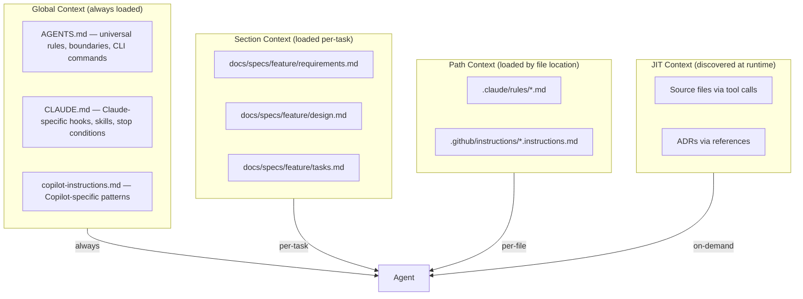

### Three-Tier Boundary Format

All context files shall include a `## Boundaries` section:

```markdown
## Boundaries

### Always Do
- Run `pnpm turbo typecheck && pnpm turbo lint && pnpm turbo test` before every commit
- Create feature branch `work/<task-slug>` before writing code
- Create/update state tracker in `docs/memory/session/`
- Annotate all function parameters and return types
- Use `neverthrow` Result types for domain errors

### Ask First
- Changes to shared interfaces in `packages/core/src/`
- Database schema changes
- New dependency additions
- Tasks touching >1 package (present plan, wait for confirmation)
- Architectural decisions not covered by existing ADRs

### Never Do
- Commit directly to `main`
- Use `any` type (use `unknown` + Zod validation)
- Mock Redis, PostgreSQL, or S3 in integration tests
- Add `eslint-disable` without justification comment
- Generate code before spec validation
- Skip guard functions before committing
- Push with `--force` on shared branches
```

---

## 2. Enforcement Hooks Architecture

### Claude Code Hooks

```jsonc
// .claude/settings.json
{
  "hooks": {
    "PreToolUse": [
      {
        "matcher": { "tool_name": "Bash", "input.command": "git commit" },
        "hooks": [{
          "type": "command",
          "command": "pnpm turbo typecheck && pnpm turbo lint && pnpm turbo test"
        }]
      },
      {
        "matcher": { "tool_name": "Bash", "input.command": "git push" },
        "hooks": [{
          "type": "command",
          "command": "bash -c '[[ $(git branch --show-current) != \"main\" ]] || { echo \"BLOCKED: Push to main — use work/<slug> branch\" >&2; exit 2; }'"
        }]
      }
    ],
    "PostToolUse": [
      {
        "matcher": { "tool_name": "Write" },
        "hooks": [{
          "type": "command",
          "command": "pnpm tsc --noEmit 2>&1 | head -20"
        }]
      },
      {
        "matcher": { "tool_name": "Write" },
        "hooks": [{
          "type": "command",
          "command": "bash -c 'FILE=\"$CLAUDE_TOOL_INPUT_file_path\"; LINES=$(wc -l < \"$FILE\" 2>/dev/null || echo 0); [[ $LINES -le 300 ]] || echo \"WARNING: $FILE has $LINES lines (>300 hard limit, MUST #4)\" >&2'"
        }]
      }
    ],
    "Stop": [
      {
        "hooks": [{
          "type": "command",
          "command": "bash -c 'echo \"Session ending — verify: guard functions passed, changes committed, state tracker updated\" >&2'"
        }]
      }
    ]
  }
}
```

Covers: REQ-AGENT-008 to 013

### Hook Flow

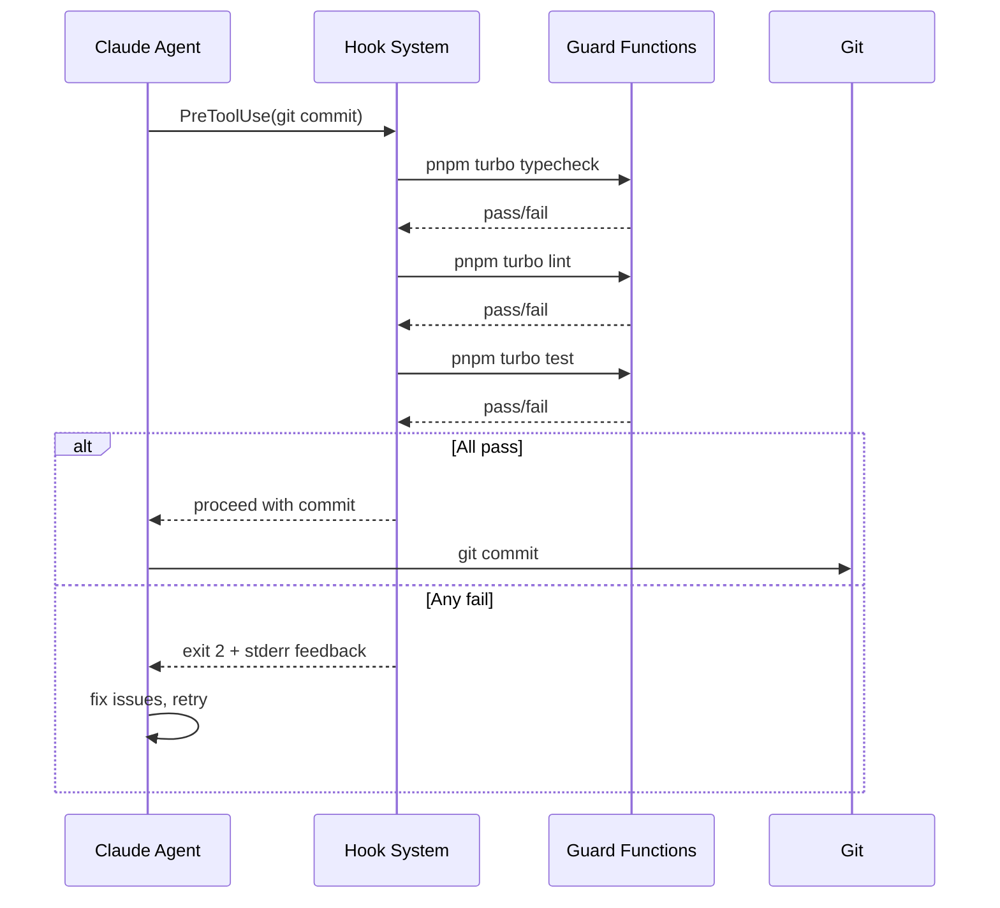

### Copilot Agent Hooks

VS Code Copilot has its own hook system (`.github/hooks/*.json`) with the same lifecycle events as Claude Code. Key difference: hooks receive stdin JSON with `tool_name` and `tool_input` fields, and return JSON via stdout with `hookSpecificOutput`.

```jsonc
// .github/hooks/gates.json
{
  "hooks": {
    "PreToolUse": [{
      "type": "command",
      "command": "./scripts/hooks/copilot-pre-tool-use.sh",
      "timeout": 300
    }],
    "PostToolUse": [{
      "type": "command",
      "command": "./scripts/hooks/copilot-post-tool-use.sh",
      "timeout": 30
    }],
    "Stop": [{
      "type": "command",
      "command": "./scripts/hooks/copilot-stop.sh",
      "timeout": 10
    }]
  }
}
```

Scripts parse `tool_name` from stdin JSON and filter internally (unlike Claude matchers). Non-matching tools get silent pass-through (exit 0, no output).

Covers: REQ-AGENT-107 to 112

### Three-Layer Enforcement Architecture

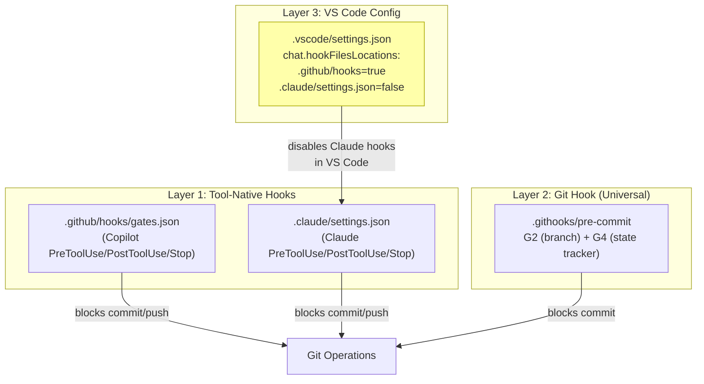

**Why disable Claude hooks in VS Code?** VS Code ignores Claude's matcher syntax (`"matcher": "Bash(git commit)"`), causing ALL Claude hooks to fire on EVERY tool invocation — including reads, searches, and file edits. This would run full guard functions on every operation. The `.vscode/settings.json` disables Claude hook loading; Copilot uses its own hooks from `.github/hooks/` which filter by `tool_name` internally.

---

## 3. TDD Agent Workflow Architecture

### Claude Code Skills

```yaml
# .claude/skills/tdd-cycle/SKILL.md
---
name: tdd-cycle
description: Execute RED→GREEN→REFACTOR TDD cycle with context isolation
triggers: ["implement feature", "tdd", "new feature"]
tools: [bash, read, write, edit, grep, search]
---
## Execution Steps

### Phase 1: RED (Test Writer)
1. Read the feature spec: `docs/specs/<feature>/requirements.md` + `design.md`
2. Read interface contracts from `packages/core/src/`
3. Write comprehensive failing tests in `<feature>/*.test.ts`
4. Verify: `pnpm test --run` exits non-zero with all new tests failing
5. Do NOT read or write any production implementation files
6. Report: test file paths, test count, failure reason for each

### Phase 2: GREEN (Implementer)
1. Read the failing test suite (output from RED phase)
2. Read the feature spec and design
3. Write minimum production code to make all tests pass
4. Do NOT modify any test files
5. Verify: `pnpm test --run` exits zero
6. Report: implementation file paths, approach taken

### Phase 3: REFACTOR (Quality)
1. Read full codebase context for the feature
2. Review implementation for: naming, duplication, type safety, CUPID qualities
3. Refactor with tests as safety net
4. Verify: `pnpm test --run` exits zero AND `pnpm lint` passes
5. Report: changes made, quality improvements
```

Covers: REQ-AGENT-020 to 025

### Copilot Chat Mode Definitions

```markdown
# .github/chatmodes/tdd-red.chatmode.md
---
name: TDD Red Phase
description: Write failing tests for a new feature
tools: [codebase, githubRepo, terminalLastCommand]
handoffs: [tdd-green]
---
## Instructions
Your role is to write failing tests ONLY. Do not implement any production code.
1. Read the feature specification from the current task
2. Read interface contracts from packages/core/src/
3. Write comprehensive failing unit tests (co-located *.test.ts)
4. Write integration test stubs with Testcontainers setup
5. Verify all tests fail: `pnpm test --run`
6. Summary: test file paths, test count, failure reason for each

When complete, suggest handoff to "TDD Green" mode.
```

```markdown
# .github/chatmodes/tdd-green.chatmode.md
---
name: TDD Green Phase
description: Implement minimum code to pass all tests
tools: [codebase, githubRepo, terminal, terminalLastCommand]
handoffs: [tdd-refactor]
---
## Instructions
Your role is to implement ONLY enough code to make all tests pass.
1. Read the failing test suite from the RED phase
2. Read the feature spec and design docs
3. Implement minimum production code
4. Do NOT modify any test files
5. Verify all tests pass: `pnpm test --run`
6. Summary: files created/modified, approach taken

When complete, suggest handoff to "TDD Refactor" mode.
```

```markdown
# .github/chatmodes/tdd-refactor.chatmode.md
---
name: TDD Refactor Phase
description: Clean up implementation with tests as safety net
tools: [codebase, githubRepo, terminal, terminalLastCommand]
---
## Instructions
Your role is to refactor for quality with green tests as safety net.
1. Review implementation for naming, duplication, types, CUPID
2. Check file sizes (≤200 target, 300 hard limit)
3. Refactor incrementally, running tests after each change
4. Verify: `pnpm test --run` passes AND `pnpm lint` passes
5. Summary: quality improvements, final file structure
```

### Handoff Flow

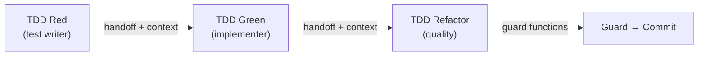

---

## 4. Multi-Agent Orchestration Architecture

### Topology Selection

| Task Scope | Topology | Claude Code | Copilot |
| --- | --- | --- | --- |
| Single file | Direct (no orchestration) | Single session | Chat |
| Single package | Chain (TDD) | Subagents in-session | Chat mode handoffs |
| 2–3 packages | Star (orchestrator→specialists) | Subagents + worktrees | Coding agent + PR |
| >3 packages | Tree (hierarchical) | Agent teams (worktrees) | Multiple agent PRs |

Covers: REQ-AGENT-026 to 031

### Orchestrator Skill

```yaml
# .claude/skills/orchestrate/SKILL.md
---
name: orchestrate
description: Decompose multi-package tasks and delegate to specialists
triggers: ["multi-package", "orchestrate", "delegate"]
tools: [bash, read, search, subagent]
---
## Execution Steps
1. Read the task specification and identify affected packages
2. Decompose into single-package subtasks with clear interfaces
3. For each subtask, launch a specialist subagent:
   - Test Writer: write failing tests for the subtask
   - Implementer: make tests pass
   - Reviewer: review the implementation (blind — no rationale)
4. Synthesize results and verify cross-package integration
5. Never generate code directly — only coordinate
```

### Review Agent Perspectives

```yaml
# .claude/skills/review-code/SKILL.md
---
name: review-code
description: Multi-perspective code review with anti-sycophancy
triggers: ["review", "code review", "pr review"]
tools: [read, search, bash]
---
## Review Perspectives (run sequentially)

### 1. Security Auditor
- Check for injection vulnerabilities, hardcoded secrets, SSRF
- Verify all external input is Zod-validated
- Check error messages don't leak internals

### 2. Performance Reviewer
- Check for N+1 queries, unbounded loops, memory leaks
- Verify connection pooling and resource cleanup
- Check async patterns (no blocking I/O in hot paths)

### 3. API Consistency Checker
- Verify naming follows domain ubiquitous language
- Check interface contracts match design.md
- Verify error types use discriminated unions

### 4. Dissent Requirement
- You MUST find at least one genuine concern before approving
- Unanimous approval on first pass triggers additional scrutiny
- Record all concerns in structured format

### 5. RALPH Loop (Mandatory for G8)
- G8 ALWAYS requires a Review Agent running the full RALPH loop
- Round 1 (Analysis) → Round 2 (Deliberation) → Round 3 (Vote)
- If any sustained Critical/Major findings remain → fix → re-run
- Iterate until verdict is APPROVED (no sustained Critical/Major)
- Self-review alone is NEVER sufficient for G8
```

Covers: REQ-AGENT-029, REQ-AGENT-030, REQ-AGENT-051 to 053

---

## 5. CI/CD Pipeline for Agent PRs

### GitHub Actions Workflow

```yaml
# .github/workflows/agent-pr-validation.yml
name: Agent PR Validation
on:
  pull_request:
    types: [opened, synchronize]
    branches: ['work/*', 'copilot/*', 'agent/*']

jobs:
  guard-functions:
    runs-on: ubuntu-latest
    steps:
      - uses: actions/checkout@v4
      - uses: pnpm/action-setup@v4
      - uses: actions/setup-node@v4
        with:
          node-version: '22'
          cache: 'pnpm'
      - run: pnpm install --frozen-lockfile
      - run: pnpm turbo typecheck
      - run: pnpm turbo lint
      - run: pnpm turbo test -- --coverage

  coverage-gate:
    needs: guard-functions
    runs-on: ubuntu-latest
    steps:
      - name: Check coverage thresholds
        run: |
          # Enforce ≥80% line, ≥75% branch on new code
          echo "Coverage gate: checking thresholds"

  security-scan:
    runs-on: ubuntu-latest
    steps:
      - uses: actions/checkout@v4
      - name: Trivy scan
        uses: aquasecurity/trivy-action@master
        with:
          scan-type: 'fs'
          severity: 'HIGH,CRITICAL'
      - name: Semgrep
        uses: returntocorp/semgrep-action@v1

  context-file-lint:
    runs-on: ubuntu-latest
    steps:
      - uses: actions/checkout@v4
      - name: Validate context file sizes
        run: |
          CLAUDE_LINES=$(wc -l < CLAUDE.md)
          AGENTS_LINES=$(wc -l < AGENTS.md)
          COPILOT_LINES=$(wc -l < .github/copilot-instructions.md)
          if [ "$CLAUDE_LINES" -gt 200 ]; then
            echo "::error::CLAUDE.md exceeds 200 lines ($CLAUDE_LINES)"
            exit 1
          fi
          if [ "$AGENTS_LINES" -gt 1000 ]; then
            echo "::error::AGENTS.md exceeds 1000 lines ($AGENTS_LINES)"
            exit 1
          fi
          if [ "$COPILOT_LINES" -gt 1000 ]; then
            echo "::error::copilot-instructions.md exceeds 1000 lines ($COPILOT_LINES)"
            exit 1
          fi

  architecture-conformance:
    needs: guard-functions
    runs-on: ubuntu-latest
    steps:
      - uses: actions/checkout@v4
      - run: pnpm install --frozen-lockfile
      - name: Check circular dependencies
        run: pnpm turbo lint -- --rule 'import-x/no-cycle: error'
      - name: Check layer boundaries
        run: pnpm turbo lint -- --rule 'import-x/no-restricted-paths: error'
```

Covers: REQ-AGENT-037 to 041

---

## 6. Failure Recovery Flow

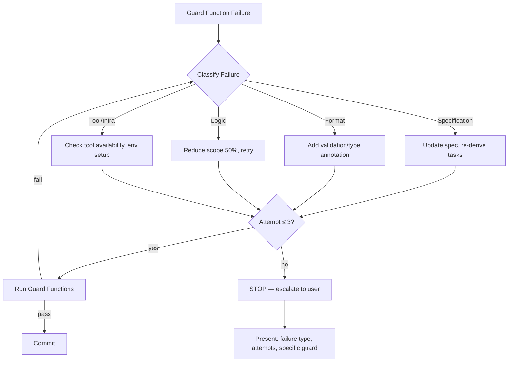

Covers: REQ-AGENT-032 to 036

### Ambiguity Detection Protocol

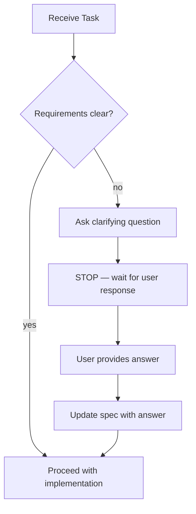

Covers: REQ-AGENT-034

---

## 7. Human Gate Checkpoint Design

### Gate Sequence per Feature Cycle

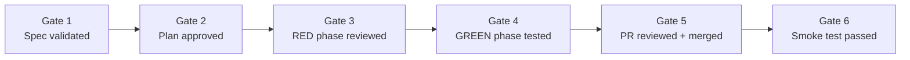

### Gate Properties

| Gate | Machine-Verifiable Criterion | Bounded Artifact | Commitment | Rollback |
| --- | --- | --- | --- | --- |
| Spec | Spec has EARS requirements + acceptance criteria | requirements.md | User says "approved" | Delete spec, re-brief |
| Plan | Plan references ADRs, tasks traceable | plan.md | User says "proceed" | Revise plan |
| RED | All new tests fail for expected reasons | Test output | User reviews test names | Delete test files |
| GREEN | All tests pass, no test modifications | Test output + diff | Automated (CI) | `git revert` |
| PR Review | Reviewer can explain implementation | PR diff | Explicit approve | Close PR |
| Smoke | Health endpoints respond, no error logs | Monitoring dashboard | Deploy approval | Rollback deploy |

Covers: REQ-AGENT-042 to 046

---

## 8. Autonomy Tier Selection

| Tier | Scope | Human Role | Agent Role | Use When |
| --- | --- | --- | --- | --- |
| 1 — Suggestion | Architectural decisions, security, novel domains | Decides + implements | Proposes options | High risk, learning context |
| 2 — Constrained | Standard features, test generation, docs | Reviews all diffs | Implements within bounds | Well-understood domain |
| 3 — Supervised | Routine refactors, dependency upgrades, patterns | Reviews PR | Works autonomously across files | Low risk, pattern-consistent |

Task assignment template in state tracker:

```markdown
## Task: <name>
- **Autonomy Tier**: [1/2/3]
- **Justification**: [why this tier]
- **Gate Checkpoints**: [which gates apply]
```

Covers: REQ-AGENT-042

---

## 9. Context Collapse Prevention Architecture

### Token Budget Governance

```text
Context Window Budget Allocation (per REQ-AGENT-054):
┌──────────────────────────────────────────────────────────────┐
│ Instructions (boundaries, invariants)           ≤5%         │
│ System prompts (AGENTS.md/CLAUDE.md excerpts)   ≤28%        │
│ Task/spec context (requirements, design)        ≤32%        │
│ Working memory (current code, edits)            ≤20%        │
│ Tool outputs (file reads, search results)       ≤10%        │
│ Safety margin (overhead, response space)        ≥5%         │
└──────────────────────────────────────────────────────────────┘
```

### Context File Positional Layout

```text
Context File Structure (per REQ-AGENT-055):
┌─ START (primacy zone — highest attention) ──────────────────┐
│ ## Boundaries                                               │
│ ### Always Do / Ask First / Never Do                        │
│ Critical invariants, guard function requirements            │
├─ MIDDLE (reduced attention zone) ───────────────────────────┤
│ Reference tables (ADR routing, naming conventions)          │
│ Package layout, feature structure                           │
│ Detailed coding rules with examples                        │
├─ END (recency zone — high attention) ───────────────────────┤
│ ## Common Commands (frequently needed)                      │
│ ## Quick Reference (most critical rules repeated)           │
│ Provenance                                                  │
└─────────────────────────────────────────────────────────────┘
```

### Compression and Drift Detection

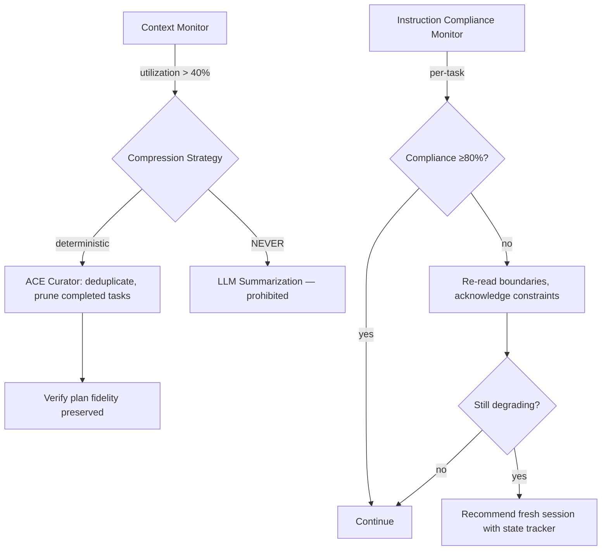

Covers: REQ-AGENT-054 to 060

---

## 10. OWASP ASI Security Architecture

### SSGM Memory Governance Gates

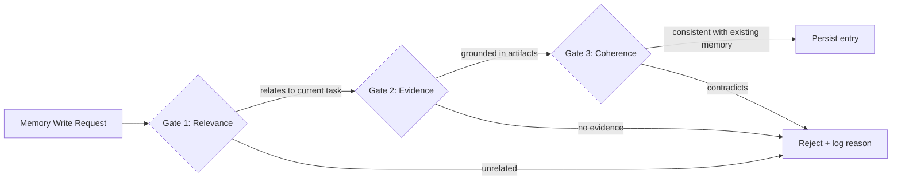

### Multi-Agent Trust and Cascade Prevention

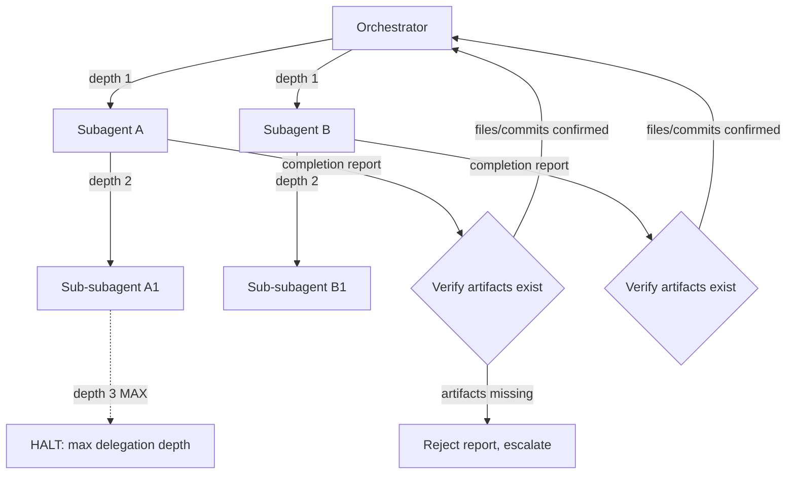

### Tool Output Isolation

```text
Untrusted Input Processing (per REQ-AGENT-064):
┌─ Tool Call ─────────────────────────────────────────────────┐
│ file_read(), web_fetch(), mcp_server_call()                 │
└─────────────────────────────────┬───────────────────────────┘
                                  │
                    ┌─────────────▼──────────────┐
                    │ DATA EXTRACTION ONLY       │
                    │ - Parse structured data    │
                    │ - Extract values           │
                    │ - Never execute as command │
                    └────────────────────────────┘
```

Covers: REQ-AGENT-061 to 065

---

## 11. Property-Based Testing Architecture

### EARS → fast-check Pipeline

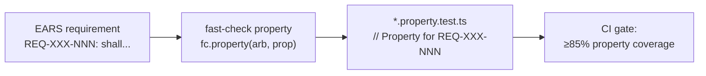

### Property Test Template

```typescript
// src/features/<feature>/<feature>.property.test.ts
import { fc } from '@fast-check/vitest';
import { describe, it } from 'vitest';

describe('<feature> properties', () => {
  // Property for REQ-XXX-001: <shall clause>
  it.prop([fc.string(), fc.integer()], (input, count) => {
    // Arrange: derive from EARS precondition (When/While)
    // Act: invoke the system under test
    // Assert: verify the shall clause holds for ALL generated inputs
  });
});
```

### Critical Algorithm Properties

| Algorithm | Properties | Source Requirement |
| --- | --- | --- |
| Rate limiter (sliding window) | `requests_in_window ≤ limit` for all time offsets | REQ-CRAWL-* |
| Circuit breaker | State transitions: closed→open→half-open only on defined thresholds | REQ-RESILIENCE-* |
| Token bucket | `tokens ≤ max_capacity` invariant, refill monotonic | REQ-CRAWL-* |
| URL deduplication | `normalize(url) = normalize(normalize(url))` idempotent | REQ-FRONTIER-* |

Covers: REQ-AGENT-066 to 069

---

## 12. Quality Gate Architecture

### Five-Dimension Gate

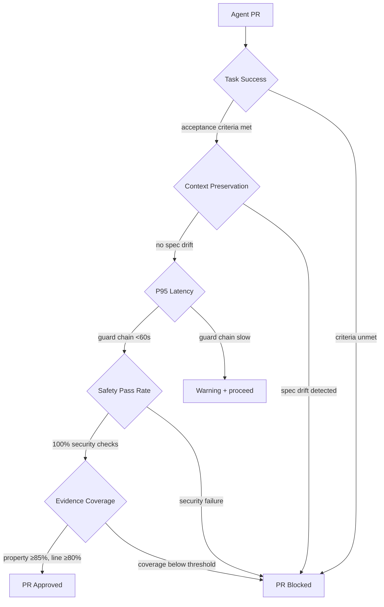

### Spec Drift Detection

Implemented as `scripts/verify-spec-update.sh` (G11 gate), invoked via `pnpm verify:specs`.

**Checks performed:**

1. **Task Completion Sync**: For each package with source files, verify that the corresponding `tasks.md` has checkboxes matching implementation status. Fails if a package has source files but 0/N tasks checked.
2. **Unimplemented Specs**: List spec directories without a matching package (informational).
3. **Spec Freshness**: Verify all spec docs have provenance lines.

**Package→Spec mapping**: Explicit map for non-obvious names (e.g., `core→core-contracts`, `config→core-contracts`, `testing→testing-quality`); otherwise package name matches spec dir name.

**Integration**: G11 runs after G10 in the completion gates, is included in `pnpm verify:session`, and is also available standalone via `pnpm verify:specs`.

```yaml
# Added to .github/workflows/agent-pr-validation.yml
spec-drift-detection:
  runs-on: ubuntu-latest
  steps:
    - uses: actions/checkout@v4
    - name: Check API contract consistency
      run: |
        # Verify OpenAPI spec matches implementation
        npx spectral lint api/openapi.yaml
    - name: Check domain type consistency
      run: |
        # Verify types in design.md match TypeScript interfaces
        # Custom script: extract types from design.md, diff against src/
        node scripts/check-spec-drift.js
    - name: Verify living spec updates (G11)
      run: |
        ./scripts/verify-spec-update.sh
```

### Runtime Predicate System (AgentSpec pattern)

```typescript
// scripts/agent-constraints.ts — checked by PostToolUse hooks
interface AgentConstraint {
  readonly name: string;
  readonly check: () => boolean;
  readonly message: string;
}

const CONSTRAINTS: readonly AgentConstraint[] = [
  {
    name: 'file-count-bound',
    check: () => getNewFileCount() <= 10,
    message: 'Agent created >10 files in one task — split the task',
  },
  {
    name: 'directory-scope',
    check: () => allChangesWithin(ALLOWED_DIRECTORIES),
    message: 'Agent modified files outside task scope',
  },
  {
    name: 'no-new-dependencies',
    check: () => !packageJsonChanged() || dependencyApproved(),
    message: 'New dependency added without ADR-001 approval',
  },
];
```

Covers: REQ-AGENT-070 to 073

---

## 13. Reasoning and Ideation Workflow

### Architectural Decision Flow

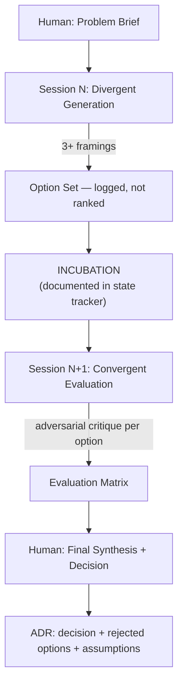

### Agent Framing Assignments

| Framing | Agent Role | Epistemic Identity |
| --- | --- | --- |
| Standard | Architect | "Senior backend architect following industry conventions" |
| Adversarial | Security + SRE | "Architect who has seen this approach fail at 100× scale" |
| Startup | Research | "Engineer optimizing for time-to-market and iteration speed" |
| Maintenance | Documentation | "Team maintaining this system in 5 years" |

### Anti-Sycophancy Protocol for ADR Creation

1. **Frame** (human): Define problem, constraints, success criteria — before AI sees the problem
2. **Generate** (AI, multiple framings): "Generate N approaches. Include ≥3 unconventional options. Do not rank."
3. **Evaluate** (human first, then AI): Human evaluates against internal criteria, then AI with adversarial framing
4. **Debate** (structured MAD): Assign contrarian role, 3-round max, minority positions preserved
5. **Synthesize** (human): Human argues for final decision — not rubber-stamps AI recommendation

Covers: REQ-AGENT-074 to 078

---

## 14. Atomic Action Pair and Code Loop Architecture

### Atomic Action Pair Enforcement

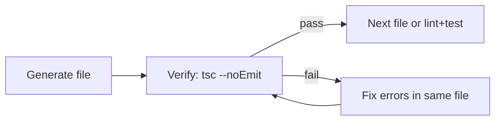

The PostToolUse hook on Write (§2) already enforces this — `pnpm tsc --noEmit` runs after every file write. The key constraint: **never queue multiple file writes without intermediate verification**.

### Dual-State Agentic Code Loop

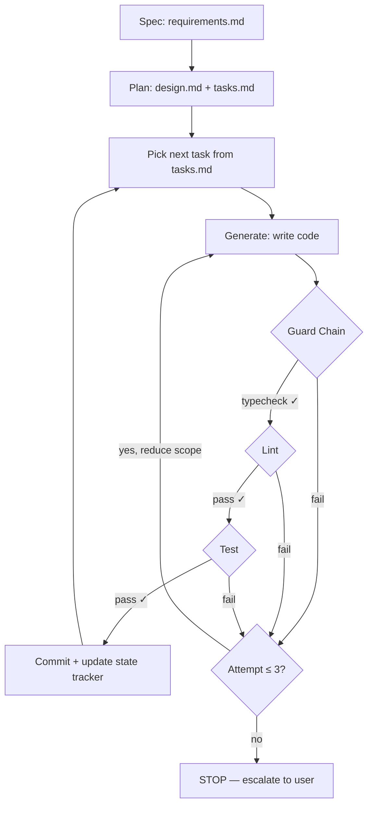

### Token Budget as File Size Decision

```text
File size → Token cost → Context budget impact:
  100 lines ≈  2K tokens → fits comfortably in working memory (≤20%)
  200 lines ≈  4K tokens → TARGET: good balance of context + cohesion
  300 lines ≈  6K tokens → HARD LIMIT: starts crowding context
  500 lines ≈ 10K tokens → PROHIBITED: forces compression
```

Covers: REQ-AGENT-079 to 082

---

## 15. Spec Authorship Architecture

### Spec-Writer Skill Flow

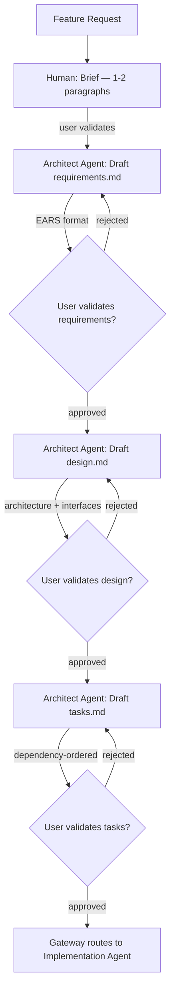

### Spec-Writer Skill Definition

```yaml
# .claude/skills/spec-writer/SKILL.md
---
name: spec-writer
description: Create three-document feature spec (requirements.md, design.md, tasks.md)
triggers: ["new feature", "write spec", "create spec", "feature request"]
tools: [read, write, search, bash]
---
## Execution Steps

### Phase 1: Brief (Human-led)
1. Ask user for: goal, constraints, success criteria, affected packages
2. Confirm understanding — do NOT proceed until user validates
3. Read relevant ADRs from the routing table in AGENTS.md

### Phase 2: Requirements (Architect drafts, human validates)
1. Draft EARS requirements in `docs/specs/<feature>/requirements.md`
2. Each requirement uses EARS pattern: Ubiquitous/Event-driven/State-driven
3. Include acceptance criteria in Gherkin format
4. Include requirement count summary and traceability table
5. STOP — present to user for validation. Do NOT proceed without approval.

### Phase 3: Design (Architect drafts, human validates)
1. Draft architecture in `docs/specs/<feature>/design.md`
2. Include Mermaid diagrams for data flow and component interaction
3. Reference relevant ADRs and existing packages
4. Define interfaces and data models
5. STOP — present to user for validation. Do NOT proceed without approval.

### Phase 4: Tasks (Architect drafts, human validates)
1. Draft implementation tasks in `docs/specs/<feature>/tasks.md`
2. Each task: single-concern, test-verifiable, traceable to requirements
3. Include dependency graph and phase ordering
4. STOP — present to user for validation. Do NOT proceed without approval.

### Phase 5: Index Update
1. Update `docs/specs/index.md` with new spec entry
2. Update requirement count totals
```

### Copilot Chat Mode for Spec Writing

```markdown
# .github/chatmodes/spec-writer.chatmode.md
---
name: Spec Writer
description: Create feature specs (requirements.md, design.md, tasks.md)
tools: [codebase, githubRepo]
---
## Instructions
Your role is to create specifications for new features.
1. Gather goal, constraints, and success criteria from the user
2. Read relevant ADRs from AGENTS.md routing table
3. Draft requirements.md in EARS format with acceptance criteria
4. STOP for user validation before proceeding
5. Draft design.md with Mermaid diagrams and interface contracts
6. STOP for user validation before proceeding
7. Draft tasks.md with dependency-ordered implementation tasks
8. STOP for user validation before implementation begins
9. Update docs/specs/index.md
```

### Agent Capability Update

```diff
# docs/agents/orchestration-protocol.md — Agent Capabilities table
  | Architect | Can Do | Cannot Do |
- | Design, ADR management, pattern review | Write production code |
+ | Design, ADR management, pattern review, spec creation (requirements.md/design.md/tasks.md) | Write production code |
```

### Development Lifecycle Pipeline Update

```diff
# docs/automation/pipelines/development-lifecycle.md — Stage 2
  2. **Design** (Architect Agent, conditional):
-    Skip for bugfixes/refactors/tests/docs.
-    Required for features, architecture changes, new packages.
+    Skip for bugfixes/refactors/tests/docs.
+    Required for features, architecture changes, new packages.
+    Includes full spec creation: requirements.md → design.md → tasks.md (per REQ-AGENT-083).
+    Stage does not complete until all three documents exist and are validated by user.
     Belief ≥80% gate
```

Covers: REQ-AGENT-083 to 088

---

## 16. TypeScript & Architecture Enforcement

> Cross-validation gap: ADR-016 mandates strict TypeScript, ADR-015 mandates hexagonal architecture, arch.md Phase 3 requires layer boundaries — but the agentic setup only documents these as patterns. This section adds lint-enforced verification.

### Layer Boundary ESLint Rules

```text
packages/eslint-config/src/rules/
├── layer-boundaries.ts      # Prevents cross-layer imports
├── otel-first-import.ts     # Verifies OTel is first import in main.ts
└── no-barrel-imports.ts     # Prevents index.ts re-exports
```

### Layer Import Matrix

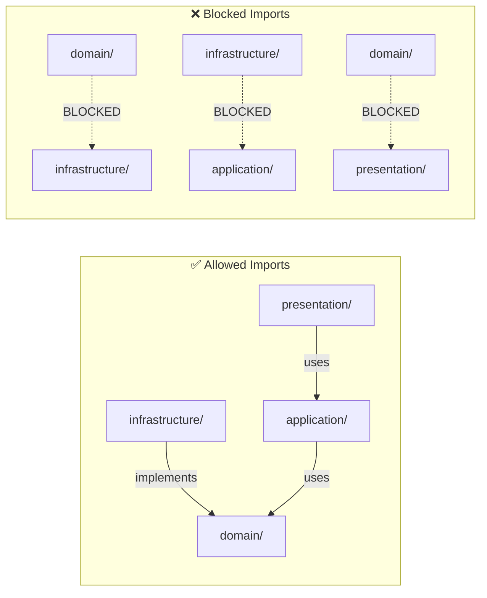

### ESLint Rule Configuration

```typescript
// packages/eslint-config/src/rules/layer-boundaries.ts
// Rule: @ipf/no-infra-in-domain
// Matches: packages/core/src/domain/**/*.ts
// Blocks: imports from **/infrastructure/**, **/infra/**

// Rule: @ipf/no-app-in-infra
// Matches: packages/*/src/infrastructure/**/*.ts
// Blocks: imports from **/application/**

// Rule: @ipf/otel-first-import
// Matches: apps/*/src/main.ts
// Requires: first import statement is './otel' or '../otel'
```

### TypeScript Strict Mode Instruction Template

```markdown
# .github/instructions/strict-typescript.instructions.md
---
applyTo: "**/*.ts"
---
## TypeScript Strict Mode Enforcement
- `exactOptionalPropertyTypes`: never assign `undefined` to optional props
- `noUncheckedIndexedAccess`: array/map access returns `T | undefined`
- `noImplicitOverride`: must use `override` keyword for inherited methods
- `no-explicit-any`: use `unknown` + Zod `.parse()` instead
- Discriminated unions: use `_tag` literal field for all variant types
```

Covers: REQ-AGENT-089 to 094

---

## 17. API Contract & Resilience Enforcement

> Cross-validation gap: arch.md Phase 5 (API) and Phase 7 (Resilience) patterns are documented but not verified in CI.

### Contract-First Enforcement Pipeline

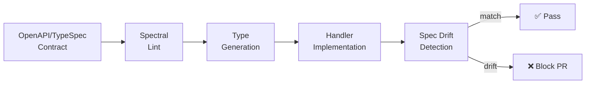

### Resilience Verification CI Job

```yaml
# Added to .github/workflows/agent-pr-validation.yml
resilience-check:
  steps:
    - name: Verify SIGTERM handlers
      run: |
        # Check each service entry point for SIGTERM handling
        for main in apps/*/src/main.ts; do
          grep -q "SIGTERM\|gracefulShutdown\|process.on.*signal" "$main" || exit 1
        done
    - name: Verify health endpoints
      run: |
        # Check each service for health route registration
        for app in apps/*/; do
          grep -rq "health/live\|healthLive\|livenessProbe" "$app/src/" || exit 1
          grep -rq "health/ready\|healthReady\|readinessProbe" "$app/src/" || exit 1
        done
    - name: Verify idempotency in workers
      run: |
        # Check worker processors for idempotency patterns
        grep -rq "idempotency\|deduplication\|jobId" apps/worker-service/src/ || exit 1
```

### Resource Cleanup Instruction

```markdown
# Addition to .github/instructions/infra-layer.instructions.md
## Resource Cleanup
- Use `using` keyword with `Symbol.dispose` for connections, locks, file handles
- Never use try/finally for resource cleanup when `using` is available
- Pattern: `using connection = await pool.connect()`
```

Covers: REQ-AGENT-095 to 099

---

## 18. Security Property Testing

> Cross-validation gap: REQUIREMENTS-AGNOSTIC §12 identifies 5 security gaps (GAP-SEC-001 to 005). Phase 15 provides PBT framework but no security-specific generators.

### Security Property Generator Architecture

```text
packages/testing/src/generators/
├── ip-address.generator.ts     # IPv4, IPv6, mapped, CGNAT, multicast
├── dns-rebinding.generator.ts  # TOCTOU payloads, rebinding sequences
├── ssrf-payload.generator.ts   # Redirect chains, scheme abuse
└── rfc6890.generator.ts        # All RFC 6890 reserved ranges
```

### Gap-to-Property Mapping

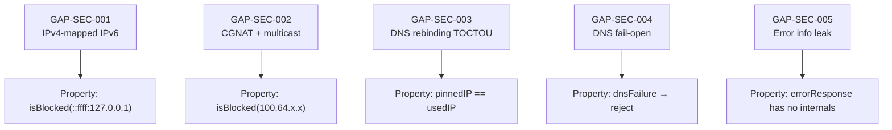

### RFC 6890 Property Template

```typescript
// packages/testing/src/generators/rfc6890.generator.ts
import * as fc from 'fast-check';

// RFC 6890 reserved ranges that MUST be blocked
const RFC_6890_RANGES = [
  { cidr: '0.0.0.0/8', name: 'This host' },
  { cidr: '10.0.0.0/8', name: 'Private-Use' },
  { cidr: '100.64.0.0/10', name: 'Shared Address (CGNAT)' },
  { cidr: '127.0.0.0/8', name: 'Loopback' },
  { cidr: '169.254.0.0/16', name: 'Link Local' },
  { cidr: '172.16.0.0/12', name: 'Private-Use' },
  { cidr: '192.168.0.0/16', name: 'Private-Use' },
  { cidr: '224.0.0.0/4', name: 'Multicast' },
  { cidr: '240.0.0.0/4', name: 'Reserved' },
  { cidr: '255.255.255.255/32', name: 'Broadcast' },
] as const;

// Arbitrary that generates IPs from reserved ranges
export const reservedIpArbitrary: fc.Arbitrary<string> =
  fc.oneof(...RFC_6890_RANGES.map(r => ipFromCidr(r.cidr)));
```

Covers: REQ-AGENT-100 to 102

---

## 19. Advanced Reasoning & Cross-Cutting Enforcement

> Cross-validation gap: ideating.md reasoning framework selection (CoT/ToT/SPIRAL), test pyramid enforcement, code provenance tracking.

### Reasoning Framework Selection Guide

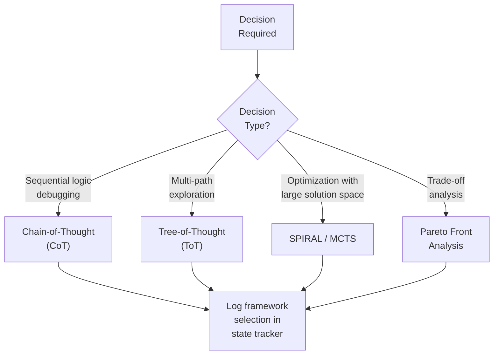

### Test Pyramid CI Job

```yaml
# Added to .github/workflows/agent-pr-validation.yml
test-pyramid:
  steps:
    - name: Classify and count tests
      run: |
        UNIT=$(find . -name '*.unit.test.ts' -o -name '*.test.ts' ! -name '*.integration.*' ! -name '*.contract.*' ! -name '*.e2e.*' | wc -l)
        INTEGRATION=$(find . -name '*.integration.test.ts' | wc -l)
        CONTRACT=$(find . -name '*.contract.test.ts' | wc -l)
        E2E=$(find . -name '*.e2e.test.ts' | wc -l)
        TOTAL=$((UNIT + INTEGRATION + CONTRACT + E2E))
        echo "Unit: $UNIT ($((UNIT * 100 / TOTAL))%)"
        echo "Integration: $INTEGRATION ($((INTEGRATION * 100 / TOTAL))%)"
        echo "Contract: $CONTRACT ($((CONTRACT * 100 / TOTAL))%)"
        echo "E2E: $E2E ($((E2E * 100 / TOTAL))%)"
```

### Commit Provenance Template

```text
feat(crawler): implement URL normalization

- Normalize URLs following RFC 3986
- Add property tests for edge cases

Requirement: REQ-CRAWL-003
Agent: implementation-agent
Tool: claude-code
```

### Human-AI Complementarity Matrix

| Task Type | Lead | Support | Rationale |
| --- | --- | --- | --- |
| Requirements elicitation | Human | AI drafts EARS syntax | Creativity, domain judgment |
| Architecture decisions | Human | AI generates options (ToT) | Ethical, long-term impact |
| Code implementation | AI | Human reviews diffs | Consistency, exhaustive patterns |
| Test generation | AI | Human validates properties | Pattern application, coverage |
| Security review | AI + Human | Adversarial review agent | Both needed: pattern + intuition |
| Debugging | AI | Human provides domain context | Exhaustive search, log analysis |

Covers: REQ-AGENT-103 to 106

---

> **Provenance**: Created 2026-03-25. Updated 2026-03-25: added sections 9–15 from research. Updated 2026-03-26: added sections 16–19 (TypeScript/architecture enforcement, API contract/resilience, security property testing, advanced reasoning/cross-cutting) from cross-validation against all 22 ADRs, REQUIREMENTS-AGNOSTIC.md §12, arch.md 12-phase plan, code.md, 13 feature specs, and docs infrastructure. Updated 2026-03-26: added §20 (MVP Strategy), §21 (Design Coverage Mapping) per PR Review Council.

---

## 20. MVP Implementation Strategy

> **Problem**: 109 tasks across 24 phases creates implementation paralysis. The spec requires tooling that doesn't exist yet to create the tooling (chicken-and-egg).

### Bootstrap Sequence

```mermaid
graph TD
    B0["Phase 0: Bootstrap<br/>Branch protection + boundaries"] --> P1["Phase 1: Context restructure<br/>CLAUDE.md + AGENTS.md"]
    P1 --> P4["Phase 4: Hooks<br/>Guard functions + push protection"]
    P4 --> P5["Phase 5: Skills<br/>TDD cycle + guard chain"]
    P5 --> P9["Phase 9: CI<br/>Agent PR validation"]
    P9 --> MVP_DONE["MVP Complete<br/>11 tasks, agents can operate safely"]
    MVP_DONE --> ENHANCE["Enhancement Phases 2,3,6–8,10–24"]
```

### MVP vs Enhancement Boundary

| Category | MVP (11 tasks) | Enhancement (~98 tasks) |
| --- | --- | --- |
| Branch safety | `.claude/settings.json` push block | Full hook suite (file size, typecheck) |
| Guard functions | Pre-commit hook + CI job | PostToolUse, Stop hook, retry logic |
| Context files | Restructured AGENTS.md + CLAUDE.md | Path-scoped instructions, modular rules |
| TDD workflow | TDD skill definition | Chat modes, handoffs, context isolation |
| Review | Manual PR review | Multi-agent review with anti-sycophancy |
| Security | Existing ESLint rules | Property generators, RFC 6890, OWASP ASI |

### Phase 0 Design

Phase 0 requires zero new tooling — it uses existing Git hooks and file creation only:

```jsonc
// .claude/settings.json — Phase 0 minimal
{
  "hooks": {
    "PreToolUse": [
      {
        "matcher": { "tool_name": "Bash", "input.command": "git push" },
        "hooks": [{
          "type": "command",
          "command": "bash -c '[[ $(git branch --show-current) != \"main\" ]] || { echo \"BLOCKED: Push to main\" >&2; exit 2; }'"
        }]
      }
    ]
  }
}
```

## 21. Design Coverage Mapping

All 106 requirements map to design sections. Requirements grouped by design section:

| Design Section | Requirements Covered |
| --- | --- |
| §1 Context File Architecture | REQ-AGENT-001–007, 047–050, 054–060 |
| §2 Enforcement Hooks | REQ-AGENT-008–013, 070, 107–112 |
| §3 TDD Agent Workflow | REQ-AGENT-020–025 |
| §4 Multi-Agent Orchestration | REQ-AGENT-026–031 |
| §5 CI/CD Pipeline | REQ-AGENT-037–041 |
| §6 Failure Recovery Flow | REQ-AGENT-032–036 |
| §7 Human Gate Checkpoints | REQ-AGENT-042–046 |
| §8 Autonomy Tier Selection | REQ-AGENT-042 (shared) |
| §9 Context Collapse Prevention | REQ-AGENT-054–060 |
| §10 OWASP ASI Security | REQ-AGENT-061–065 |
| §11 Property-Based Testing | REQ-AGENT-066–069 |
| §12 Quality Gate Architecture | REQ-AGENT-070–073 |
| §13 Reasoning & Ideation | REQ-AGENT-074–078 |
| §14 Atomic Action Pair | REQ-AGENT-079–082 |
| §15 Spec Authorship | REQ-AGENT-083–088 |
| §16 TypeScript & Architecture | REQ-AGENT-089–094 |
| §17 API Contract & Resilience | REQ-AGENT-095–099 |
| §18 Security Property Testing | REQ-AGENT-100–102 |
| §19 Advanced Reasoning | REQ-AGENT-103–106 |
| §3 TDD (shared: REQ-014–019) | REQ-AGENT-014–019 (spec workflow → TDD lifecycle) |

**Coverage**: 112/112 requirements have corresponding design sections (100%).
