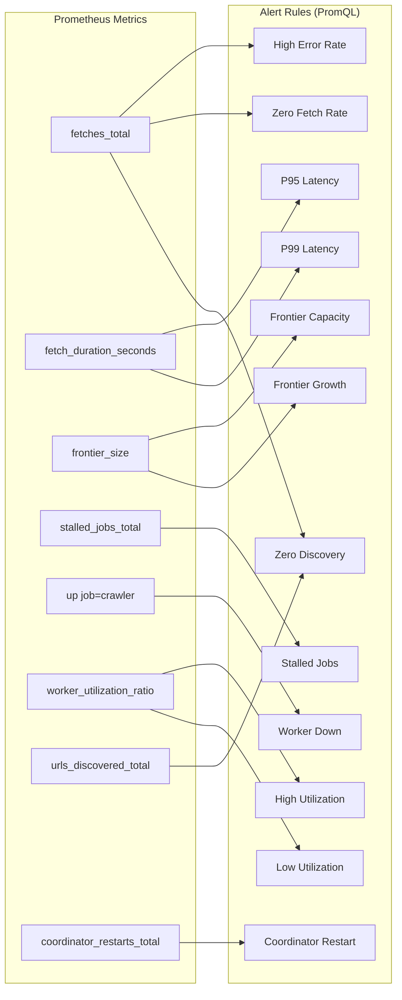

# Alerting — Design

> Architecture for alert rule definitions and alert testing.
> Implements: [requirements.md](requirements.md) | ADRs: [ADR-006](../../adr/ADR-006-observability-stack.md)

---

## 1. Alert Rule Architecture



## 2. Alert Rule Definitions

| Alert | PromQL Condition | Severity | Duration |
| --- | --- | --- | --- |
| HighErrorRate | `(sum(rate(fetches_total{status="error"}[2m])) / sum(rate(fetches_total[2m]))) > 0.5 AND sum(rate(fetches_total[2m])) > 0.1` | warning | 2m |
| ZeroFetchRate | `frontier_size > 0 AND on() sum(rate(fetches_total{status="success"}[5m])) == 0` | critical | 5m |
| StalledJobs | `rate(stalled_jobs_total[2m]) > 0.05` | warning | 2m |
| P95LatencyHigh | `histogram_quantile(0.95, rate(fetch_duration_seconds_bucket[3m])) > 10` | warning | 3m |
| P99LatencyCritical | `histogram_quantile(0.99, rate(fetch_duration_seconds_bucket[5m])) > 15` | critical | 5m |
| FrontierCapacity | `frontier_size > 5000` | warning | 5m |
| FrontierGrowth | `deriv(frontier_size[3m]) * 60 > 100` | warning | 3m |
| HighUtilization | `avg(worker_utilization_ratio) > 0.8` | warning | 3m |
| LowUtilization | `avg(worker_utilization_ratio) < 0.2 AND avg(worker_utilization_ratio) > 0` | info | 10m |
| WorkerDown | `up{job="crawler"} == 0` | critical | 1m |
| CoordinatorRestart | `increase(coordinator_restarts_total[1m]) > 0` | warning | 0m |
| ZeroDiscovery | `frontier_size > 100 AND on() sum(rate(fetches_total{status="success"}[10m])) > 0 AND on() sum(rate(urls_discovered_total[10m])) == 0` | warning | 10m |

> **Implementation note**: HighErrorRate uses `sum()` to aggregate across label dimensions before division (prevents label leakage from `rate()` retaining the `status` label). ZeroFetchRate/ZeroDiscovery use `on()` in `and` clauses to match series with different label sets (frontier_size has no labels vs. fetches_total with status label).

## 3. Alert Testing Strategy

Each alert rule gets three unit tests using `promtool test rules`:

| Test Type | Purpose | Example |
| --- | --- | --- |
| **Should fire** | Metric values exceed threshold for required duration | Error rate 60% for 2m |
| **Should not fire** | Metric values below threshold | Error rate 40% for 2m |
| **Edge case** | Boundary values (±1%), duration boundary, no data | Error rate 50.1% for exactly 2m |

```yaml
# Test structure per alert rule
- alert: HighErrorRate
  tests:
    - name: "should fire when error rate > 50%"
      input_series:
        - series: 'fetches_total{status="error"}'
          values: '0+1x120'   # 1 error/s for 2 min
        - series: 'fetches_total{status="success"}'
          values: '0+0.5x120' # 0.5 success/s
      expected: firing

    - name: "should not fire when error rate < 50%"
      input_series:
        - series: 'fetches_total{status="error"}'
          values: '0+0.1x120'
        - series: 'fetches_total{status="success"}'
          values: '0+1x120'
      expected: not_firing

    - name: "edge: should not fire at exactly 50%"
      input_series:
        - series: 'fetches_total{status="error"}'
          values: '0+1x120'
        - series: 'fetches_total{status="success"}'
          values: '0+1x120'
      expected: not_firing  # Alert is > 50%, not >= 50%
```

Uses Prometheus unit testing framework (`promtool test rules`). Integrated into CI via `pnpm turbo test:alerts` (REQ-ALERT-014).

## 4. Alert Routing Configuration

```yaml
# Alertmanager routing configuration (REQ-ALERT-016)
route:
  receiver: 'default'
  group_by: ['alertname']
  group_wait: 30s
  group_interval: 5m
  repeat_interval: 4h
  routes:
    - match:
        severity: critical
      receiver: 'pagerduty'
      repeat_interval: 15m
    - match:
        severity: warning
      receiver: 'slack-alerts'
      repeat_interval: 1h
    - match:
        severity: info
      receiver: 'log-only'

receivers:
  - name: 'pagerduty'
    pagerduty_configs:
      - service_key: '$PAGERDUTY_SERVICE_KEY'
  - name: 'slack-alerts'
    slack_configs:
      - api_url: '$SLACK_WEBHOOK_URL'
        channel: '#ipf-alerts'
  - name: 'log-only'
    webhook_configs: []
  - name: 'default'
    slack_configs:
      - api_url: '$SLACK_WEBHOOK_URL'
        channel: '#ipf-alerts'
```

All alerts include annotations (REQ-ALERT-017):

```yaml
# Example alert with annotations
- alert: HighErrorRate
  expr: rate(fetches_total{status="error"}[2m]) / rate(fetches_total[2m]) > 0.5
  for: 2m
  labels:
    severity: warning
  annotations:
    summary: "High fetch error rate ({{ $value | humanizePercentage }})"
    description: "Error rate is {{ $value | humanizePercentage }} over the last 2 minutes. Threshold: 50%."
    runbook_url: "https://github.com/ipf/ipf/wiki/Runbooks#high-error-rate"
```

## 4. Design Decisions

| Decision | Choice | Rationale |
| --- | --- | --- |
| Alert language | PromQL | Native to Prometheus (ADR-006) |
| Testing | promtool test rules | Official Prometheus rule testing |
| Notification | Future: Alertmanager routing | GAP-ALERT-003 remediation |
| CI integration | Alert tests as post-coverage stage | GAP-ALERT-002 remediation |

---

> **Provenance**: Created 2026-03-25. SRE Agent design for alerting per ADR-006/020.
