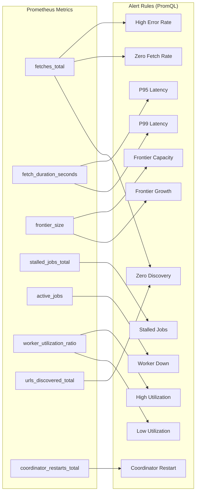

# Alerting — Design

> Architecture for alert rule definitions and alert testing.
> Implements: [requirements.md](requirements.md) | ADRs: [ADR-006](../../adr/ADR-006-observability-stack.md)

---

## 1. Alert Rule Architecture



## 2. Alert Rule Definitions

| Alert | PromQL Condition | Severity | Duration |
| --- | --- | --- | --- |
| HighErrorRate | `rate(fetches_total{status="error"}[2m]) / rate(fetches_total[2m]) > 0.5 AND rate(fetches_total[2m]) > 0.1` | warning | 2m |
| ZeroFetchRate | `frontier_size > 0 AND rate(fetches_total{status="success"}[5m]) == 0` | critical | 5m |
| StalledJobs | `rate(stalled_jobs_total[2m]) > 0.05` | warning | 2m |
| P95LatencyHigh | `histogram_quantile(0.95, rate(fetch_duration_seconds_bucket[3m])) > 10` | warning | 3m |
| P99LatencyCritical | `histogram_quantile(0.99, rate(fetch_duration_seconds_bucket[5m])) > 15` | critical | 5m |
| FrontierCapacity | `frontier_size > 5000` | warning | 5m |
| FrontierGrowth | `deriv(frontier_size[3m]) * 60 > 100` | warning | 3m |
| HighUtilization | `avg(worker_utilization_ratio) > 0.8` | warning | 3m |
| LowUtilization | `avg(worker_utilization_ratio) < 0.2 AND avg(worker_utilization_ratio) > 0` | info | 10m |
| WorkerDown | `up{job="crawler"} == 0` | critical | 1m |
| CoordinatorRestart | `increase(coordinator_restarts_total[1m]) > 0` | warning | 0m |
| ZeroDiscovery | `frontier_size > 100 AND rate(fetches_total{status="success"}[10m]) > 0 AND rate(urls_discovered_total[10m]) == 0` | warning | 10m |

## 3. Alert Testing Strategy

Each alert rule gets two unit tests:

```yaml
# Test structure per alert rule
- alert: HighErrorRate
  tests:
    - name: "should fire when error rate > 50%"
      input_series:
        - series: 'fetches_total{status="error"}'
          values: '0+1x120'   # 1 error/s for 2 min
        - series: 'fetches_total{status="success"}'
          values: '0+0.5x120' # 0.5 success/s
      expected: firing

    - name: "should not fire when error rate < 50%"
      input_series:
        - series: 'fetches_total{status="error"}'
          values: '0+0.1x120'
        - series: 'fetches_total{status="success"}'
          values: '0+1x120'
      expected: not_firing
```

Uses Prometheus unit testing framework (`promtool test rules`).

## 4. Design Decisions

| Decision | Choice | Rationale |
| --- | --- | --- |
| Alert language | PromQL | Native to Prometheus (ADR-006) |
| Testing | promtool test rules | Official Prometheus rule testing |
| Notification | Future: Alertmanager routing | GAP-ALERT-003 remediation |
| CI integration | Alert tests as post-coverage stage | GAP-ALERT-002 remediation |

---

> **Provenance**: Created 2026-03-25. SRE Agent design for alerting per ADR-006/020.
