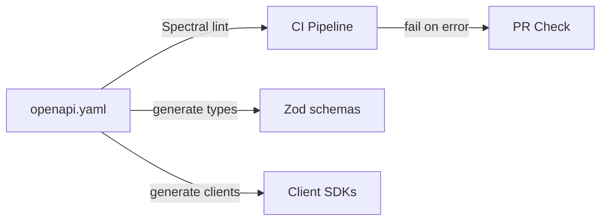

# API Contracts — Design

> Architecture for public API contract definitions and validation.
> Implements: [requirements.md](requirements.md) | ADRs: [ADR-011](../../adr/ADR-011-api-framework.md), [ADR-017](../../adr/ADR-017-service-communication.md)

---

## 1. Overview



## 2. OpenAPI Spec Structure

The spec follows OpenAPI 3.1 and defines the IPF Crawler management API.

### Endpoints

| Method | Path | Description | Request | Response |
| --- | --- | --- | --- | --- |
| POST | `/api/v1/crawls` | Create crawl session | CrawlRequest | CrawlSession (201) |
| GET | `/api/v1/crawls/{id}` | Get crawl status | path: id | CrawlSession (200) |
| GET | `/api/v1/crawls` | List crawl sessions | query: limit, offset | CrawlList (200) |
| POST | `/api/v1/seed` | Seed URLs into frontier | SeedRequest | SeedResponse (200) |
| GET | `/health/live` | Liveness probe | — | HealthStatus (200) |
| GET | `/health/ready` | Readiness probe | — | HealthStatus (200/503) |
| GET | `/metrics` | Prometheus metrics | — | text/plain (200) |

### Schema Definitions

```yaml
# Core schemas matching Zod definitions from ADR-011
CrawlRequest:
  type: object
  required: [name, seedUrls]
  properties:
    name: { type: string, minLength: 1 }
    seedUrls: { type: array, items: { type: string, format: uri }, minItems: 1 }
    maxDepth: { type: integer, minimum: 0, maximum: 10, default: 3 }
    maxPages: { type: integer, minimum: 1, default: 10000 }

CrawlSession:
  type: object
  required: [id, status, createdAt]
  properties:
    id: { type: string, format: uuid }
    status: { type: string, enum: [active, completed, failed, paused] }
    createdAt: { type: string, format: date-time }
    pagesProcessed: { type: integer }
    pagesTotal: { type: integer }

SeedRequest:
  type: object
  required: [url]
  properties:
    url: { type: string, format: uri }
    depth: { type: integer, minimum: 0, default: 0 }
```

## 3. Validation Pipeline

Spectral is configured via `.spectral.yml` at the repository root:

```yaml
extends: ["spectral:oas"]
rules:
  operation-operationId: error
  oas3-api-servers: warn
```

The `architecture-conformance` job in `agent-pr-validation.yml` already runs Spectral on any `openapi.yaml` files found — no additional CI changes needed beyond creating the spec file.

## 4. File Layout

```text
openapi.yaml                   — The OpenAPI 3.1 spec file (repo root — CI find scans all depths)
.spectral.yml                  — Spectral linting config (repo root)
docs/specs/api-contracts/
  requirements.md              — This spec (10 reqs)
  design.md                    — This document
  tasks.md                     — Implementation tasks
```

---

> **Provenance**: Created 2026-03-29. Contract-first API design per ADR-017 §3.
