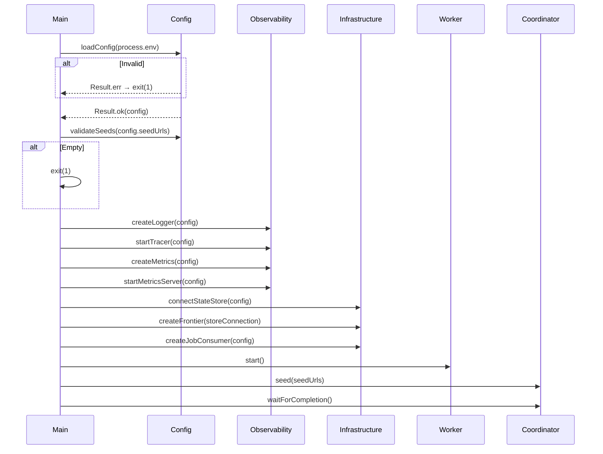
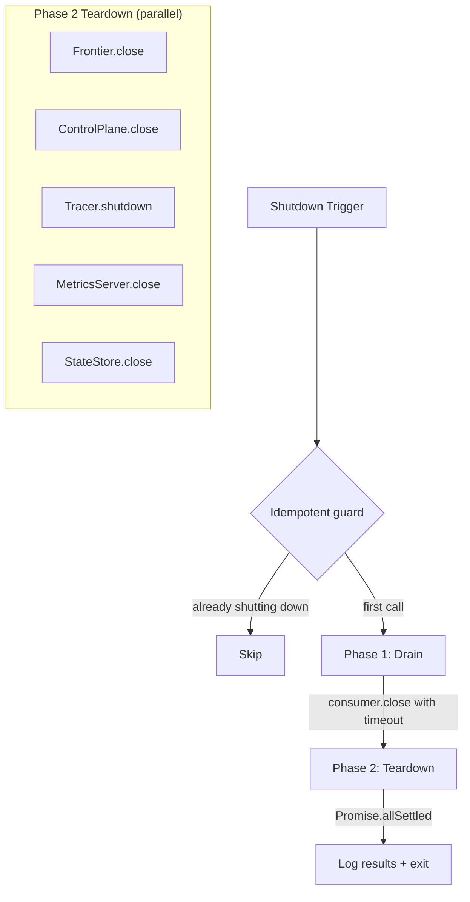
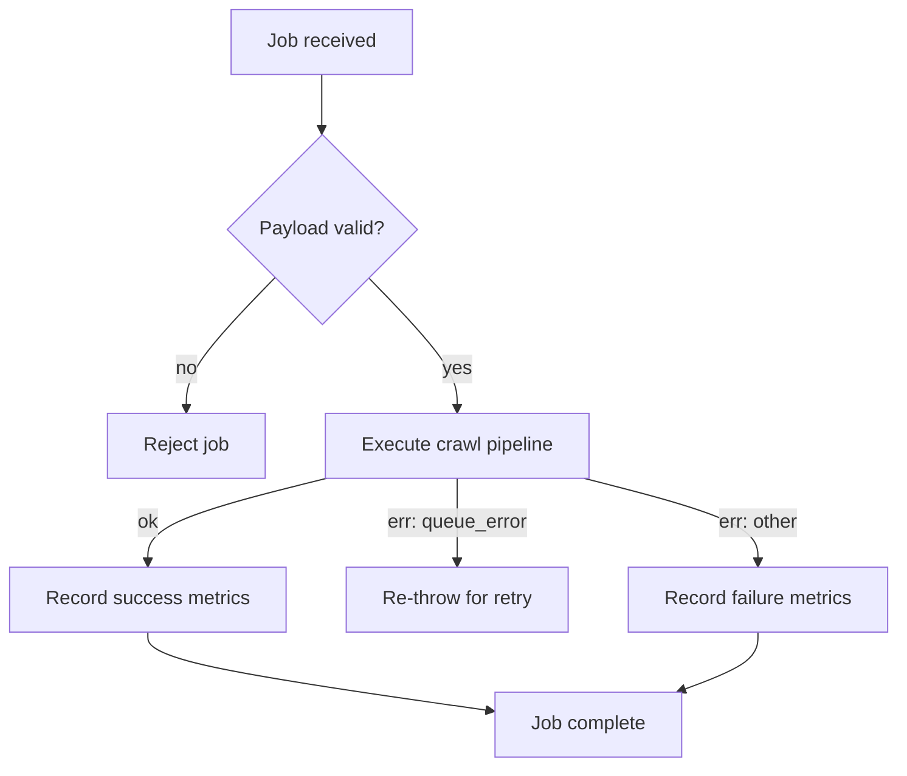

# Application Lifecycle — Design

> Architecture for startup sequencing, graceful shutdown, signal handling, and worker processing.
> Implements: [requirements.md](requirements.md) | ADRs: [ADR-009](../../adr/ADR-009-resilience-patterns.md), [ADR-013](../../adr/ADR-013-configuration-management.md)

---

## 1. Startup Sequence



Covers: REQ-LIFE-001 to 006

## 2. Graceful Shutdown



```typescript
interface ShutdownConfig {
  readonly drainTimeout: number     // Phase 1 timeout (default: 15s)
  readonly teardownTimeout: number  // Phase 2 timeout (default: 8s)
}

type ShutdownReason =
  | { _tag: 'Signal'; signal: string }
  | { _tag: 'Completion' }
  | { _tag: 'Error'; cause: unknown }
  | { _tag: 'Abort'; reason: string }
```

Key design:

- Idempotent via boolean guard (REQ-LIFE-018)
- Phase 1: Consumer drain with configurable timeout (REQ-LIFE-019)
- Phase 2: `Promise.allSettled()` — one failure doesn't block others (REQ-LIFE-020)
- Each failure logged with component name (REQ-LIFE-021)
- Typed shutdown reason (REQ-LIFE-022)
- Coordinator clears poll interval, settles pending promise (REQ-LIFE-023)
- Coordinator does not close shared resources (REQ-LIFE-024)

## 3. Signal Handler Mapping

| Signal/Event | Shutdown Reason | Exit Code | Covers |
| --- | --- | --- | --- |
| SIGINT | `{ _tag: 'Signal', signal: 'SIGINT' }` | 0 | REQ-LIFE-011 |
| SIGTERM | `{ _tag: 'Signal', signal: 'SIGTERM' }` | 0 | REQ-LIFE-012 |
| Uncaught exception | `{ _tag: 'Error', cause }` | 1 | REQ-LIFE-013 |
| Unhandled rejection | `{ _tag: 'Error', cause }` | 1 | REQ-LIFE-014 |
| Main throws | `{ _tag: 'Error', cause }` | 1 | REQ-LIFE-015 |
| State-store abort | `{ _tag: 'Abort', reason }` | 3 | REQ-LIFE-016 |
| Crawl complete | `{ _tag: 'Completion' }` | 0 | REQ-LIFE-017 |

## 4. Worker Job Processing



- Payload validated via Zod schema or type guard (REQ-LIFE-025)
- `queue_error` re-thrown to trigger queue retry (REQ-LIFE-026)
- Metrics recorded for all outcomes (REQ-LIFE-027)
- Single fetcher instance reused (REQ-LIFE-028)

## 5. Seeding Design

```typescript
async function seedFrontier(
  seeds: string[],
  frontier: Frontier,
  logger: Logger,
  metrics: CrawlMetrics,
): Promise<void> {
  const entries: FrontierEntry[] = []
  for (const raw of seeds) {
    const result = createCrawlUrl(raw)
    if (result.isErr()) {
      logger.warn('Invalid seed URL, skipping', { url: raw, error: result.error })
      continue
    }
    entries.push({
      url: result.value,
      depth: 0,
      discoveredBy: 'coordinator',
      discoveredAt: Date.now(),
      parentUrl: null,
    })
  }
  const enqueueResult = await frontier.enqueue(entries)
  if (enqueueResult.isErr()) {
    logger.error('Seed enqueue failed', { error: enqueueResult.error })
  }
  const size = await frontier.size()
  if (size.isOk()) {
    metrics.setFrontierSize(size.value.total)
  }
}
```

Covers: REQ-LIFE-007 to 010

## 6. Design Decisions

| Decision | Choice | Rationale |
| --- | --- | --- |
| Shutdown guard | Boolean flag (atomic in single-threaded JS) | Simple, safe (REQ-LIFE-018) |
| Teardown strategy | Promise.allSettled | Fault-isolated (REQ-LIFE-020) |
| Config validation | Zod schema (ADR-013) | Fail-fast with structured errors |
| Fetcher reuse | Single instance per worker | Preserves politeness chains (REQ-LIFE-028) |
| Payload validation | Zod parse at job entry | Catches malformed payloads early |

---

> **Provenance**: Created 2026-03-25. Architect Agent design for application lifecycle per ADR-009/013/020.
