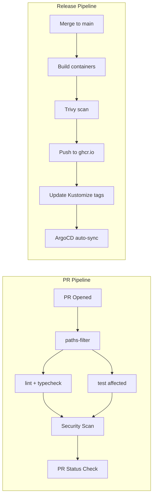

# CI/CD Pipeline — Design

> Architecture, workflow structure, and pipeline diagrams for the CI/CD system.
> Requirements: [requirements.md](requirements.md) | ADR: [ADR-012](../../adr/ADR-012-ci-cd-pipeline.md)

---

## Pipeline Architecture



## Existing Workflows

| Workflow | File | Purpose | Status |
| --- | --- | --- | --- |
| Agent PR Validation | `agent-pr-validation.yml` | Guard functions for `work/*` branches | Exists |
| Quality Gate | `quality-gate.yml` | Push-to-main quality checks | Exists |
| K8s E2E | `k8s-e2e.yml` | End-to-end tests in k3d | Exists |
| CI (full) | `ci.yml` | Full PR pipeline with paths-filter | **To create** |
| Release | `release.yml` | Build + publish + deploy on merge | **To create** |
| Security | `security.yml` | Trivy + gitleaks + audit | **To create** |

## PR Pipeline Design (ci.yml)

```yaml
name: CI
on:
  pull_request:
    branches: [main]

jobs:
  changes:
    runs-on: ubuntu-latest
    outputs:
      packages: ${{ steps.filter.outputs.changes }}
    steps:
      - uses: dorny/paths-filter@v3

  guard-functions:
    runs-on: ubuntu-latest
    steps:
      - uses: pnpm/action-setup@v4
      - uses: actions/setup-node@v4
      - run: pnpm install --frozen-lockfile
      - run: pnpm turbo typecheck lint test

  security-scan:
    needs: [guard-functions]
    runs-on: ubuntu-latest
    steps:
      - run: pnpm audit --audit-level=high
      - uses: aquasecurity/trivy-action@master
      - uses: gitleaks/gitleaks-action@v2
```

## Release Pipeline Design (release.yml)

```yaml
name: Release
on:
  push:
    branches: [main]

jobs:
  build-and-publish:
    steps:
      - uses: docker/setup-buildx-action@v3
      - uses: docker/build-push-action@v6
        with:
          platforms: linux/amd64,linux/arm64
          cache-from: type=gha
          push: true
          tags: ghcr.io/${{ github.repository }}/crawler:${{ github.sha }}
```

## Security Gate Configuration

| Tool | Scope | Severity | Blocking |
| --- | --- | --- | --- |
| `pnpm audit` | Dependencies | HIGH, CRITICAL | Yes |
| Trivy (fs) | Source code + deps | HIGH, CRITICAL | Yes |
| Trivy (image) | Container images | HIGH, CRITICAL | Yes |
| gitleaks | Git history | Any secret | Yes |
| Spectral | OpenAPI specs | Error rules | Yes |

## Turborepo CI Configuration

```jsonc
// turbo.json pipeline (relevant section)
{
  "pipeline": {
    "build": { "dependsOn": ["^build"], "outputs": ["dist/**"] },
    "test": { "dependsOn": ["^build"], "outputs": ["coverage/**"] },
    "typecheck": { "dependsOn": ["^build"] },
    "lint": {}
  }
}
```

## Deployment Strategy

- **Canary**: 5% → 25% → 100% traffic based on error rate SLO
- **Rollback**: ArgoCD auto-rollback if health checks fail within 5 min
- **Multi-arch**: All images built for `amd64` + `arm64`

## Security Notes

- **OIDC authentication**: Production workflows should use GitHub OIDC tokens (`permissions: id-token: write`) for authenticating to ghcr.io and cloud providers, avoiding long-lived credentials (per ADR-012 risk mitigation).
- **Environment protection rules**: Production deployment jobs require environment approval gates.

---

> **Provenance**: Created 2026-03-29 per ADR-020. Source: ADR-012, ADR-001. Updated 2026-03-29: added Security Notes per RALPH S-1 finding.
