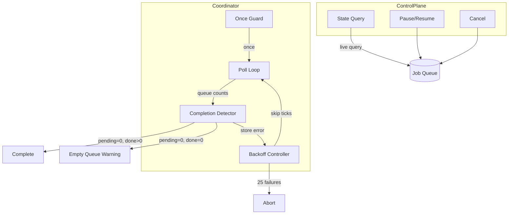
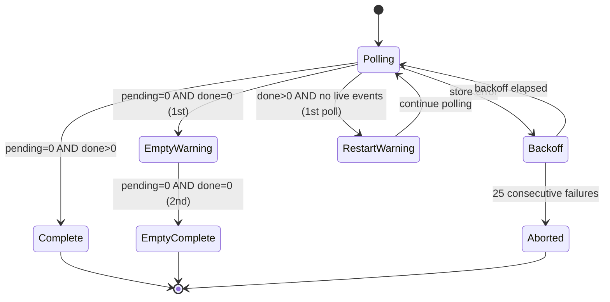
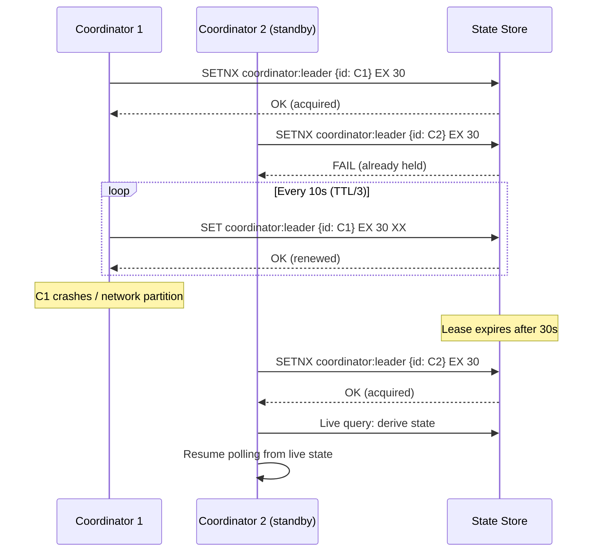
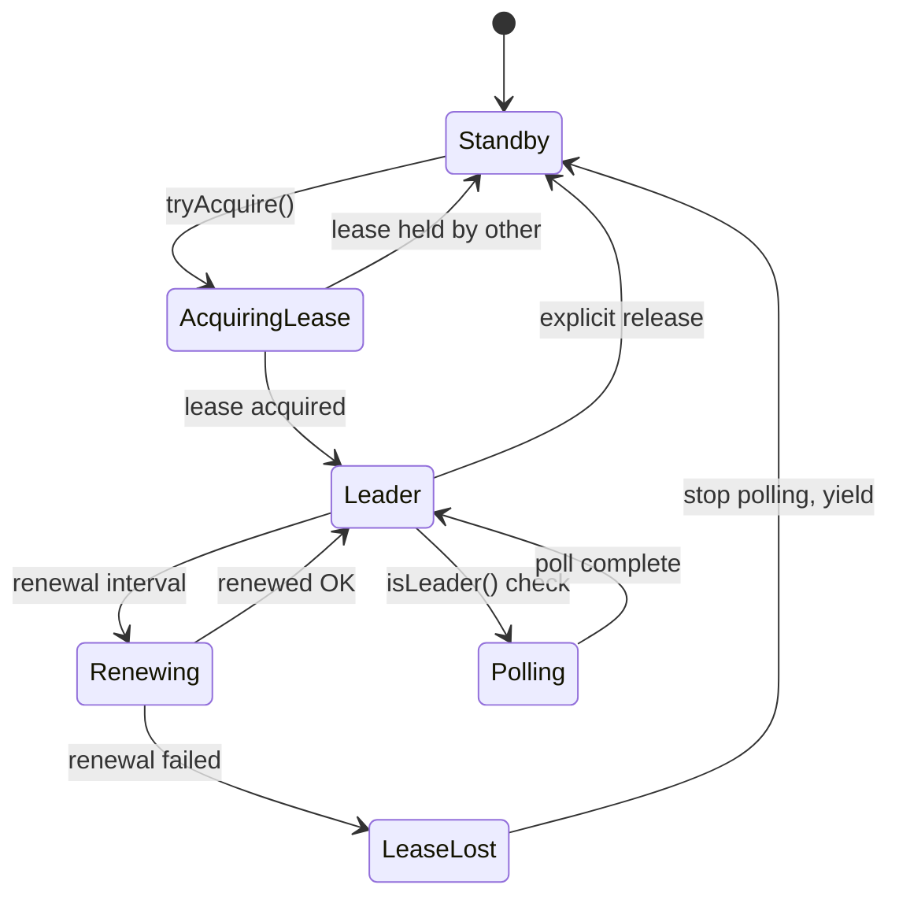

# Completion Detection & Control Plane — Design

> Architecture for crawl completion detection, coordinator lifecycle, and control plane.
> Implements: [requirements.md](requirements.md) | ADRs: [ADR-002](../../adr/ADR-002-job-queue-system.md), [ADR-009](../../adr/ADR-009-resilience-patterns.md)

---

## 1. Coordinator Architecture



## 2. Completion State Machine



## 3. Backoff Strategy

```typescript
interface BackoffController {
  readonly consecutiveFailures: number
  onStoreError(): void           // increment, compute next skip
  onStoreSuccess(): void         // reset to 0
  shouldSkipTick(): boolean      // true if in backoff period
  isAborted(): boolean           // true if failures >= threshold
}
```

- Exponential backoff: skip `2^n` poll ticks (capped at max interval)
- Abort threshold: 25 consecutive failures (~12 minutes at 30s polls)
- Covers: REQ-DIST-015

## 4. Control Plane State Derivation

State is derived from live queue queries, not cached:

```typescript
function deriveState(queueCounts: QueueCounts, isCancelled: boolean): CrawlState {
  if (isCancelled) return 'cancelled'
  if (queueCounts.paused) return 'paused'
  // pending MUST include delayed jobs (RALPH F-001)
  const pending = queueCounts.waiting + queueCounts.active + queueCounts.delayed
  if (pending === 0 && queueCounts.done > 0) return 'completed'
  if (pending === 0 && queueCounts.done === 0) return 'idle'
  return 'running'
}
```

Covers: REQ-DIST-017

## 5. Idempotent Cancel

```typescript
class ControlPlaneAdapter implements ControlPlane {
  private cancelPromise: Promise<void> | null = null
  private cancelResult: Result<void, QueueError> | undefined

  async cancel(): AsyncResult<void, QueueError> {
    // Deduplicate concurrent cancel calls
    if (!this.cancelPromise) {
      this.cancelPromise = this.doCancel()
    }
    await this.cancelPromise
    // RALPH F-002: propagate obliterate error, don't swallow
    return this.cancelResult ?? ok(undefined)
  }
}
```

Covers: REQ-DIST-019

## 6. Design Decisions

| Decision | Choice | Rationale |
| --- | --- | --- |
| Polling interval | Configurable (default: 1s) | Balance responsiveness vs. store load |
| State derivation | Live query, not cached | Fresh state for reliable decisions (REQ-DIST-017) |
| Completion semantics | pending=0 AND done>0 | Accounts for all job states |
| Abort threshold | 25 failures | ~12 min tolerance for transient outages |
| Cancel idempotency | Promise deduplication | Thread-safe convergence (REQ-DIST-019) |
| Cancel error propagation | Propagate Result from obliterate | RALPH F-002: interface contract requires callers can detect failure |
| Once guard | Boolean flag | Prevents overlapping polls (REQ-DIST-016) |
| Poll scheduling | Recursive setTimeout (not setInterval) | RALPH F-003: prevents overlapping ticks under slow network |
| Leader election | Redis SETNX with TTL | Simple, state-store-native HA (REQ-DIST-023) |
| Lease renewal | lease_ttl / 3 interval | Prevents unnecessary failover (REQ-DIST-026) |
| Leader release | get + conditional del (TOCTOU) | RALPH F-004: not atomic — requires future compareAndDelete for full safety |

## 7. Coordinator High Availability

### Leader Election Model



### Election Protocol

```typescript
interface LeaderElection {
  readonly coordinatorId: string
  readonly leaseTtlMs: number        // Default: 30_000ms
  readonly renewIntervalMs: number   // leaseTtlMs / 3

  tryAcquire(): AsyncResult<boolean, QueueError>
  renew(): AsyncResult<boolean, QueueError>
  release(): AsyncResult<void, QueueError>
  isLeader(): boolean
}
```

**Key invariants:**

- **Lease key**: `coordinator:leader` in the state store
- **SETNX semantics**: Only one coordinator acquires; others fail safely
- **Lease auto-expiry**: TTL ensures crashed leaders are eventually replaced
- **Renewal at TTL/3**: Renew at 10s for 30s TTL — allows 2 missed renewals before expiry
- **State re-derivation**: New leader queries live queue state (REQ-DIST-025), never trusts in-memory state from predecessor
- **Fencing**: Coordinator checks `isLeader()` before every poll tick and every control plane command (REQ-DIST-027)

### Failover State Machine



Covers: REQ-DIST-023 to 027

---

> **Provenance**: Created 2026-03-25. Architect Agent design for completion detection per ADR-002/009/020.
