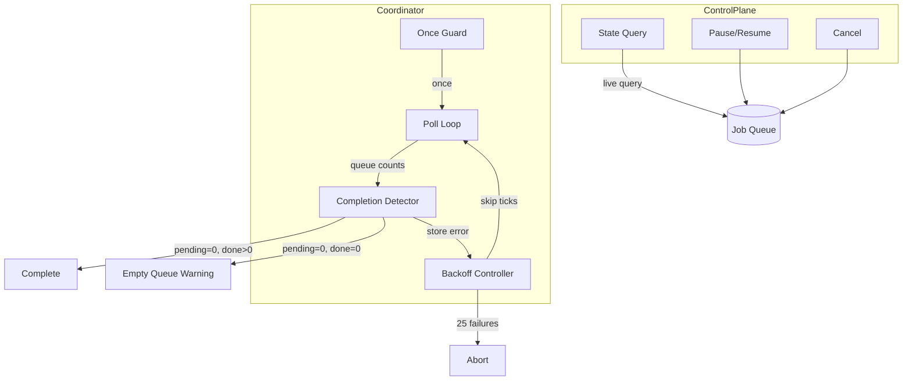
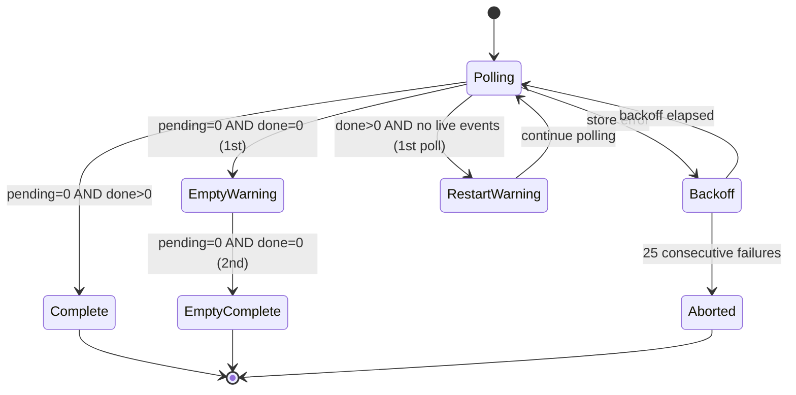

# Completion Detection & Control Plane — Design

> Architecture for crawl completion detection, coordinator lifecycle, and control plane.
> Implements: [requirements.md](requirements.md) | ADRs: [ADR-002](../../adr/ADR-002-job-queue-system.md), [ADR-009](../../adr/ADR-009-resilience-patterns.md)

---

## 1. Coordinator Architecture



## 2. Completion State Machine



## 3. Backoff Strategy

```typescript
interface BackoffController {
  readonly consecutiveFailures: number
  onStoreError(): void           // increment, compute next skip
  onStoreSuccess(): void         // reset to 0
  shouldSkipTick(): boolean      // true if in backoff period
  isAborted(): boolean           // true if failures >= threshold
}
```

- Exponential backoff: skip `2^n` poll ticks (capped at max interval)
- Abort threshold: 25 consecutive failures (~12 minutes at 30s polls)
- Covers: REQ-DIST-015

## 4. Control Plane State Derivation

State is derived from live queue queries, not cached:

```typescript
function deriveState(queueCounts: QueueCounts, isCancelled: boolean): CrawlState {
  if (isCancelled) return 'cancelled'
  if (queueCounts.paused) return 'paused'
  if (queueCounts.pending === 0 && queueCounts.done > 0) return 'completed'
  return 'running'
}
```

Covers: REQ-DIST-017

## 5. Idempotent Cancel

```typescript
class ControlPlaneAdapter implements ControlPlane {
  private cancelPromise: Promise<void> | null = null

  async cancel(): AsyncResult<void, QueueError> {
    // Deduplicate concurrent cancel calls
    if (!this.cancelPromise) {
      this.cancelPromise = this.doCancel()
    }
    await this.cancelPromise
    return ok(undefined)
  }
}
```

Covers: REQ-DIST-019

## 6. Design Decisions

| Decision | Choice | Rationale |
| --- | --- | --- |
| Polling interval | Configurable (default: 1s) | Balance responsiveness vs. store load |
| State derivation | Live query, not cached | Fresh state for reliable decisions (REQ-DIST-017) |
| Completion semantics | pending=0 AND done>0 | Accounts for all job states |
| Abort threshold | 25 failures | ~12 min tolerance for transient outages |
| Cancel idempotency | Promise deduplication | Thread-safe convergence (REQ-DIST-019) |
| Once guard | Boolean flag | Prevents overlapping polls (REQ-DIST-016) |

---

> **Provenance**: Created 2026-03-25. Architect Agent design for completion detection per ADR-002/009/020.
