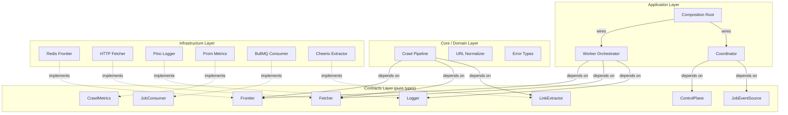
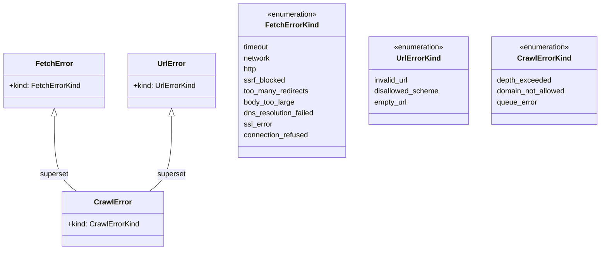
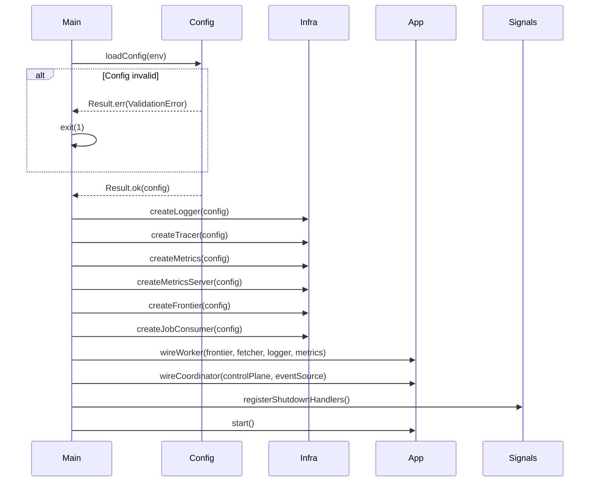

# Core Contracts & Architecture — Design

> Architecture decisions, component interfaces, and data models for the clean architecture foundation.
> Implements: [requirements.md](requirements.md) | ADRs: [ADR-015](../../adr/ADR-015-application-architecture-patterns.md), [ADR-016](../../adr/ADR-016-coding-standards-principles.md)

---

## 1. Layer Architecture



## 2. Contract Interfaces

### Frontier

```typescript
interface Frontier {
  enqueue(entries: FrontierEntry[]): AsyncResult<number, QueueError>
  size(): AsyncResult<FrontierSize, QueueError>
  close(): Promise<void>
}
```

Covers: REQ-ARCH-002, REQ-ARCH-009, REQ-ARCH-010

### Fetcher

```typescript
interface Fetcher {
  fetch(url: CrawlUrl, config: FetchConfig): AsyncResult<FetchResult, FetchError>
}
```

Covers: REQ-ARCH-002, REQ-ARCH-010

### Logger

```typescript
interface Logger {
  debug(msg: string, bindings?: Record<string, unknown>): void
  info(msg: string, bindings?: Record<string, unknown>): void
  warn(msg: string, bindings?: Record<string, unknown>): void
  error(msg: string, bindings?: Record<string, unknown>): void
  fatal(msg: string, bindings?: Record<string, unknown>): void
  child(bindings: Record<string, unknown>): Logger
}
```

Covers: REQ-ARCH-002, REQ-ARCH-010

### CrawlMetrics

```typescript
interface CrawlMetrics {
  recordFetch(status: string, errorKind?: string): void
  recordFetchDuration(seconds: number): void
  recordUrlsDiscovered(count: number): void
  setFrontierSize(size: number): void
  setStalledJobs(count: number): void
  setActiveJobs(count: number): void
  setWorkerUtilization(ratio: number): void
  incrementCoordinatorRestarts(): void
}
```

Covers: REQ-ARCH-002, REQ-ARCH-010

### JobConsumer

```typescript
interface JobConsumer {
  start(): Promise<void>
  close(timeout?: number): Promise<void>
}
```

Covers: REQ-ARCH-002, REQ-ARCH-009

### JobEventSource

```typescript
interface JobEventSource {
  onCompleted(handler: (jobId: string) => void): void
  onFailed(handler: (jobId: string, error: unknown) => void): void
  onStalled(handler: (jobId: string) => void): void
  close(): Promise<void>
}
```

Covers: REQ-ARCH-002, REQ-ARCH-009

### LinkExtractor

```typescript
interface LinkExtractor {
  extract(html: string, baseUrl: string): string[]
}
```

Covers: REQ-ARCH-002, REQ-ARCH-010 (synchronous — CPU-bound)

### ControlPlane

```typescript
interface ControlPlane {
  getState(): AsyncResult<CrawlState, QueueError>
  pause(): AsyncResult<void, QueueError>
  resume(): AsyncResult<void, QueueError>
  cancel(): AsyncResult<void, QueueError>
  getProgress(): AsyncResult<CrawlProgress, QueueError>
  close(): Promise<void>
}
```

Covers: REQ-ARCH-002, REQ-ARCH-009

## 3. Error Type Taxonomy



Covers: REQ-ARCH-012, REQ-ARCH-013

## 4. Composition Root Sequence



Covers: REQ-ARCH-006

## 5. Design Decisions

| Decision | Choice | Rationale |
| --- | --- | --- |
| Error channel | `neverthrow` `Result<T, E>` | ADR-016 mandates; composable, type-safe |
| Contract enforcement | Static analysis (eslint + import rules) | ADR-018 guard function chain |
| Cleanup pattern | `using` keyword (TC39 `Symbol.dispose`) | AGENTS.md SHOULD rule #8 |
| Configuration | Zod schema-first validation | ADR-013, REQ-ARCH-014 |
| Dependency injection | Constructor injection via composition root | No DI container overhead for this scale |
| Singleton guard | Module-level boolean + throw | REQ-ARCH-016; prevents double-wiring |

## 7. Singleton Composition Root Guard

```typescript
// Enforces exactly-once instantiation
let initialized = false

function createCompositionRoot(env: ProcessEnv): CompositionRoot {
  if (initialized) {
    throw new Error('Composition root already initialized — singleton violation')
  }
  initialized = true

  const disposables: Array<{ name: string; close: () => Promise<void> }> = []

  try {
    const config = loadConfig(env).match(
      (c) => c,
      (e) => { throw new StartupError('Config validation failed', e) }
    )

    const logger = createLogger(config)
    disposables.push({ name: 'logger', close: () => Promise.resolve() })

    const tracer = startTracer(config)
    disposables.push({ name: 'tracer', close: () => tracer.shutdown() })

    // ... continue initialization, pushing each to disposables

    return { config, logger, tracer, /* ... */ shutdown: () => cleanupAll(disposables) }
  } catch (error) {
    // Cleanup already-initialized resources in reverse order (REQ-ARCH-017)
    await cleanupReverse(disposables)
    throw error
  }
}

async function cleanupReverse(
  disposables: Array<{ name: string; close: () => Promise<void> }>
): Promise<void> {
  for (const d of disposables.reverse()) {
    try { await d.close() } catch (e) { /* log cleanup error */ }
  }
}
```

Covers: REQ-ARCH-016, REQ-ARCH-017, REQ-ARCH-018

## 8. Disposable Interface

```typescript
interface Disposable {
  close(): Promise<void>
}

// Contracts that hold resources implement Disposable
interface Frontier extends Disposable {
  enqueue(entries: FrontierEntry[]): AsyncResult<number, QueueError>
  size(): AsyncResult<FrontierSize, QueueError>
}
```

Covers: REQ-ARCH-018

## 6. Package Mapping

| Contract | Package | Rationale |
| --- | --- | --- |
| All contract types | `packages/core/src/contracts/` | Central type authority |
| Error types | `packages/core/src/errors/` | Shared error taxonomy |
| URL types | `packages/core/src/domain/` | Domain value objects |
| Configuration schema | `packages/config/src/` | ADR-013 |
| Static analysis rules | `packages/eslint-config/` | ADR boundary enforcement |

---

## G8 Review Council Findings (sustained)

| Finding | Severity | Affects | Design Change |
| --- | --- | --- | --- |
| AR-6 | Minor | §6 Package Mapping | Package export entries deduplicated, missing entries added |
| S-1/P4 | Major | §4 Composition Root | `resetCompositionRoot()` annotated `@internal`; `toSafeLog()` + `SENSITIVE_FIELDS` added to config (T-ARCH-032) |
| AC-1/P4 | Minor | §5 Disposable | `DisposableEntry` extends `Disposable` interface |
| AR-2/P4 | Major | §4 Composition Root | `createCompositionRoot` made async; cleanup awaited (not fire-and-forget) |
| S-2 | Minor | §3 Error Handling | `stripUrlCredentials()` integrated in all error constructors (T-ARCH-033) |
| P-1/P6 | Minor | §3 Static Analysis | ESLint integration test results cached per-package |

---

> **Provenance**: Created 2026-03-25. Architect Agent design for core contracts per ADR-015/016/020. Updated 2026-03-26: incorporated G8 sustained findings (living specs per AGENTS.md SHOULD #15).
