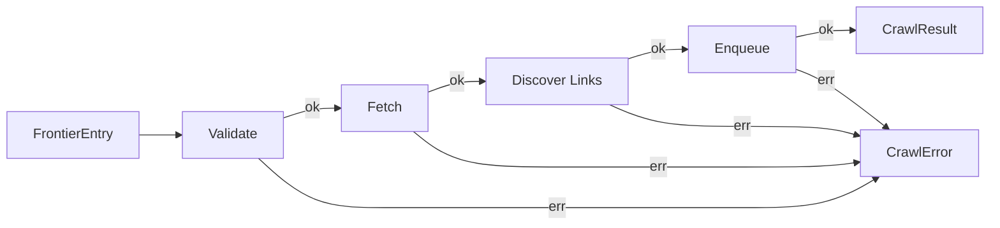
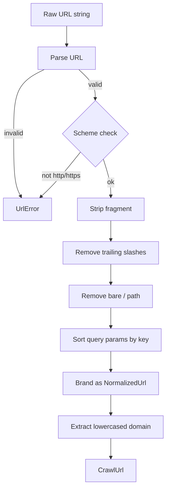

# Crawl Pipeline — Design

> Architecture, interfaces, and data flow for the core crawl pipeline.
> Implements: [requirements.md](requirements.md) | ADRs: [ADR-008](../../adr/ADR-008-http-parsing-stack.md), [ADR-015](../../adr/ADR-015-application-architecture-patterns.md)

---

## 1. Pipeline Architecture



Each stage is a pure function with injected dependencies returning `Result<StageOutput, CrawlError>`. Pipeline composition uses monadic chaining (`andThen`/`flatMap`).

## 2. Data Types

```typescript
// Branded newtype — compile-time safety against raw/normalized interchange
type NormalizedUrl = string & { readonly __brand: 'NormalizedUrl' }

interface CrawlUrl {
  readonly raw: string
  readonly normalized: NormalizedUrl
  readonly domain: string
}

interface FrontierEntry {
  readonly url: CrawlUrl
  readonly depth: number
  readonly discoveredBy: string
  readonly discoveredAt: number   // epoch ms
  readonly parentUrl: NormalizedUrl | null
}

interface FetchResult {
  readonly requestedUrl: CrawlUrl
  readonly finalUrl: CrawlUrl | null
  readonly statusCode: number
  readonly contentType: string | null
  readonly body: string
  readonly fetchTimestamp: number
  readonly fetchDurationMs: number
}

interface CrawlResult {
  readonly fetchResult: FetchResult
  readonly discoveredUrls: readonly CrawlUrl[]
  readonly enqueuedCount: number
}
```

## 3. Stage Signatures

```typescript
// Stage 1: Validate
type ValidateStage = (
  entry: FrontierEntry,
  config: { maxDepth: number; allowedDomains: string[] | null }
) => Result<FrontierEntry, CrawlError>

// Stage 2: Fetch
type FetchStage = (
  entry: FrontierEntry,
  fetcher: Fetcher,
  logger: Logger
) => AsyncResult<FetchResult, CrawlError>

// Stage 3: Discover Links
type DiscoverStage = (
  fetchResult: FetchResult,
  extractor: LinkExtractor,
  entry: FrontierEntry
) => Result<CrawlUrl[], CrawlError>

// Stage 4: Enqueue
type EnqueueStage = (
  urls: CrawlUrl[],
  parentEntry: FrontierEntry,
  frontier: Frontier,
  workerId: string
) => AsyncResult<number, CrawlError>
```

## 4. URL Normalization Rules



| Rule | Input | Output |
| --- | --- | --- |
| Strip fragment | `https://x.com/p#s` | `https://x.com/p` |
| Keep www | `https://www.x.com` | `https://www.x.com` |
| Strip trailing / | `https://x.com/p/` | `https://x.com/p` |
| Remove bare path | `https://x.com/` | `https://x.com` |
| Sort params | `https://x.com?b=2&a=1` | `https://x.com?a=1&b=2` |
| Keep index files | `https://x.com/index.html` | `https://x.com/index.html` |

## 5. Link Discovery

The discover stage:

1. Checks `contentType` — only `text/html` triggers extraction (REQ-CRAWL-009)
2. Calls `LinkExtractor.extract(body, finalUrl ?? requestedUrl)` to get raw hrefs
3. Resolves relative URLs against the final URL (REQ-CRAWL-010)
4. Normalizes each URL via the CrawlUrl factory
5. Silently skips invalid/disallowed-scheme URLs (REQ-CRAWL-012)
6. Deduplicates by normalized form (REQ-CRAWL-011)
7. Returns the unique `CrawlUrl[]`

## 6. Design Decisions

| Decision | Choice | Rationale |
| --- | --- | --- |
| Pipeline composition | Monadic `Result.andThen()` chaining | ADR-016 neverthrow; short-circuit on error |
| URL branding | Newtype/branded string | Compile-time safety; prevents raw/norm interchange |
| Stage injection | Function parameters (not classes) | ADR-016 FOOP; pure functions with thin wrappers |
| Link extractor | Synchronous interface | CPU-bound; no I/O (REQ-ARCH-010) |
| Deduplication scope | Per-page before enqueue | Frontier handles global dedup (REQ-DIST-001) |

---

> **Provenance**: Created 2026-03-25. Architect Agent design for crawl pipeline per ADR-008/015/020.
