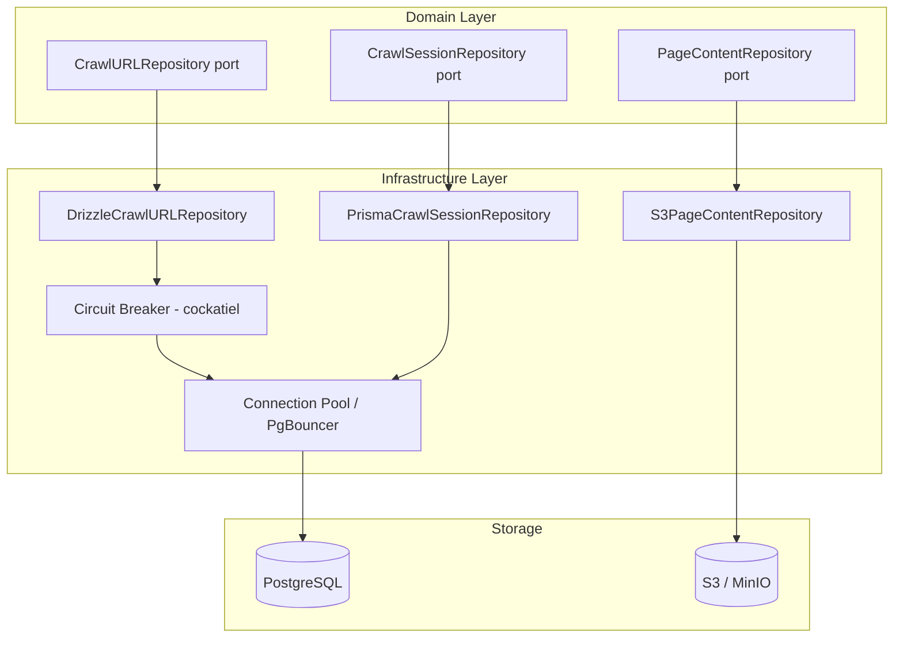

# Data Layer — Design

> Architecture, interfaces, data models, and Mermaid diagrams for the data layer.
> Requirements: [requirements.md](requirements.md) | ADR: [ADR-010](../../adr/ADR-010-data-layer.md)

---

## Architecture Overview



## Package Structure

```text
packages/database/
  prisma/
    schema.prisma          # Single source of truth for DB schema
    migrations/            # Prisma migration history
  src/
    generated/             # Prisma-generated client (gitignored)
    schema/
      crawl-urls.ts        # Drizzle schema definition
      crawl-links.ts       # Drizzle schema definition
      crawl-sessions.ts    # Drizzle schema definition
    repositories/
      crawl-url-repository.ts      # DrizzleCrawlURLRepository
      page-content-repository.ts   # S3PageContentRepository
      crawl-session-repository.ts  # PrismaCrawlSessionRepository
    connection/
      pool.ts              # PostgreSQL connection pool
      s3-client.ts         # S3/MinIO client factory
      circuit-breaker.ts   # DB circuit breaker (cockatiel)
    errors.ts              # DataError discriminated union
    types.ts               # Exported types (re-exports from generated)
  package.json
  tsconfig.json
```

## Interface Contracts

### CrawlURLRepository

```typescript
import { Result } from 'neverthrow';
import { DataError } from './errors';

interface CrawlURLRepository {
  findById(id: bigint): Promise<Result<CrawlURL | undefined, DataError>>;
  findByHash(hash: Buffer): Promise<Result<CrawlURL | undefined, DataError>>;
  save(url: NewCrawlURL): Promise<Result<CrawlURL, DataError>>;
  saveBatch(urls: NewCrawlURL[]): Promise<Result<number, DataError>>;
  findPendingByDomain(domain: string, limit: number): Promise<Result<CrawlURL[], DataError>>;
  updateStatus(id: bigint, status: CrawlStatus, result?: FetchResult): Promise<Result<void, DataError>>;
}
```

### PageContentRepository

```typescript
interface PageContentRepository {
  store(key: PageKey, content: Buffer, metadata: FetchMetadata): Promise<Result<void, DataError>>;
  retrieve(key: PageKey): Promise<Result<Buffer, DataError>>;
  delete(key: PageKey): Promise<Result<void, DataError>>;
}

type PageKey = {
  sessionId: string;
  domain: string;
  urlHash: string;
};
```

### CrawlSessionRepository

```typescript
interface CrawlSessionRepository {
  create(config: CrawlConfig): Promise<Result<CrawlSession, DataError>>;
  findById(id: bigint): Promise<Result<CrawlSession | undefined, DataError>>;
  updateStatus(id: bigint, status: SessionStatus): Promise<Result<void, DataError>>;
}
```

## Error Types

```typescript
// Uses _tag discriminant per AGENTS.md convention (packages/core/ uses 'kind' — legacy)
// Each variant includes a human-readable 'message' field for logging
type DataError =
  | { _tag: 'ConnectionFailed'; cause: unknown; message: string }
  | { _tag: 'QueryFailed'; query: string; cause: unknown; message: string }
  | { _tag: 'NotFound'; entity: string; id: string; message: string }
  | { _tag: 'DuplicateKey'; constraint: string; message: string }
  | { _tag: 'CircuitOpen'; service: string; message: string }
  | { _tag: 'Timeout'; operation: string; ms: number; message: string }
  | { _tag: 'S3Error'; operation: string; cause: unknown; message: string };
```

> **Implementation notes**:
> - Repository interfaces (ports) temporarily live in `packages/database/` — extract to `packages/core/src/ports/` when implementations are added
> - `PageContentRepository` uses `Uint8Array` (not `Buffer`) for portability — `Buffer extends Uint8Array`
> - Entity IDs use `bigint` matching PostgreSQL BIGINT — convert to string at API boundaries (not JSON-serializable)

## Schema Design

### Prisma Schema

```prisma
datasource db {
  provider = "postgresql"
  url      = env("DATABASE_URL")
}

generator client {
  provider = "prisma-client-js"
  output   = "../src/generated"
}

model CrawlUrl {
  id          BigInt     @id @default(autoincrement())
  url         String
  urlHash     Bytes      @unique
  domain      String
  status      String     @default("pending")
  statusCode  Int?
  contentType String?
  s3Key       String?
  depth       Int        @default(0)
  discoveredAt DateTime  @default(now())
  fetchedAt   DateTime?
  parentUrlId BigInt?
  metadata    Json       @default("{}")
  createdAt   DateTime   @default(now())
  updatedAt   DateTime   @updatedAt

  parent      CrawlUrl?  @relation("ParentChild", fields: [parentUrlId], references: [id])
  children    CrawlUrl[] @relation("ParentChild")
  outLinks    CrawlLink[] @relation("SourceLinks")
  inLinks     CrawlLink[] @relation("TargetLinks")

  @@index([domain])
  @@index([status])
  @@map("crawl_urls")
}

model CrawlLink {
  sourceUrlId BigInt
  targetUrlId BigInt
  anchorText  String?
  createdAt   DateTime @default(now())

  source CrawlUrl @relation("SourceLinks", fields: [sourceUrlId], references: [id])
  target CrawlUrl @relation("TargetLinks", fields: [targetUrlId], references: [id])

  @@id([sourceUrlId, targetUrlId])
  @@map("crawl_links")
}

model CrawlSession {
  id        BigInt   @id @default(autoincrement())
  name      String
  config    Json
  status    String   @default("active")
  startedAt DateTime @default(now())
  endedAt   DateTime?

  @@map("crawl_sessions")
}
```

### Drizzle Schema (for complex queries)

```typescript
import { pgTable, bigint, text, timestamp, jsonb, index, uniqueIndex } from 'drizzle-orm/pg-core';

export const crawlUrls = pgTable('crawl_urls', {
  id: bigint('id', { mode: 'bigint' }).primaryKey().generatedAlwaysAsIdentity(),
  url: text('url').notNull(),
  urlHash: text('url_hash').notNull(),
  domain: text('domain').notNull(),
  status: text('status').notNull().default('pending'),
  // ... remaining columns
}, (table) => ({
  hashIdx: uniqueIndex('idx_urls_hash').on(table.urlHash),
  domainIdx: index('idx_urls_domain').on(table.domain),
  statusIdx: index('idx_urls_status').on(table.status),
}));
```

## Connection Pool Configuration

```typescript
const POOL_CONFIG = {
  min: 2,
  max: 20,
  idleTimeoutMs: 30_000,
  connectionTimeoutMs: 5_000,
  statementTimeoutMs: 10_000,
} as const;
```

## S3 Object Layout

```text
bucket: ipf-crawl-pages
├── {session_id}/
│   ├── {domain}/
│   │   ├── {url_hash}.html.zst    # Zstandard-compressed raw HTML
│   │   └── {url_hash}.meta.json   # Fetch metadata (headers, timing)
```

## Integration Test Strategy

All data layer tests use Testcontainers — never mock PostgreSQL or S3:

- PostgreSQL: `GenericContainer('postgres:16-alpine')`
- MinIO: `GenericContainer('minio/minio:latest')`
- Tests verify: CRUD operations, batch inserts, dedup constraints, S3 round-trips, circuit breaker behavior, connection pool lifecycle

## Dependencies & Out-of-Scope

- **Redis cache layer**: ADR-010 references Redis for read caching in repository implementations. Redis client setup (`packages/redis/`) is out-of-scope for this spec — to be covered by a dedicated redis/caching spec. Repository implementations may accept a cache parameter but this spec covers PostgreSQL + S3 only.
- **Backup/restore**: WAL-G backup strategy deferred to infrastructure spec.

---

> **Provenance**: Created 2026-03-29 per ADR-020. Source: ADR-010, ADR-015. Updated 2026-03-29: added Dependencies section per RALPH AR-1 finding.
