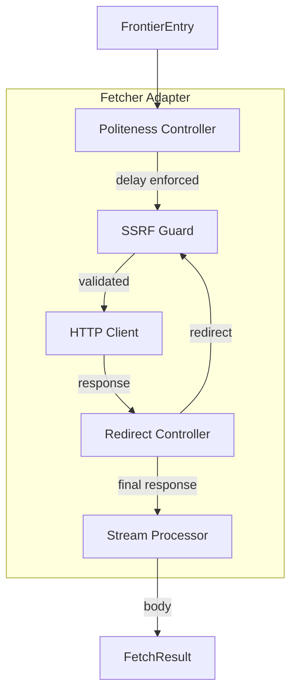
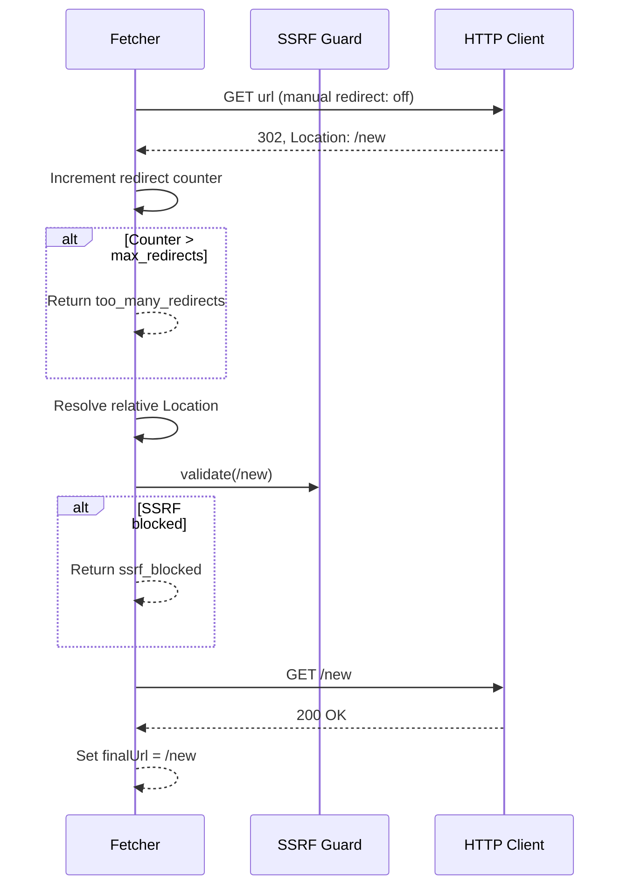
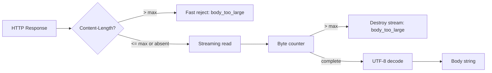

# HTTP Fetching — Design

> Architecture for HTTP client, redirect handling, politeness enforcement, and response processing.
> Implements: [requirements.md](requirements.md) | ADRs: [ADR-008](../../adr/ADR-008-http-parsing-stack.md), [ADR-009](../../adr/ADR-009-resilience-patterns.md)

---

## 1. Fetcher Architecture



## 2. Politeness Controller (Concurrency-Safe)

```typescript
interface PolitenessController {
  /** Waits for the per-domain delay, then allows execution */
  acquire(domain: string): Promise<void>
  /** Releases the domain slot (success or failure) */
  release(domain: string): void
}
```

Internal state:

- `Map<string, Promise<void>>` — domain → promise chain (NOT timestamp comparison)
- LRU eviction when map size exceeds `MAX_DOMAINS` (default: 10,000)
- First request to a domain proceeds immediately (REQ-FETCH-010)
- Failed fetches call `release()` to preserve the chain (REQ-FETCH-011)
- Background pruning of stale entries older than `STALE_THRESHOLD` (REQ-FETCH-012)

**Concurrency safety** (REQ-FETCH-020): Each domain has a promise chain. New requests chain onto the previous promise with a delay, ensuring serialization without race conditions:

```typescript
// Promise-chain approach — eliminates timestamp comparison race
class PromiseChainPoliteness implements PolitenessController {
  private chains = new Map<string, Promise<void>>()

  async acquire(domain: string): Promise<void> {
    const registrableDomain = getRegistrableDomain(domain) // TLD+1
    const prev = this.chains.get(registrableDomain) ?? Promise.resolve()
    const next = prev.then(() => delay(this.delayMs))
    this.chains.set(registrableDomain, next)
    await next
  }
}
```

**Domain definition** (REQ-FETCH-021): Domain = TLD+1 via public suffix list. `api.example.com` and `www.example.com` share the same slot.

## 3. Redirect Controller



Key decisions:

- Disable automatic redirects in the HTTP client; handle manually for SSRF + counting
- Cumulative timeout via `AbortSignal.timeout()` wrapping the entire chain
- Relative `Location` resolved against current URL at each hop (REQ-FETCH-005)
- 3xx without `Location` → HTTP error (REQ-FETCH-006)

## 4. Stream Processor



- Pre-flight `Content-Length` check (REQ-FETCH-015)
- Streaming byte counter with stream destruction (REQ-FETCH-014)
- UTF-8 decoding (REQ-FETCH-016)
- Non-2xx/redirect bodies discarded to free connections (REQ-FETCH-017)

## 5. Error Classification Map

| Error Condition | FetchError Kind | Detection |
| --- | --- | --- |
| AbortSignal timeout | `timeout` | AbortError type |
| Socket/network failure | `network` | Generic error fallback |
| Non-2xx status (non-redirect) | `http` | Status code check |
| SSRF blocked | `ssrf_blocked` | SSRF guard return |
| Redirect limit exceeded | `too_many_redirects` | Counter check |
| Body over limit | `body_too_large` | Byte counter |
| DNS lookup failure | `dns_resolution_failed` | DNS error code |
| SSL/TLS failure | `ssl_error` | Error code pattern |
| TCP connection refused | `connection_refused` | ECONNREFUSED code |

## 6. Design Decisions

| Decision | Choice | Rationale |
| --- | --- | --- |
| HTTP client | undici (ADR-008) | High performance, non-blocking, HTTP/1.1+2 |
| Redirect handling | Manual loop | SSRF validation per hop; counter control |
| Politeness data structure | Promise-chain Map | Concurrency-safe; eliminates timestamp race (REQ-FETCH-020) |
| Domain definition | TLD+1 via public suffix list | REQ-FETCH-021; subdomains share slot |
| Timeout strategy | Cumulative `AbortSignal` | Covers entire redirect chain (REQ-SEC-010) |
| Body streaming | Transform stream with byte counter | Constant memory; early abort |
| DNS pinning | Use SSRF guard's pinnedIp | Eliminates TOCTOU (REQ-FETCH-023, REQ-SEC-018) |
| Stream drain errors | Catch + log, continue redirect | REQ-FETCH-024; prevents unhandled exceptions |

## 7. Fetcher Metrics

The Fetcher records metrics via the `CrawlMetrics` contract:

| Metric | Type | When Recorded | Covers |
| --- | --- | --- | --- |
| `fetches_total{status, error_kind}` | Counter | Every fetch (success and error) | REQ-FETCH-022 |
| `fetch_duration_seconds` | Histogram | Every fetch (wall-clock duration) | REQ-FETCH-019, REQ-FETCH-022 |
| `redirects_followed_total` | Counter | Each redirect hop followed | REQ-FETCH-022 |
| `body_bytes_received_total` | Counter | Each successful body stream | REQ-FETCH-022 |

## 8. Pinned IP Integration

The Fetcher integrates with the SSRF guard's DNS pinning result (REQ-SEC-018):

```typescript
// Fetch flow with pinned IP
async function fetchWithPinnedIp(
  url: CrawlUrl,
  ssrfResult: SsrfValidationResult,
  config: FetchConfig,
): AsyncResult<FetchResult, FetchError> {
  // Use pinnedIp for the actual connection
  const targetUrl = new URL(url.normalized)
  if (ssrfResult.pinnedIp) {
    targetUrl.hostname = ssrfResult.pinnedIp
  }
  return httpClient.request(targetUrl.toString(), {
    headers: { Host: ssrfResult.originalHost },
    signal: AbortSignal.timeout(config.timeoutMs),
  })
}
```

This eliminates the TOCTOU window: DNS resolved once in SSRF guard, IP pinned for connection.

---

> **Provenance**: Created 2026-03-25. Architect Agent design for HTTP fetching per ADR-008/009/020.
