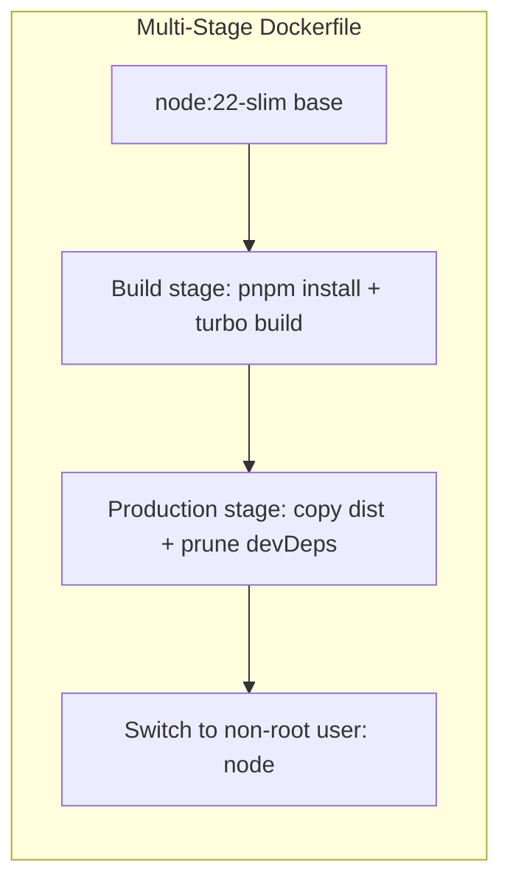
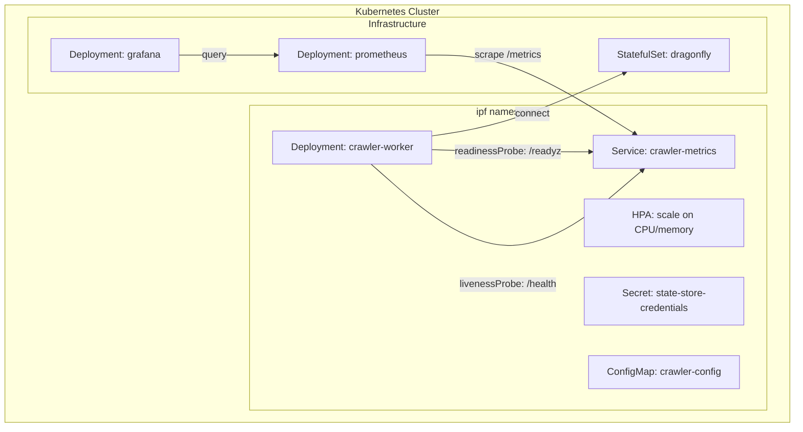

# Infrastructure — Design

> Architecture for container builds, orchestration manifests, state store, monitoring, and local dev.
> Implements: [requirements.md](requirements.md) | ADRs: [ADR-003](../../adr/ADR-003-infrastructure-as-code.md), [ADR-004](../../adr/ADR-004-gitops-deployment.md), [ADR-005](../../adr/ADR-005-local-kubernetes.md)

---

## 1. Container Build



```dockerfile
# Stage 1: Build
FROM node:22-slim AS build
WORKDIR /app
COPY pnpm-lock.yaml package.json ./
RUN corepack enable && pnpm install --frozen-lockfile
COPY . .
RUN pnpm turbo build --filter=worker-service

# Stage 2: Production
FROM node:22-slim
RUN corepack enable
WORKDIR /app
COPY --from=build /app/dist ./dist
COPY --from=build /app/node_modules ./node_modules
COPY --from=build /app/package.json ./
USER node
EXPOSE 9090
CMD ["node", "dist/main.js"]
```

Covers: REQ-INFRA-001 (multi-stage), REQ-INFRA-002 (non-root), REQ-INFRA-003 (`.dockerignore`)

## 2. Orchestration Layout



Probe configuration:

```yaml
livenessProbe:
  httpGet:
    path: /health
    port: metrics
  initialDelaySeconds: 10
  periodSeconds: 15

readinessProbe:
  httpGet:
    path: /readyz
    port: metrics
  initialDelaySeconds: 5
  periodSeconds: 10
```

Covers: REQ-INFRA-004 to 008

## 3. State Store Configuration

```yaml
# Dragonfly StatefulSet (excerpt)
containers:
  - name: dragonfly
    image: docker.dragonflydb.io/dragonflydb/dragonfly:latest
    args: ["--appendonly", "yes"]
    ports:
      - containerPort: 6379
    volumeMounts:
      - name: data
        mountPath: /data
    livenessProbe:
      exec:
        command: ["redis-cli", "ping"]
      periodSeconds: 10

volumeClaimTemplates:
  - metadata:
      name: data
    spec:
      accessModes: ["ReadWriteOnce"]
      resources:
        requests:
          storage: 5Gi
```

Covers: REQ-INFRA-009 (persistence), REQ-INFRA-010 (health), REQ-INFRA-011 (connection params)

## 4. Monitoring Stack

| Component | Image | Purpose |
| --- | --- | --- |
| Prometheus | `prom/prometheus:v2.50` | Metrics collection + alert evaluation |
| Grafana | `grafana/grafana:10` | Dashboard visualization |
| Alertmanager | `prom/alertmanager:v0.27` (future) | Alert routing |

Prometheus scrape config:

```yaml
scrape_configs:
  - job_name: 'crawler'
    kubernetes_sd_configs:
      - role: pod
        namespaces:
          names: ['ipf']
    relabel_configs:
      - source_labels: [__meta_kubernetes_pod_label_app]
        regex: crawler-worker
        action: keep
      - source_labels: [__meta_kubernetes_pod_annotation_prometheus_io_port]
        target_label: __address__
        replacement: '${1}:${2}'
```

Covers: REQ-INFRA-012 to 014

## 5. Local Development (docker-compose.dev.yml)

```yaml
services:
  crawler:
    build:
      context: .
      dockerfile: infra/docker/Dockerfile
    environment:
      STATE_STORE_URL: redis://dragonfly:6379
      METRICS_PORT: "9090"
      SEED_URLS: "https://example.com"
      MAX_DEPTH: "3"
      MAX_CONCURRENT_FETCHES: "5"
      FETCH_TIMEOUT_MS: "10000"
      POLITENESS_DELAY_MS: "1000"
      MAX_RETRIES: "3"
    ports:
      - "9090:9090"
    depends_on:
      dragonfly:
        condition: service_healthy

  dragonfly:
    image: docker.dragonflydb.io/dragonflydb/dragonfly:latest
    command: ["--appendonly", "yes"]
    ports:
      - "6379:6379"
    volumes:
      - dragonfly-data:/data
    healthcheck:
      test: ["CMD", "redis-cli", "ping"]
      interval: 5s
      timeout: 3s
      retries: 5

  prometheus:
    image: prom/prometheus:v2.50
    volumes:
      - ./infra/monitoring/prometheus.yml:/etc/prometheus/prometheus.yml
      - ./infra/monitoring/alert-rules.yml:/etc/prometheus/alert-rules.yml
    ports:
      - "9091:9090"

  grafana:
    image: grafana/grafana:10
    volumes:
      - ./infra/monitoring/dashboards:/var/lib/grafana/dashboards
      - ./infra/monitoring/provisioning:/etc/grafana/provisioning
    ports:
      - "3000:3000"

volumes:
  dragonfly-data:
```

Covers: REQ-INFRA-017, REQ-INFRA-019

## 6. Design Decisions

| Decision | Choice | Rationale |
| --- | --- | --- |
| Container runtime | node:22-slim | Minimal image, LTS, pnpm support |
| State store | Dragonfly (Redis-compatible) | ADR-002, better multi-threaded perf |
| IaC | Pulumi (TypeScript) | ADR-003, type-safe infrastructure |
| K8s manifests | Kustomize overlays | ADR-004, GitOps-friendly |
| Local dev | docker compose | ADR-005, single-command reproducibility |
| Probe endpoints | Reuse metrics server | No extra HTTP servers needed |

---

> **Provenance**: Created 2026-03-25. DevOps Agent design for infrastructure per ADR-003/004/005/020.
