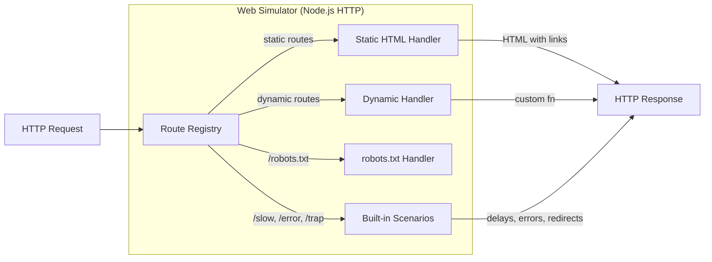

# K8s E2E Testing — Web Simulator Design

> Detailed architecture for the web simulator (mock internet) component.
> Part of: [design.md](design.md) | Implements: [requirements.md](requirements.md) REQ-K8E-010–016

---

## 1. Architecture



## 2. Interfaces

```typescript
/** Route definition for the web simulator */
type SimulatorRoute = {
  readonly path: string;
  readonly handler: RouteHandler;
};

type RouteHandler = (
  req: SimulatorRequest,
) => SimulatorResponse | Promise<SimulatorResponse>;

type SimulatorRequest = {
  readonly url: string;
  readonly method: string;
  readonly headers: Record<string, string | undefined>;
};

type SimulatorResponse = {
  readonly status: number;
  readonly headers?: Record<string, string>;
  readonly body: string;
  readonly delay?: number; // ms before responding
};

/** Declarative site graph definition */
type SiteGraph = {
  readonly pages: ReadonlyArray<PageDefinition>;
  readonly robotsTxt?: string;
};

type PageDefinition = {
  readonly path: string;
  readonly title: string;
  readonly links: ReadonlyArray<string>;
  readonly body?: string;
};

type WebSimulatorConfig = {
  readonly port?: number; // 0 = random
  readonly host?: string; // default: '0.0.0.0'
};

type WebSimulatorInstance = {
  readonly url: string;
  readonly port: number;
  readonly close: () => Promise<void>;
};

/** Factory functions */
function createWebSimulator(
  config: WebSimulatorConfig,
  routes: ReadonlyArray<SimulatorRoute>,
): Promise<WebSimulatorInstance>;

function createSiteGraphSimulator(
  config: WebSimulatorConfig,
  graph: SiteGraph,
): Promise<WebSimulatorInstance>;
```

## 3. Built-in Scenarios

| Scenario | Path | Behavior | Requirement |
| --- | --- | --- | --- |
| Slow response | `/slow?ms=N` | Delays N ms before 200 | REQ-K8E-013 |
| HTTP error | `/error?code=N` | Returns status code N | REQ-K8E-013 |
| Connection reset | `/reset` | Destroys socket immediately | REQ-K8E-013 |
| Redirect chain | `/redirect?hops=N` | N redirects before final 200 | REQ-K8E-013 |
| Link trap | `/trap?depth=N` | Page links to depth N+1 | REQ-K8E-013 |
| robots.txt | `/robots.txt` | Configurable disallow rules | REQ-K8E-014 |
| SSRF bait | `/ssrf-links` | Links to reserved IPs | REQ-K8E-019 |
| Robots.txt block | `/robots-block.txt` | Disallow specific paths | REQ-K8E-038 |
| Rate limit | `/rate-limit` | 429 + Retry-After header | REQ-K8E-034 |
| Mixed links | `/mixed-links` | Relative, absolute, fragment, mailto | REQ-K8E-037 |

## 4. Deployment Modes

**In-process** (integration tests):

```typescript
const sim = await createSiteGraphSimulator({ port: 0 }, {
  pages: [
    { path: '/', title: 'Home', links: ['/about', '/blog'] },
    { path: '/about', title: 'About', links: ['/'] },
    { path: '/blog', title: 'Blog', links: ['/'] },
  ],
});
// sim.url === 'http://localhost:<random>'
```

**K8s Pod** (E2E tests):

```yaml
apiVersion: v1
kind: Pod
metadata:
  name: web-simulator
  namespace: ipf-test
  labels:
    app: web-simulator
spec:
  containers:
    - name: simulator
      image: k3d-ipf-registry.localhost:5111/ipf-web-simulator:latest
      ports:
        - containerPort: 8080
      env:
        - name: SIMULATOR_PORT
          value: "8080"
```

## 5. HTML Generation

Site graph pages produce minimal valid HTML:

```html
<!DOCTYPE html>
<html>
<head><title>{title}</title></head>
<body>
  <h1>{title}</h1>
  {body}
  <nav>
    <a href="{link1}">{link1}</a>
    <a href="{link2}">{link2}</a>
  </nav>
</body>
</html>
```

Links use relative paths. The simulator resolves them against its own base URL so crawlers discover full URLs.

---

> **Provenance**: Created 2025-07-21. Split from design.md for 300-line limit compliance.
