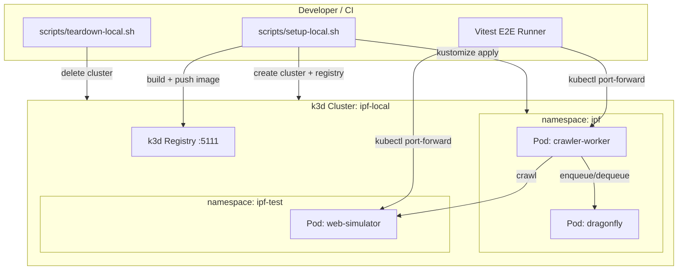
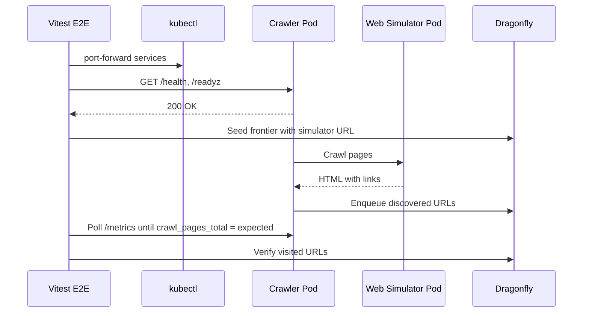

# K8s E2E Testing — Design

> Architecture for local K8s cluster automation, web simulator, and E2E test pipeline.
> Implements: [requirements.md](requirements.md) | ADRs: [ADR-005](../../adr/ADR-005-local-kubernetes.md), [ADR-007](../../adr/ADR-007-testing-strategy.md), [ADR-009](../../adr/ADR-009-resilience-patterns.md)
> Split: Web simulator details in [design-simulator.md](design-simulator.md)

---

## 1. System Overview



Covers: REQ-K8E-001–009, REQ-K8E-016–017

## 2. Web Simulator

See [design-simulator.md](design-simulator.md) for full architecture, interfaces, and built-in scenarios.

Summary: Node.js HTTP server with route registry. Supports static HTML pages (site graphs), dynamic handlers, and built-in scenarios (slow, error, redirect, trap, robots.txt, SSRF-bait). Deployable in-process or as K8s Pod.

Covers: REQ-K8E-010–016

## 3. Cluster Automation Scripts

### 3.1 setup-local.sh

```bash
#!/bin/bash
set -euo pipefail

CLUSTER_NAME="${K3D_CLUSTER_NAME:-ipf-local}"
REGISTRY_NAME="${K3D_REGISTRY_NAME:-ipf-registry.localhost}"
REGISTRY_PORT="${K3D_REGISTRY_PORT:-5111}"
SERVERS="${K3D_SERVERS:-1}"
AGENTS="${K3D_AGENTS:-2}"

# Idempotent: delete existing cluster if present (REQ-K8E-003)
if k3d cluster list | grep -q "$CLUSTER_NAME"; then
  echo "Cluster $CLUSTER_NAME exists — deleting for clean state..."
  k3d cluster delete "$CLUSTER_NAME"
fi

# Create registry if not exists (REQ-K8E-002)
if ! k3d registry list | grep -q "$REGISTRY_NAME"; then
  k3d registry create "$REGISTRY_NAME" --port "$REGISTRY_PORT"
fi

# Create cluster (REQ-K8E-001)
k3d cluster create "$CLUSTER_NAME" \
  --servers "$SERVERS" \
  --agents "$AGENTS" \
  --registry-use "k3d-${REGISTRY_NAME}:${REGISTRY_PORT}" \
  --port "8080:80@loadbalancer" \
  --port "8443:443@loadbalancer" \
  --k3s-arg "--disable=traefik@server:0" \
  --wait

# Wait for nodes (REQ-K8E-006)
echo "Waiting for nodes..."
kubectl wait --for=condition=Ready node --all --timeout=60s

echo "Cluster $CLUSTER_NAME ready."
kubectl cluster-info
kubectl get nodes
```

### 3.2 teardown-local.sh

```bash
#!/bin/bash
set -euo pipefail

CLUSTER_NAME="${K3D_CLUSTER_NAME:-ipf-local}"
REGISTRY_NAME="${K3D_REGISTRY_NAME:-ipf-registry.localhost}"

k3d cluster delete "$CLUSTER_NAME" 2>/dev/null || true
k3d registry delete "k3d-${REGISTRY_NAME}" 2>/dev/null || true

echo "Cleanup complete."
```

### 3.3 build-and-push.sh

```bash
#!/bin/bash
set -euo pipefail

REGISTRY="k3d-ipf-registry.localhost:5111"
TAG="${1:-$(git rev-parse --short HEAD)}"

docker build -f infra/docker/Dockerfile -t "$REGISTRY/ipf-crawler:$TAG" .
docker push "$REGISTRY/ipf-crawler:$TAG"

docker build -f infra/docker/Dockerfile.web-simulator \
  -t "$REGISTRY/ipf-web-simulator:$TAG" .
docker push "$REGISTRY/ipf-web-simulator:$TAG"

echo "Images pushed with tag: $TAG"
```

## 4. K8s E2E Overlay

```yaml
# infra/k8s/overlays/e2e/kustomization.yml
apiVersion: kustomize.config.k8s.io/v1beta1
kind: Kustomization

resources:
  - ../../base
  - web-simulator.yml

patches:
  - target:
      kind: Deployment
      name: crawler-worker
    patch: |
      - op: replace
        path: /spec/replicas
        value: 1
      - op: replace
        path: /spec/template/spec/containers/0/image
        value: k3d-ipf-registry.localhost:5111/ipf-crawler:latest
      - op: replace
        path: /spec/template/spec/containers/0/resources/limits/cpu
        value: 500m
      - op: replace
        path: /spec/template/spec/containers/0/resources/limits/memory
        value: 256Mi
```

## 5. E2E Test Flow



Covers: REQ-K8E-017, REQ-K8E-020, REQ-K8E-021

## 6. File Layout

```text
packages/testing/src/
  simulators/
    web-simulator.ts           # HTTP server + route registry
    site-graph-builder.ts      # Site graph → routes
    built-in-scenarios.ts      # Slow, error, redirect, trap, robots
    web-simulator.unit.test.ts # Unit tests
  e2e/
    helpers/
      k8s-helpers.ts           # kubectl utilities
      e2e-setup.ts             # beforeAll/afterAll setup
    crawl-pipeline.e2e.test.ts
    health-probes.e2e.test.ts
    graceful-shutdown.e2e.test.ts
    ssrf-blocking.e2e.test.ts
scripts/
  setup-local.sh
  teardown-local.sh
  build-and-push.sh
infra/k8s/overlays/e2e/
  kustomization.yml
  web-simulator.yml
infra/docker/
  Dockerfile.web-simulator
```

## 7. Dependencies

| Component | Depends On | Blocks |
| --- | --- | --- |
| setup-local.sh | k3d, Docker | All E2E tests |
| Web simulator | Node.js `http` module | E2E tests |
| K8s E2E overlay | Base manifests, images | E2E execution |
| E2E tests | Cluster + images + manifests | — |

---

> **Provenance**: Created 2025-07-21 per ADR-020. Split from single design.md for 300-line limit compliance.
