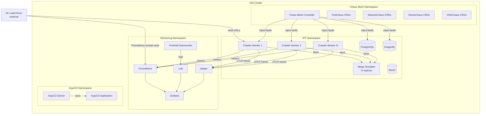
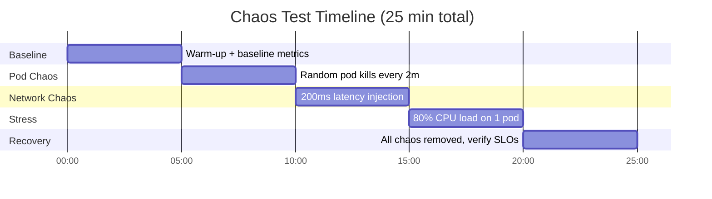
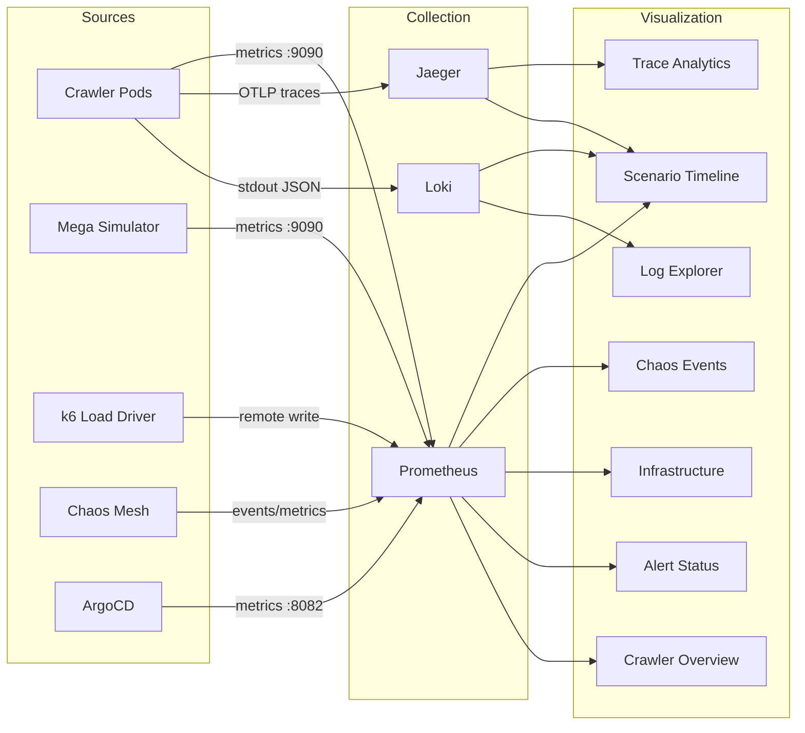

# Load Test + Observability Suite — Design

> Architecture and interfaces for the mega load test, observability stack, chaos engineering, and ArgoCD integration.
> References: ADR-004, ADR-005, ADR-006, ADR-007, ADR-009

## 1. System Architecture



## 2. Mega Simulator Design

### 2.1 Domain Generation Algorithm

```typescript
interface MegaSimulatorConfig {
  readonly domainCount: number;        // REQ-LTO-001: default 1000
  readonly pagesPerDomain: number;     // REQ-LTO-001: default 50
  readonly crossDomainLinkRatio: number; // REQ-LTO-002: default 0.1
  readonly chaosDomainRatio: number;   // REQ-LTO-003: default 0.2
  readonly disallowedPathRatio: number; // REQ-LTO-005: default 0.1
  readonly port: number;
}

interface VirtualDomain {
  readonly id: number;                 // 0..domainCount-1
  readonly hostname: string;           // domain-0000.sim, domain-0001.sim, ...
  readonly pageCount: number;
  readonly chaosScenario?: ChaosScenarioType;
  readonly disallowedPaths: readonly string[];
}

type ChaosScenarioType =
  | { _tag: 'slow'; delayMs: number }
  | { _tag: 'error'; statusCodes: readonly number[] }
  | { _tag: 'redirect-chain'; hops: number }
  | { _tag: 'intermittent'; failureRate: number }
  | { _tag: 'rate-limited'; maxRequests: number };
```

### 2.2 URL Routing

The simulator uses a single HTTP server. Virtual domains are encoded in the URL path:

```
GET /domain-{id}/page-{pageNum}    → HTML page with links
GET /domain-{id}/robots.txt        → Domain-specific robots.txt
GET /metrics                       → Prometheus metrics (REQ-LTO-006)
GET /health                        → Health check
```

Deterministic content via seeded PRNG: `seed = hash(domainId, pageNum)` produces same links, same content fingerprint (REQ-LTO-004).

### 2.3 Link Generation

For page `P` in domain `D` with `PAGES_PER_DOMAIN=50` and `CROSS_DOMAIN_LINK_RATIO=0.1`:
- Generate 10 links per page
- 9 intra-domain: `hash(D, P, i) % pagesPerDomain` for link targets
- 1 cross-domain: `hash(D, P, 'cross') % domainCount` for domain, random page

### 2.4 Metrics (REQ-LTO-006)

```typescript
// Prometheus metrics exported by simulator
const simulatorMetrics = {
  requestsTotal: new Counter({ name: 'simulator_requests_total', labels: ['domain', 'status'] }),
  responseDuration: new Histogram({ name: 'simulator_response_duration_seconds', buckets: [0.01, 0.05, 0.1, 0.5, 1, 5] }),
  activeDomains: new Gauge({ name: 'simulator_active_domains' }),
  pagesServed: new Counter({ name: 'simulator_pages_served_total' }),
};
```

## 3. Loki Stack Design

### 3.1 Docker Compose Architecture

```yaml
# Added to docker-compose.dev.yml
loki:        # grafana/loki:3.0 — single-binary mode, filesystem storage
promtail:    # grafana/promtail:3.0 — scrapes Docker container logs
```

Promtail is configured to:
1. Discover containers via Docker socket mount
2. Parse Pino JSON lines (structured labels: `level`, `service`, `jobId`)
3. Forward to Loki with pipeline stages for label extraction

### 3.2 Grafana Datasource

```yaml
# Added to provisioning/datasources/datasources.yml
- name: Loki
  type: loki
  access: proxy
  url: http://loki:3100
  jsonData:
    derivedFields:
      - name: TraceID
        datasourceUid: jaeger
        matcherRegex: '"traceId":"([a-f0-9]+)"'
        url: '$${__value.raw}'
```

The `derivedFields` configuration enables REQ-LTO-010 (log → trace correlation).

### 3.3 Kubernetes Deployment

In k8s: Loki as StatefulSet, Promtail as DaemonSet reading `/var/log/pods/**/*.log`.

## 4. Grafana Dashboard Suite Design

### 4.1 Dashboard Inventory (REQ-LTO-013..019)

| Dashboard | File | Datasources | Key Panels |
| --------- | ---- | ----------- | ---------- |
| Scenario Timeline | `scenario-timeline.json` | Prometheus, Loki, Jaeger | Annotation timeline, SLO gauges, chaos event markers |
| Chaos Events | `chaos-events.json` | Prometheus, Loki | Active experiments, affected pods, MTTR, recovery timeline |
| Infrastructure | `infrastructure-health.json` | Prometheus | CPU/memory heatmaps, connection pools, storage, network I/O |
| Alerts | `alert-status.json` | Prometheus | Alert state table, firing history, rule evaluation |
| Traces | `trace-analytics.json` | Jaeger, Prometheus | Latency heatmap, error rate by op, service graph, slow traces |
| Logs | `log-explorer.json` | Loki | Volume by level, error rate, top messages, per-domain logs |

### 4.2 Annotation Strategy

Grafana annotations provide visual markers on all dashboards:

| Source | Annotation | Color |
| ------ | ---------- | ----- |
| k6 load test | Test start/end | Blue |
| Chaos Mesh | Experiment inject/recover | Red |
| ArgoCD | Sync start/complete/fail | Green |
| Prometheus | Alert firing/resolved | Orange |

Annotations via Prometheus recording rules + Grafana annotation queries.

### 4.3 Panel Design Principles

- **Consistent time range**: All dashboards share a time picker synced to the same window
- **Drill-down**: Click metric data point → Jaeger trace (exemplars, REQ-LTO-018)
- **Correlation**: Split view with logs + metrics side by side (Grafana Explore)
- **Thresholds**: Green/yellow/red zones matching SLO definitions
- **Variables**: Template variables for `namespace`, `pod`, `domain`, `scenario`

## 5. ArgoCD Design

### 5.1 Installation (REQ-LTO-020)

Added to `scripts/setup-local.sh`:
```bash
kubectl create namespace argocd
kubectl apply -n argocd -f https://raw.githubusercontent.com/argoproj/argo-cd/stable/manifests/install.yaml
kubectl wait --for=condition=available deploy/argocd-server -n argocd --timeout=120s
```

### 5.2 Application CRD

```yaml
# infra/k8s/argocd/ipf-application.yml
apiVersion: argoproj.io/v1alpha1
kind: Application
metadata:
  name: ipf-crawler
  namespace: argocd
spec:
  project: default
  source:
    repoURL: https://github.com/<org>/ipf-crawler
    targetRevision: HEAD
    path: infra/k8s/overlays/dev
  destination:
    server: https://kubernetes.default.svc
    namespace: ipf
  syncPolicy:
    automated:
      prune: true
      selfHeal: true
```

### 5.3 Grafana Integration (REQ-LTO-021, REQ-LTO-023)

ArgoCD exposes metrics on `:8082/metrics`. Prometheus scrapes them. Dashboard panels show:
- Sync status (Synced/OutOfSync/Unknown)
- Health status (Healthy/Degraded/Missing)
- Sync duration histogram
- Last sync timestamp

## 6. Chaos Mesh Design

### 6.1 Installation (REQ-LTO-024)

Added to `scripts/setup-local.sh`:
```bash
helm repo add chaos-mesh https://charts.chaos-mesh.org
helm install chaos-mesh chaos-mesh/chaos-mesh \
  --namespace chaos-mesh --create-namespace \
  --set chaosDaemon.runtime=containerd \
  --set chaosDaemon.socketPath=/run/k3s/containerd/containerd.sock
```

### 6.2 Experiment CRDs (REQ-LTO-025..028)

```yaml
# infra/k8s/chaos/pod-kill.yml
apiVersion: chaos-mesh.org/v1alpha1
kind: PodChaos
metadata:
  name: crawler-pod-kill
  namespace: ipf
spec:
  action: pod-kill
  mode: one
  selector:
    namespaces: [ipf]
    labelSelectors:
      app: crawler-worker
  scheduler:
    cron: "@every 2m"

# infra/k8s/chaos/network-delay.yml
apiVersion: chaos-mesh.org/v1alpha1
kind: NetworkChaos
metadata:
  name: crawler-network-delay
spec:
  action: delay
  mode: all
  selector:
    namespaces: [ipf]
    labelSelectors:
      app: crawler-worker
  delay:
    latency: "200ms"
    jitter: "50ms"
  duration: "5m"

# infra/k8s/chaos/stress-cpu.yml
apiVersion: chaos-mesh.org/v1alpha1
kind: StressChaos
metadata:
  name: crawler-cpu-stress
spec:
  mode: one
  selector:
    namespaces: [ipf]
    labelSelectors:
      app: crawler-worker
  stressors:
    cpu:
      workers: 2
      load: 80
  duration: "5m"

# infra/k8s/chaos/dns-failure.yml
apiVersion: chaos-mesh.org/v1alpha1
kind: DNSChaos
metadata:
  name: crawler-dns-failure
spec:
  action: error
  mode: all
  selector:
    namespaces: [ipf]
    labelSelectors:
      app: crawler-worker
  patterns: ["web-simulator.ipf.svc.cluster.local"]
  duration: "2m"
```

### 6.3 Orchestrated Chaos Sequence (REQ-LTO-030)



## 7. Scaled Load Test Design

### 7.1 k6 Mega Crawl Script (REQ-LTO-031)

```javascript
// New: mega-crawl.k6.js
export const options = {
  scenarios: {
    sustained_load: {
      executor: 'constant-arrival-rate',
      rate: 500,              // 500 URL/s
      timeUnit: '1s',
      duration: '30m',
      preAllocatedVUs: 100,
      maxVUs: 500,
    },
  },
  thresholds: {
    'http_req_duration{type:seed}': ['p(95)<5000'],
    'http_req_failed{type:seed}': ['rate<0.05'],
  },
};
```

### 7.2 Prometheus Remote Write (REQ-LTO-035)

k6 with `--out experimental-prometheus-rw` writes metrics to Prometheus, enabling real-time visualization in Grafana during test execution.

### 7.3 Test Orchestration Script

```bash
# scripts/run-mega-test.sh
# 1. Deploy mega simulator (N replicas)
# 2. Wait for ArgoCD sync
# 3. Start k6 mega crawl in background
# 4. Apply chaos experiments in sequence
# 5. Wait for k6 completion
# 6. Collect results + generate report
# 7. Verify SLOs programmatically
```

## 8. Data Flow


