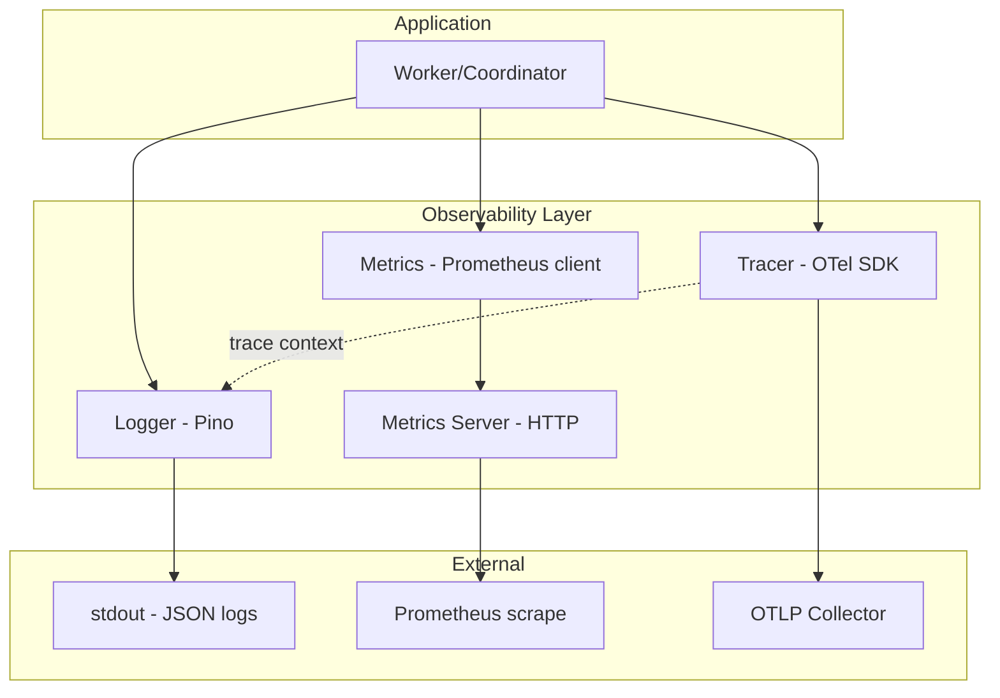
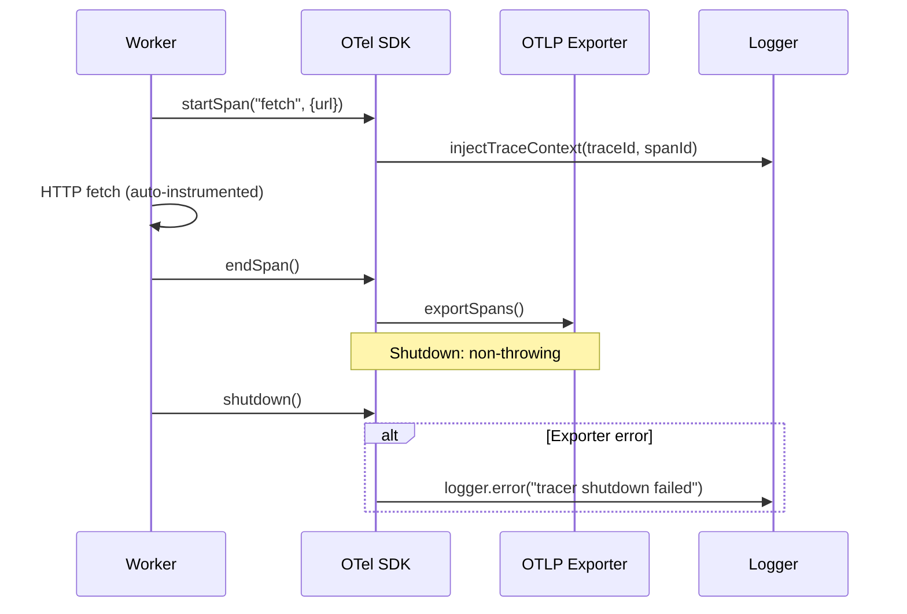

# Observability — Design

> Architecture for logging, metrics, metrics server, and distributed tracing.
> Implements: [requirements.md](requirements.md) | ADRs: [ADR-006](../../adr/ADR-006-observability-stack.md)

---

## 1. Observability Stack



## 2. Logger Implementation

```typescript
// Production: Pino with JSON output
interface LoggerConfig {
  readonly level: string           // debug|info|warn|error|fatal
  readonly initialBindings: Record<string, unknown>
}

// Null logger for tests
class NullLogger implements Logger {
  debug(): void { /* no-op */ }
  info(): void { /* no-op */ }
  warn(): void { /* no-op */ }
  error(): void { /* no-op */ }
  fatal(): void { /* no-op */ }
  child(): Logger { return this }
}
```

Per-job child logger chain:

```text
rootLogger{service, workerId}
  └── jobLogger{jobId, url, depth}
       └── fetchLogger{requestId}
```

Covers: REQ-OBS-001 to 007

## 3. Metrics Registry

```typescript
interface MetricsRegistry {
  readonly fetches_total: Counter         // labels: status, error_kind
  readonly fetch_duration_seconds: Histogram  // buckets configurable
  readonly urls_discovered_total: Counter
  readonly frontier_size: Gauge
  readonly stalled_jobs_total: Counter
  readonly active_jobs: Gauge
  readonly worker_utilization_ratio: Gauge
  readonly coordinator_restarts_total: Counter
}
```

- Per-process isolated registry (new `Registry()` per instance) → REQ-OBS-017
- Duration recorded only when `> 0` → REQ-OBS-010
- Discovery count recorded only when `count > 0` → REQ-OBS-011

## 4. Metrics Server Routes

| Route | Method | Response | Covers |
| --- | --- | --- | --- |
| `/metrics` | GET | Prometheus exposition format | REQ-OBS-019 |
| `/health` | GET | `{"status":"ok","timestamp":"..."}` | REQ-OBS-020 |
| `/readyz` | GET | State-store connectivity check | REQ-OBS-021 |
| `*` | ANY | 404 Not Found | REQ-OBS-022 |

Error handler: catch all handler errors → log details server-side → return `500 {"error":"Internal Server Error"}`. Never leak stack traces or internal details (GAP-SEC-005 mitigation).

## 5. Distributed Tracing



- Auto-instrumentation of HTTP client (undici) → REQ-OBS-024
- Job queue instrumentation (BullMQ) for cross-job propagation → REQ-OBS-024 improvement
- In-memory exporter for tests → REQ-OBS-025
- Non-throwing shutdown → REQ-OBS-026

## 6. Design Decisions

| Decision | Choice | Rationale |
| --- | --- | --- |
| Logger | Pino (ADR-006) | Fastest Node.js structured logger; JSON output |
| Metrics | prom-client | De facto Prometheus client for Node.js |
| Tracing | @opentelemetry/sdk-node | Standard OTel SDK (ADR-006) |
| Metrics server | Built-in HTTP server | Minimal; no framework needed for 3 routes |
| Registry isolation | New Registry() per process | Prevents collisions (REQ-OBS-017) |
| Log-trace correlation | OTel log instrumentation | Automatic trace ID injection |

---

> **Provenance**: Created 2026-03-25. SRE Agent design for observability per ADR-006/020.
