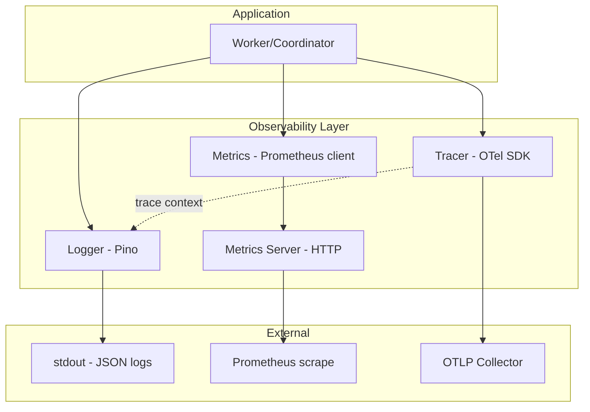
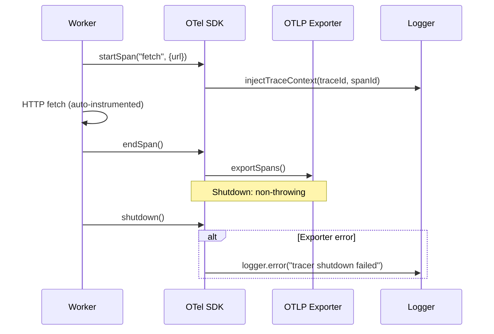
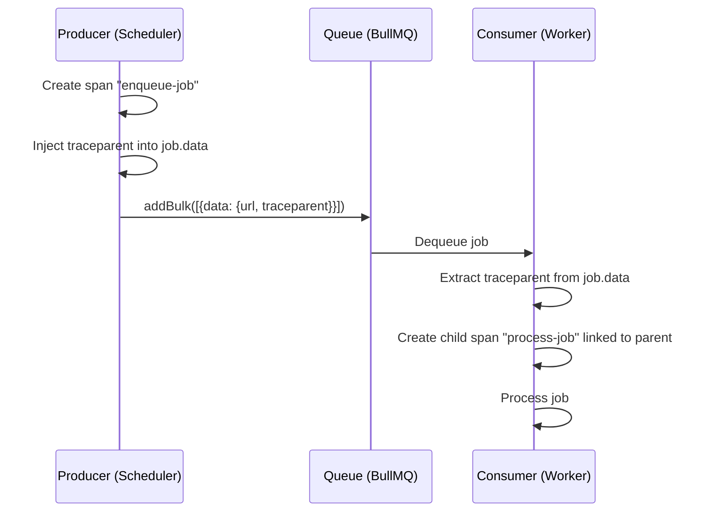

# Observability — Design

> Architecture for logging, metrics, metrics server, and distributed tracing.
> Implements: [requirements.md](requirements.md) | ADRs: [ADR-006](../../adr/ADR-006-observability-stack.md)

---

## 1. Observability Stack



## 2. Logger Implementation

```typescript
// Production: Pino with JSON output
interface LoggerConfig {
  readonly level: string           // debug|info|warn|error|fatal
  readonly initialBindings: Record<string, unknown>
}

// Null logger for tests
class NullLogger implements Logger {
  debug(): void { /* no-op */ }
  info(): void { /* no-op */ }
  warn(): void { /* no-op */ }
  error(): void { /* no-op */ }
  fatal(): void { /* no-op */ }
  child(): Logger { return this }
}
```

Per-job child logger chain:

```text
rootLogger{service, workerId}
  └── jobLogger{jobId, url, depth}
       └── fetchLogger{requestId}
```

**G8 Finding F-004**: `wrapPino(instance)` is exported as a public API to allow test helpers and consumers to wrap external Pino instances without reimplementing the Logger adapter.

Covers: REQ-OBS-001 to 007

## 3. Metrics Registry

```typescript
interface MetricsRegistry {
  readonly fetches_total: Counter         // labels: status, error_kind
  readonly fetch_duration_seconds: Histogram  // buckets configurable
  readonly urls_discovered_total: Counter
  readonly frontier_size: Gauge
  readonly stalled_jobs_total: Counter
  readonly active_jobs: Gauge
  readonly worker_utilization_ratio: Gauge
  readonly coordinator_restarts_total: Counter
}
```

- Per-process isolated registry (new `Registry()` per instance) → REQ-OBS-017
- Duration recorded only when `> 0` → REQ-OBS-010
- Discovery count recorded only when `count > 0` → REQ-OBS-011
- **G8 Finding F-003**: `status` label on `fetches_total` constrained to allowlist; unrecognised values mapped to `'unknown'` fallback → REQ-OBS-009

## 4. Metrics Server Routes

| Route | Method | Response | Covers |
| --- | --- | --- | --- |
| `/metrics` | GET | Prometheus exposition format | REQ-OBS-019 |
| `/health` | GET | `{"status":"ok","timestamp":"..."}` | REQ-OBS-020 |
| `/readyz` | GET | State-store connectivity check | REQ-OBS-021 |
| `*` | ANY | 404 Not Found | REQ-OBS-022 |

Error handler: catch all handler errors → log details server-side → return `500 {"error":"Internal Server Error"}`. Never leak stack traces or internal details (GAP-SEC-005 mitigation).

## 5. Distributed Tracing



- Auto-instrumentation of HTTP client (undici) → REQ-OBS-024
- Job queue instrumentation (BullMQ) for cross-job propagation → REQ-OBS-024, REQ-OBS-029
- In-memory exporter for tests → REQ-OBS-025
- Non-throwing shutdown → REQ-OBS-026
- **G8 Finding F-015**: Tracer name in `extractAndStartSpan` is parameterised (default `'ipf-observability'`), not hardcoded
- **G8 Finding F-017**: Default sampling rate is 10% — tests verifying span capture must pass `samplingRate: 1.0`

### Trace Sampling Strategy (REQ-OBS-027)

```typescript
import { ParentBasedSampler, TraceIdRatioBasedSampler, AlwaysOnSampler } from '@opentelemetry/sdk-trace-base';

const sampler = new ParentBasedSampler({
  root: new TraceIdRatioBasedSampler(
    parseFloat(process.env.TRACE_SAMPLING_RATE ?? '0.1')  // 10% default
  ),
});

// Error traces: always sampled via span processor post-hoc
// If span.status.code === ERROR, force export regardless of sampling decision
```

### OTel Buffer Overflow Mitigation (REQ-OBS-028)

```typescript
import { BatchSpanProcessor } from '@opentelemetry/sdk-trace-base';

const spanProcessor = new BatchSpanProcessor(exporter, {
  maxQueueSize: parseInt(process.env.OTEL_BSP_MAX_QUEUE_SIZE ?? '2048'),
  maxExportBatchSize: 512,
  scheduledDelayMillis: 5000,
  exportTimeoutMillis: 30000,
});
// Monitor: otel_bsp_queue_size metric for buffer pressure alerts
```

### Job Queue Trace Propagation (REQ-OBS-029)



### Readiness Probe Design (REQ-OBS-030)

```typescript
async function readinessCheck(): Promise<ReadinessResult> {
  const checks = await Promise.allSettled([
    redis.ping(),             // Required
    pg.query('SELECT 1'),     // Required
    otelCollector.health(),   // Optional (non-blocking)
  ]);
  const required = checks.slice(0, 2);
  const allHealthy = required.every(r => r.status === 'fulfilled');
  return {
    status: allHealthy ? 200 : 503,
    components: {
      redis: checks[0].status === 'fulfilled' ? 'ok' : 'fail',
      postgres: checks[1].status === 'fulfilled' ? 'ok' : 'fail',
      otel: checks[2].status === 'fulfilled' ? 'ok' : 'degraded',
    },
  };
}
```

## 6. Design Decisions

| Decision | Choice | Rationale |
| --- | --- | --- |
| Logger | Pino (ADR-006) | Fastest Node.js structured logger; JSON output |
| Metrics | prom-client | De facto Prometheus client for Node.js |
| Tracing | @opentelemetry/sdk-node | Standard OTel SDK (ADR-006) |
| Metrics server | Built-in HTTP server | Minimal; no framework needed for 3 routes |
| Registry isolation | New Registry() per process | Prevents collisions (REQ-OBS-017) |
| Log-trace correlation | OTel log instrumentation | Automatic trace ID injection |

---

## G8 Review Council Findings (sustained)

| Finding | Severity | Affects | Design Change |
| --- | --- | --- | --- |
| F-003 | Minor | §3 Metrics Registry | Added status label allowlist + `'unknown'` fallback |
| F-004 | Minor | §2 Logger | `wrapPino` exported as public API |
| F-015 | Minor | §5 Tracing | Tracer name parameterised in `extractAndStartSpan` |
| F-017 | Minor | §5 Trace Sampling | Default 10% sampling; tests use `samplingRate: 1.0` |

---

> **Provenance**: Created 2026-03-25. SRE Agent design for observability per ADR-006/020. Updated 2026-03-26: added trace sampling strategy, OTel buffer overflow mitigation, job queue trace propagation, readiness probe design per PR Review Council. Updated 2026-03-26: incorporated G8 sustained findings F-003, F-004, F-015, F-017 (living specs per AGENTS.md SHOULD #15).
