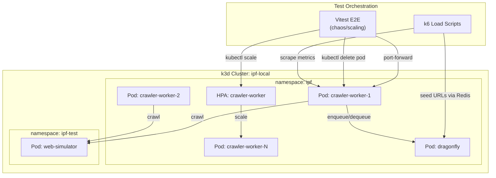

# Production Testing — Design

> Architecture for chaos testing, load testing, scaling verification, and DDoS resilience testing.
> Implements: [requirements.md](requirements.md) | ADRs: [ADR-002](../../adr/ADR-002-job-queue-system.md), [ADR-007](../../adr/ADR-007-testing-strategy.md), [ADR-009](../../adr/ADR-009-resilience-patterns.md)

---

## 1. System Overview



## 2. Test Categories & Tools

| Category | Tool | Trigger | Validation |
| --- | --- | --- | --- |
| Chaos — Pod kill | Vitest + `kubectl delete pod` | E2E test | Metrics delta, job reprocessing |
| Chaos — Redis failure | Vitest + `kubectl delete pod dragonfly` | E2E test | Reconnection time, job retention |
| Chaos — Network partition | Vitest + NetworkPolicy or `kubectl exec iptables` | E2E test | Circuit breaker state, timeout |
| Load — Throughput | k6 + Redis seeding | k6 script | SLO assertions (p95, error rate) |
| Load — Backpressure | k6 + burst seeding | k6 script | Queue depth, memory, no OOM |
| Scaling — HPA up | Vitest + queue depth trigger | E2E test | Replica count, processing time |
| Scaling — HPA down | Vitest + queue drain | E2E test | Scale-down, graceful shutdown |
| DDoS — Rate limit | Vitest + burst seeding per domain | E2E test | Rate metrics, domain isolation |

## 3. Chaos Test Architecture

### 3.1 Pod Kill Pattern

```typescript
// Pattern for chaos pod-kill tests
async function killWorkerPod(podName: string): Promise<void> {
  await execKubectl(['delete', 'pod', podName, '--force', '--grace-period=0']);
}

async function waitForPodRestart(
  deployment: string,
  expectedReplicas: number,
  timeoutMs: number,
): Promise<void> {
  const start = Date.now();
  while (Date.now() - start < timeoutMs) {
    const ready = await getReadyReplicas(deployment);
    if (ready >= expectedReplicas) return;
    await sleep(2_000);
  }
  throw new Error(`Deployment ${deployment} did not reach ${expectedReplicas} replicas`);
}
```

### 3.2 Redis Failure Pattern

```typescript
// Kill Redis → verify workers detect failure → restart Redis → verify recovery
async function testRedisFailure(ctx: E2EContext): Promise<void> {
  // 1. Seed jobs, verify processing
  // 2. Kill dragonfly pod
  // 3. Verify workers detect failure (health returns 503)
  // 4. Wait for dragonfly restart
  // 5. Verify workers reconnect and resume
}
```

### 3.3 Network Partition Pattern

Uses Kubernetes NetworkPolicy to isolate pods:

```yaml
# network-partition-policy.yaml — blocks worker→redis traffic
apiVersion: networking.k8s.io/v1
kind: NetworkPolicy
metadata:
  name: partition-worker-redis
  namespace: ipf
spec:
  podSelector:
    matchLabels:
      app: crawler-worker
  policyTypes: [Egress]
  egress:
    - to:
        - podSelector:
            matchLabels:
              app: web-simulator
      # Redis traffic blocked by omission
```

### 3.4 K8s Helper Extensions

New helpers added to `packages/testing/src/e2e/helpers/`:

| Helper | Purpose | Used By |
| --- | --- | --- |
| `execKubectl(args)` | Execute kubectl commands, parse output | All chaos tests |
| `killPod(name)` | Force-delete a pod | Pod kill tests |
| `getReadyReplicas(deploy)` | Query deployment ready count | Scaling tests |
| `applyNetworkPolicy(yaml)` | Apply/delete NetworkPolicy | Network partition |
| `scaleDeployment(deploy, n)` | Set replica count | Scaling tests |
| `getPodNames(label)` | List pod names by label | All chaos tests |

## 4. Load Test Architecture (k6)

### 4.1 k6 Script Structure

```text
packages/testing/src/load/
  throughput.k6.js        — Sustained load throughput test
  backpressure.k6.js      — Burst load, queue depth monitoring
  k6-helpers.ts           — Redis seeding, metrics scraping
  slo-thresholds.ts       — Shared SLO threshold definitions
```

### 4.2 k6 Throughput Script Pattern

```typescript
// throughput.k6.js (k6 runtime — not Node.js)
import http from 'k6/http';
import { check } from 'k6';

export const options = {
  scenarios: {
    sustained_load: {
      executor: 'constant-arrival-rate',
      rate: 100,           // 100 URLs/second
      timeUnit: '1s',
      duration: '60s',
      preAllocatedVUs: 50,
      maxVUs: 200,
    },
  },
  thresholds: {
    'http_req_duration{type:seed}': ['p(95)<5000'],
    'http_req_failed{type:seed}': ['rate<0.05'],
  },
};

export default function (): void {
  // Seed URL into Redis via HTTP API or direct Redis protocol
  const res = http.post('http://localhost:PORT/api/seed', JSON.stringify({
    url: `http://web-simulator:8080/page-${__ITER}`,
    depth: 0,
  }));
  check(res, { 'seed accepted': (r) => r.status === 200 });
}
```

### 4.3 SLO Thresholds

| Metric | Threshold | Source |
| --- | --- | --- |
| p95 fetch latency | < 5s | ADR-007 §Load |
| Error rate | < 5% | ADR-007 §Load |
| Worker RSS memory | < 512MB | K8s resource limit |
| Queue drain time (10k URLs) | < 10 min | Derived from throughput SLO |
| Worker startup to ready | < 30s | REQ-PROD-017 |

## 5. Scaling Test Architecture

### 5.1 HPA Configuration (E2E overlay)

```yaml
# infra/k8s/overlays/e2e/hpa.yaml
apiVersion: autoscaling/v2
kind: HorizontalPodAutoscaler
metadata:
  name: crawler-worker
  namespace: ipf
spec:
  scaleTargetRef:
    apiVersion: apps/v1
    kind: Deployment
    name: crawler-worker
  minReplicas: 1
  maxReplicas: 10
  metrics:
    - type: External
      external:
        metric:
          name: redis_queue_depth
          selector:
            matchLabels:
              queue: crawl-jobs
        target:
          type: AverageValue
          averageValue: "100"
  behavior:
    scaleDown:
      stabilizationWindowSeconds: 300
```

### 5.2 Scaling Test Pattern

```typescript
// 1. Start with 1 replica
// 2. Seed 500 URLs (exceeds 100/worker threshold)
// 3. Verify HPA scales to 3+ replicas within 60s
// 4. Wait for queue drain
// 5. Verify HPA scales down after stabilization
```

## 6. DDoS Simulation Architecture

### 6.1 Simulator Extensions

New routes for production testing:

| Route | Behavior | Tests |
| --- | --- | --- |
| `/burst-links?count=N` | Page with N links to unique URLs | REQ-PROD-020,024 |
| `/connection-hold?ms=N` | Hold connection open for N ms (slow loris) | REQ-PROD-007 |
| `/dynamic-429?after=N` | Return 200 for first N requests, then 429 | REQ-PROD-022 |

### 6.2 Rate Limit Verification

```typescript
// Verify per-domain rate limiting under burst
// 1. Seed 100 URLs for domain-A, 10 for domain-B
// 2. Measure fetch rate for domain-A (should be ~0.5/s)
// 3. Measure fetch rate for domain-B (should be ~0.5/s independently)
// 4. Verify domain-B is not starved by domain-A's queue depth
```

## 7. File Layout

```text
packages/testing/src/
  e2e/
    chaos-pod-kill.e2e.test.ts          — REQ-PROD-001–005
    chaos-network-partition.e2e.test.ts  — REQ-PROD-006–008
    scaling-hpa.e2e.test.ts             — REQ-PROD-015–019
    ddos-rate-limiting.e2e.test.ts      — REQ-PROD-020–024
    helpers/
      chaos-helpers.ts                  — kubectl wrappers for chaos ops
  load/
    throughput.k6.js                    — Sustained load test
    backpressure.k6.js                  — Burst/backpressure test
    k6-helpers.ts                       — Redis seeding, metrics helpers
    slo-thresholds.ts                   — Shared SLO constants
  simulators/
    built-in-scenarios.ts               — +3 new routes (burst, hold, dynamic-429)

infra/k8s/overlays/e2e/
  hpa.yaml                             — HPA for scaling tests
  network-partition-policy.yaml         — NetworkPolicy for chaos tests

docs/specs/production-testing/
  requirements.md                      — This spec
  design.md                            — This document
  tasks.md                             — Implementation tasks
```

---

> **Provenance**: Created 2026-03-29. Implements ADR-007 §Load/Chaos mandates.
