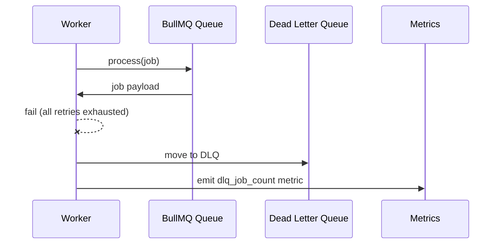

# Resilience Patterns — Design

> Architecture and implementation design for the 7-layer resilience stack.
> Implements: [requirements.md](requirements.md) | Source: [ADR-009](../../adr/ADR-009-resilience-patterns.md)

---

## Architecture Overview

```mermaid
graph TB
  subgraph "7-Layer Resilience Stack"
    RL[Rate Limiter<br/>Token Bucket per-domain]
    TO[Timeout<br/>Cooperative cancellation]
    CB[Circuit Breaker<br/>Per-domain ConsecutiveBreaker]
    RT[Retry<br/>Exponential + jitter]
    BH[Bulkhead<br/>Concurrency limiter]
    FB[Fallback<br/>Cached stale data]
    DLQ[Dead Letter Queue<br/>BullMQ DLQ]
  end

  RL --> TO --> CB --> RT --> BH --> FB --> DLQ

  subgraph "cockatiel Composition"
    WR[wrap&#40;timeout, retry, breaker&#41;]
  end

  subgraph "Observability"
    OT[OTel Metrics]
    SL[Structured Logs]
  end

  CB -->|state transitions| OT
  CB -->|state transitions| SL
  DLQ -->|job moved| OT
```



---

## Per-Domain Circuit Breaker Factory

```typescript
// REQ-RES-002, REQ-RES-019, REQ-RES-020
import { CircuitBreakerPolicy, ConsecutiveBreaker, SamplingBreaker } from 'cockatiel';

type DomainPolicyEntry = {
  policy: CircuitBreakerPolicy;
  lastUsed: number;
};

// LRU map with max 10,000 entries
const domainBreakers = new Map<string, DomainPolicyEntry>();
const MAX_DOMAINS = 10_000;

function getDomainBreaker(domain: string): CircuitBreakerPolicy {
  const existing = domainBreakers.get(domain);
  if (existing) {
    existing.lastUsed = Date.now();
    return existing.policy;
  }
  if (domainBreakers.size >= MAX_DOMAINS) {
    evictLRU(domainBreakers);
  }
  const breaker = new CircuitBreakerPolicy({
    halfOpenAfter: 30_000,
    breaker: new ConsecutiveBreaker(5),
  });
  domainBreakers.set(domain, { policy: breaker, lastUsed: Date.now() });
  return breaker;
}
```

---

## Policy Composition Pattern

> **Note**: The cockatiel `wrap()` below composes the 3 core layers (timeout → retry → circuit breaker). The full fetch pipeline additionally applies rate limiting (pre-call) and bulkhead (concurrency). See T-RES-016 for the complete 7-layer composition.

```typescript
// REQ-RES-018: timeout → retry → circuit breaker (core 3 of 7 layers)
import { wrap, TimeoutPolicy, RetryPolicy, ExponentialBackoff } from 'cockatiel';

function createFetchPolicy(domain: string): Policy {
  const timeout = new TimeoutPolicy(30_000, TimeoutStrategy.Cooperative);
  const retry = new RetryPolicy({
    maxAttempts: 3,
    backoff: new ExponentialBackoff({
      initialDelay: 1_000,
      maxDelay: 30_000,
    }),
  });
  const breaker = getDomainBreaker(domain);
  return wrap(timeout, retry, breaker);
}
```

---

## Rate Limiter Design

```typescript
// REQ-RES-010: Token bucket per domain
type TokenBucket = {
  tokens: number;
  maxTokens: number;
  refillRate: number; // tokens per second
  lastRefill: number;
};

// REQ-RES-011: Redis sliding window for API rate limiting
// Key: `rate:{ip}:{window}` → INCR + EXPIRE
```

---

## Bulkhead Pattern

```typescript
// REQ-RES-012, REQ-RES-013
import { BulkheadPolicy } from 'cockatiel';

function createDomainBulkhead(maxConcurrent: number = 2): BulkheadPolicy {
  return new BulkheadPolicy(maxConcurrent, Infinity); // queue unlimited
}
```

---

## Dead Letter Queue



---

## Observability Integration

| Event | Metric | Log Level |
| ----- | ------ | --------- |
| Circuit opens | `circuit_breaker_open{domain}` | warn |
| Circuit half-open | `circuit_breaker_half_open{domain}` | info |
| Circuit closes | `circuit_breaker_closed{domain}` | info |
| Retry attempt | `retry_attempt{domain,attempt}` | debug |
| Timeout fired | `timeout_fired{domain}` | warn |
| DLQ job | `dlq_job_count{queue}` | error |
| Degraded mode | `degraded_mode{dependency}` | warn |

---

## Decision Rules

| Scenario | Policy Layers Applied |
| -------- | -------------------- |
| HTTP fetch to crawl target | Rate limit → Timeout → Retry → Circuit breaker → Bulkhead |
| Database query | Timeout → Retry (idempotent only) → Circuit breaker |
| Redis operation | Timeout → Circuit breaker (no retry — fast fail) |
| BullMQ job processing | Retry (BullMQ built-in) → DLQ on exhaustion |
| Health probe response | Direct — no resilience wrapping |

---

## Cross-References

- **Graceful Shutdown**: The shutdown protocol (markNotReady → close worker → flush telemetry → close connections → markDead) is specified in [application-lifecycle](../application-lifecycle/requirements.md). Circuit breakers and in-flight request draining must coordinate with the shutdown sequence (ADR-009 §4.4).
- **Health Probes**: `/healthz` and `/readyz` endpoints are specified in [application-lifecycle](../application-lifecycle/design.md). Resilience layer exposes readiness state changes on circuit open.

---

> **Provenance**: Created 2026-03-29 per ADR-020. Source: ADR-009, ADR-002.
