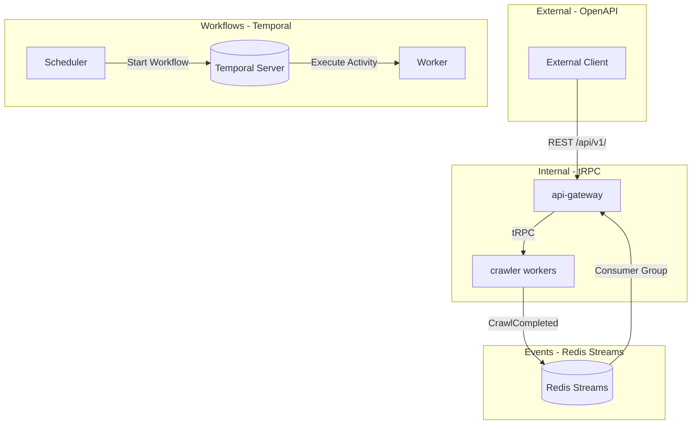

# Service Communication — Design

> Architecture, router patterns, event schemas, and workflow definitions.
> Requirements: [requirements.md](requirements.md) | ADR: [ADR-017](../../adr/ADR-017-service-communication.md)

---

## Communication Architecture



## tRPC Router Structure

```typescript
// packages/api-router/src/router.ts
import { router, publicProcedure, protectedProcedure } from './trpc';
import { CrawlSubmitSchema, CrawlStatusSchema } from '@ipf/validation';

export const appRouter = router({
  crawl: router({
    submit: protectedProcedure
      .input(CrawlSubmitSchema)
      .mutation(({ ctx, input }) => ctx.crawlService.submit(input)),
    status: publicProcedure
      .input(CrawlStatusSchema)
      .query(({ input }) => ctx.crawlService.getStatus(input.jobId)),
  }),
  health: router({
    check: publicProcedure.query(() => ({ status: 'ok' })),
  }),
});

export type AppRouter = typeof appRouter;
```

## Domain Event Schema

```typescript
// Zod schemas define the single source of truth — types derived via z.infer<>
const DomainEventSchema = z.discriminatedUnion('type', [
  z.object({ type: z.literal('CrawlCompleted'), version: z.literal(1), payload: CrawlCompletedPayloadSchema }),
  z.object({ type: z.literal('CrawlFailed'), version: z.literal(1), payload: CrawlFailedPayloadSchema }),
  z.object({ type: z.literal('URLDiscovered'), version: z.literal(1), payload: URLDiscoveredPayloadSchema }),
  z.object({ type: z.literal('ContentStored'), version: z.literal(1), payload: ContentStoredPayloadSchema }),
]);

type DomainEvent = z.infer<typeof DomainEventSchema>;

// NOTE: Domain events live in packages/api-router/ temporarily.
// Extract to packages/core/ when multiple packages need them.
```

## Event Publishing Pattern

```typescript
interface EventPublisher {
  publish(event: DomainEvent): Promise<Result<string, CommError>>;
}

// Redis Streams implementation
class RedisStreamPublisher implements EventPublisher {
  async publish(event: DomainEvent): Promise<Result<string, CommError>> {
    const id = await this.redis.xadd(
      `events:${event.type}`,
      '*',
      'data', JSON.stringify(event),
    );
    return ok(id);
  }
}
```

## Temporal Workflow Definition

```typescript
// Crawl workflow — survives process restarts
async function crawlWorkflow(url: string): Promise<CrawlResult> {
  const fetchResult = await executeActivity('fetchPage', { url }, {
    startToCloseTimeout: '30s',
    retry: { maximumAttempts: 3 },
  });

  const parseResult = await executeActivity('parsePage', {
    content: fetchResult.content,
  });

  const storeResult = await executeActivity('storePage', {
    content: fetchResult.content,
    metadata: parseResult.metadata,
  });

  // Publish completion event
  await executeActivity('publishEvent', {
    type: 'CrawlCompleted',
    payload: { url, statusCode: fetchResult.statusCode },
  });

  return { url, stored: storeResult.key };
}
```

## Idempotency Key Pattern

```typescript
// Middleware for idempotent mutations
async function idempotencyMiddleware(req, reply) {
  const key = req.headers['idempotency-key'];
  if (key) {
    const cached = await redis.get(`idem:${key}`);
    if (cached) return reply.status(200).send(JSON.parse(cached));
  }
}
```

## Decision Rules

| When... | Use... |
| --- | --- |
| Both sides TypeScript in monorepo | tRPC |
| External or non-TS consumer | TypeSpec → OpenAPI |
| Simple queue job | BullMQ (ADR-002) |
| Durable multi-step workflow | Temporal.io |
| Fire-and-forget notification | Redis Pub/Sub |
| Durable event with replay | Redis Streams |

---

> **Provenance**: Created 2026-03-29 per ADR-020. Source: ADR-017, ADR-011.
