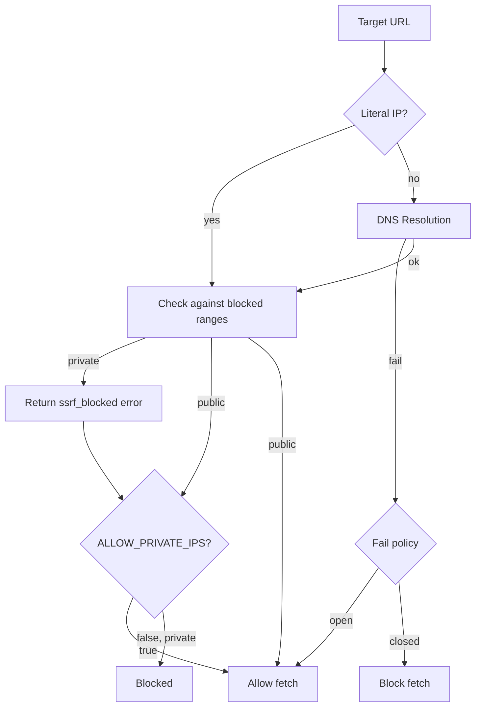
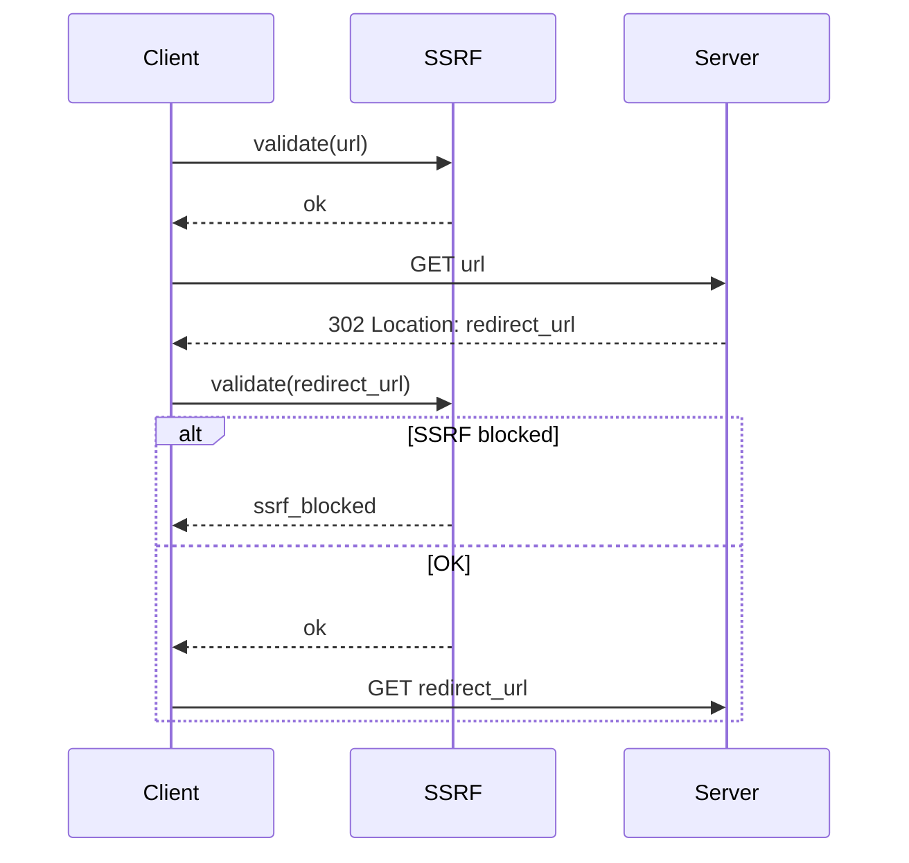

# SSRF Guard — Design

> Architecture and implementation design for SSRF protection and fetch hardening.
> Implements: [requirements.md](requirements.md) | ADRs: [ADR-009](../../adr/ADR-009-resilience-patterns.md)

---

## 1. SSRF Validation Flow



## 2. Blocked IP Ranges

```typescript
// IPv4 blocked ranges (CIDR)
const BLOCKED_IPV4_RANGES = [
  '10.0.0.0/8',        // RFC 1918 Class A
  '172.16.0.0/12',     // RFC 1918 Class B
  '192.168.0.0/16',    // RFC 1918 Class C
  '127.0.0.0/8',       // Loopback
  '169.254.0.0/16',    // Link-local
  '0.0.0.0/8',         // Current network
  // Gap fixes (GAP-SEC-002):
  '100.64.0.0/10',     // CGNAT
  '224.0.0.0/4',       // Multicast
  '255.255.255.255/32', // Broadcast
] as const

// IPv6 blocked addresses/ranges
const BLOCKED_IPV6 = [
  '::1',       // Loopback
  '::',        // Unspecified
  'fc00::/7',  // Unique local
  'fe80::/10', // Link-local
] as const
```

## 3. IPv4-Mapped IPv6 Normalization

Addresses like `::ffff:127.0.0.1` must be detected and normalized to their IPv4 equivalent before range checking. This closes GAP-SEC-001.

```typescript
function normalizeIpv4MappedIpv6(address: string): string {
  const IPV4_MAPPED_PREFIX = '::ffff:'
  if (address.toLowerCase().startsWith(IPV4_MAPPED_PREFIX)) {
    return address.slice(IPV4_MAPPED_PREFIX.length)
  }
  return address
}
```

## 4. DNS Rebinding Mitigation

To close GAP-SEC-003 (TOCTOU between DNS validation and HTTP connect):

1. Resolve DNS in the SSRF guard
2. Validate the resolved IP
3. Pin the resolved IP for the HTTP connection (use the IP as the hostname, set `Host` header to original domain)
4. This eliminates the window where a second DNS query could return a different IP

## 5. Per-Redirect Validation



Covers: REQ-SEC-004

## 6. Fetch Hardening Design

| Mechanism | Implementation | Covers |
| --- | --- | --- |
| Redirect limit | Counter in redirect-following loop; error at N+1 | REQ-SEC-008 |
| Body size limit | Streaming byte counter; destroy stream at limit | REQ-SEC-009 |
| Timeout | AbortSignal with cumulative timeout across redirects | REQ-SEC-010 |
| Scheme check | Validated before each fetch (initial + redirects) | REQ-SEC-011 |
| Content-Length pre-flight | Fast-path reject if header > limit | REQ-FETCH-015 |

## 7. Design Decisions

| Decision | Choice | Rationale |
| --- | --- | --- |
| IP range checking | CIDR matching library | Accurate subnet math vs. string compare |
| DNS fail policy | Configurable (default: open) | REQ-SEC-006; fail-closed optional for high-security |
| IPv4-mapped IPv6 | Normalize before check | Closes GAP-SEC-001 |
| DNS pinning | Resolve once, pin for connect | Closes GAP-SEC-003 |
| Stream byte counting | Transform stream with counter | Accurate; handles chunked transfer |

---

> **Provenance**: Created 2026-03-25. Security Agent design for SSRF guard per ADR-009/020.
