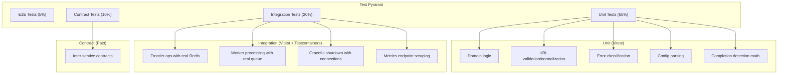
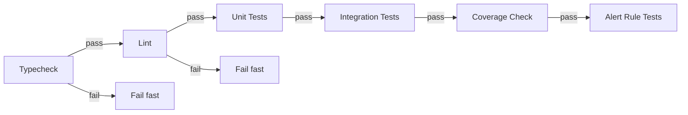

# Testing & Quality — Design

> Architecture for test infrastructure, coverage enforcement, and CI pipeline integration.
> Implements: [requirements.md](requirements.md) | ADRs: [ADR-007](../../adr/ADR-007-testing-strategy.md), [ADR-012](../../adr/ADR-012-ci-cd-pipeline.md)

---

## 1. Test Tier Architecture



Covers: REQ-TEST-001 to 008

## 2. Vitest Configuration

```typescript
// vitest.config.ts
import { defineConfig } from 'vitest/config'

export default defineConfig({
  test: {
    // Co-located test files (REQ-TEST-003)
    include: ['src/**/*.test.ts'],

    // Coverage thresholds (REQ-TEST-009 to 012)
    coverage: {
      provider: 'v8',
      reporter: ['text', 'lcov', 'json-summary'],
      thresholds: {
        lines: 80,
        branches: 75,
      },
    },

    // Timeout configuration (REQ-TEST-019, 020)
    testTimeout: 5000,

    // JUnit reporter for CI (REQ-TEST-015)
    reporters: ['default', 'junit'],
    outputFile: {
      junit: './test-results/junit.xml',
    },
  },
})
```

## 3. Testcontainers Pattern

```typescript
// Example integration test pattern
import { GenericContainer, StartedTestContainer } from 'testcontainers'
import { describe, it, beforeAll, afterAll, expect } from 'vitest'

describe('Frontier Integration', () => {
  let redis: StartedTestContainer

  beforeAll(async () => {
    redis = await new GenericContainer('redis:7-alpine')
      .withExposedPorts(6379)
      .start()
  }, 30_000)

  afterAll(async () => {
    await redis.stop()
  })

  it('enqueues and dequeues correctly', async () => {
    const url = `redis://${redis.getHost()}:${redis.getMappedPort(6379)}`
    // ... test with real Redis
  })
})
```

Covers: REQ-TEST-005, REQ-TEST-006

## 4. CI Pipeline Design



```yaml
# GitHub Actions pipeline (excerpt)
jobs:
  quality-gate:
    runs-on: ubuntu-latest
    services:
      redis:
        image: redis:7-alpine
        ports:
          - 6379:6379
    steps:
      - uses: actions/checkout@v4
      - uses: pnpm/action-setup@v2
      - run: pnpm install --frozen-lockfile

      # Fail-fast chain (REQ-TEST-013, 014)
      - name: Typecheck
        run: pnpm turbo typecheck

      - name: Lint
        run: pnpm turbo lint

      - name: Unit Tests
        run: pnpm turbo test -- --reporter=junit

      - name: Integration Tests
        run: pnpm turbo test:integration
        env:
          STATE_STORE_URL: redis://localhost:6379

      - name: Coverage Gate
        run: pnpm turbo test -- --coverage --coverage.thresholds
```

Covers: REQ-TEST-013 to 016

## 5. TypeScript Strict Configuration

```json
{
  "compilerOptions": {
    "strict": true,
    "exactOptionalPropertyTypes": true,
    "noUncheckedIndexedAccess": true,
    "noImplicitOverride": true,
    "noPropertyAccessFromIndexSignature": true
  }
}
```

Covers: REQ-TEST-017

## 6. Import Boundary Enforcement

ESLint rules to enforce domain/infrastructure separation:

```json
{
  "rules": {
    "@typescript-eslint/no-explicit-any": "error",
    "import-x/no-restricted-paths": ["error", {
      "zones": [{
        "target": "./src/**/domain/**",
        "from": "./src/**/infrastructure/**",
        "message": "Domain layer cannot import infrastructure"
      }]
    }]
  }
}
```

Covers: REQ-TEST-004, REQ-TEST-018

## 7. Design Decisions

| Decision | Choice | Rationale |
| --- | --- | --- |
| Test runner | Vitest | ADR-007, fast, ESM-first |
| Coverage tool | v8 provider | Built into Vitest, fast |
| Container testing | Testcontainers for Node | ADR-007, real infra |
| CI containers | GitHub Actions services | ADR-012, native integration |
| Import enforcement | ESLint import-x/no-restricted-paths | Static analysis, no runtime cost |
| Test co-location | `.test.ts` next to source | ADR-015 VSA co-location |

---

> **Provenance**: Created 2026-03-25. Test Agent design for testing-quality per ADR-007/012/020.
