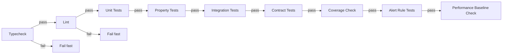

# Testing & Quality — Design

> Architecture for test infrastructure, coverage enforcement, and CI pipeline integration.
> Implements: [requirements.md](requirements.md) | ADRs: [ADR-007](../../adr/ADR-007-testing-strategy.md), [ADR-012](../../adr/ADR-012-ci-cd-pipeline.md)

---

## 1. Test Tier Architecture

```mermaid
graph TD
    subgraph "Test Pyramid (ADR-007)"
        E2E["E2E Tests (5%)"]
        CONTRACT["Contract Tests (10%) — Pact"]
        PROPERTY["Property Tests — fast-check"]
        INTEGRATION["Integration Tests (20%) — Testcontainers"]
        UNIT["Unit Tests (65%) — Vitest"]
    end

    subgraph "Unit (Vitest)"
        U1[Domain logic]
        U2[URL validation/normalization]
        U3[Error classification]
        U4[Config parsing]
        U5[Completion detection math]
    end

    subgraph "Property (fast-check)"
        P1[URL normalization idempotency]
        P2[SSRF IP range coverage]
        P3[Error variant exhaustiveness]
        P4[Politeness serialization]
    end

    subgraph "Integration (Vitest + Testcontainers)"
        I1[Frontier ops with real Redis]
        I2[Worker processing with real queue]
        I3[Graceful shutdown with connections]
        I4[Metrics endpoint scraping]
    end

    subgraph "Contract (Pact)"
        C1[State-store Redis command set]
        C2[Metrics /metrics Prometheus format]
        C3[Health /health + /readyz schemas]
    end

    UNIT --> U1
    UNIT --> U2
    UNIT --> U3
    UNIT --> U4
    UNIT --> U5
    PROPERTY --> P1
    PROPERTY --> P2
    PROPERTY --> P3
    PROPERTY --> P4
    INTEGRATION --> I1
    INTEGRATION --> I2
    INTEGRATION --> I3
    INTEGRATION --> I4
    CONTRACT --> C1
    CONTRACT --> C2
    CONTRACT --> C3
```



Covers: REQ-TEST-001 to 008, REQ-TEST-021, REQ-TEST-022

## 2. Vitest Configuration

### 2.1 Coverage Tier Model (REQ-TEST-009, REQ-TEST-011)

Two coverage tiers enforce different quality bars based on package criticality:

| Tier | Line | Branch | Packages |
| --- | --- | --- | --- |
| **Domain** (pure logic, security) | 90% | 85% | `core`, `url-frontier`, `crawl-pipeline`, `completion-detection`, `worker-management`, `ssrf-guard` |
| **Base** (infra, config, utilities) | 80% | 75% | `config`, `observability`, `http-fetching`, `application-lifecycle`, `testing` |

Domain-tier packages contain pure functions, value objects, and security-critical logic (REQ-TEST-011).
`ssrf-guard` is classified as domain-tier because its IP range validation is pure, security-critical domain logic (per G8 review council finding F-013).

### 2.2 Configuration Example

```typescript
// vitest.config.ts (base tier)
import { defineConfig } from 'vitest/config'

export default defineConfig({
  test: {
    // Co-located test files (REQ-TEST-003)
    include: ['src/**/*.test.ts'],
    // Exclude integration tests from default run
    exclude: ['src/**/*.integration.test.ts'],

    // Coverage thresholds (REQ-TEST-009 to 012)
    coverage: {
      provider: 'v8',
      reporter: ['text', 'lcov', 'json-summary'],
      include: ['src/**/*.ts'],
      exclude: ['src/**/*.test.ts', 'src/**/*.property.test.ts', 'src/**/*.integration.test.ts'],
      thresholds: {
        lines: 80,   // domain tier: 90
        branches: 75, // domain tier: 85
      },
    },

    // Timeout configuration (REQ-TEST-019, 020)
    testTimeout: 5000,

    // JUnit reporter for CI (REQ-TEST-015)
    reporters: ['default', 'junit'],
    outputFile: {
      junit: './test-results/junit.xml',
    },
  },
})
```

## 3. Testcontainers Pattern

```typescript
// Example integration test pattern
import { GenericContainer, StartedTestContainer } from 'testcontainers'
import { describe, it, beforeAll, afterAll, expect } from 'vitest'

describe('Frontier Integration', () => {
  let redis: StartedTestContainer

  beforeAll(async () => {
    redis = await new GenericContainer('redis:7-alpine')
      .withExposedPorts(6379)
      .start()
  }, 30_000)

  afterAll(async () => {
    await redis.stop()
  })

  it('enqueues and dequeues correctly', async () => {
    const url = `redis://${redis.getHost()}:${redis.getMappedPort(6379)}`
    // ... test with real Redis
  })
})
```

Covers: REQ-TEST-005, REQ-TEST-006

## 4. CI Pipeline Design



```yaml
# GitHub Actions pipeline (REQ-TEST-013 to 016)
name: Quality Gate
on:
  pull_request:
    branches: [main]
  push:
    branches: [main]

jobs:
  quality-gate:
    runs-on: ubuntu-latest
    timeout-minutes: 15
    services:
      redis:
        image: redis:7-alpine
        ports:
          - 6379:6379
        options: --health-cmd "redis-cli ping" --health-interval 10s --health-timeout 5s --health-retries 5
    steps:
      - uses: actions/checkout@v4
      - uses: pnpm/action-setup@v4
      - uses: actions/setup-node@v4
        with:
          node-version: 22
          cache: 'pnpm'
      - run: pnpm install --frozen-lockfile

      # Fail-fast chain (REQ-TEST-013, 014)
      - name: Typecheck
        run: pnpm turbo typecheck

      - name: Lint
        run: pnpm turbo lint

      - name: Unit Tests
        run: pnpm turbo test -- --reporter=junit --outputFile=test-results/junit.xml

      - name: Property Tests (fast-check)
        run: pnpm turbo test:property

      - name: Integration Tests
        run: pnpm turbo test:integration
        env:
          STATE_STORE_URL: redis://localhost:6379

      - name: Contract Tests (Pact)
        run: pnpm turbo test:contract

      - name: Coverage Gate
        run: pnpm turbo test -- --coverage --coverage.thresholds

      - name: Alert Rule Tests
        run: promtool test rules infra/monitoring/alert-rules-test.yml

      - name: Upload Test Results
        uses: actions/upload-artifact@v4
        if: always()
        with:
          name: test-results
          path: '**/test-results/'

      - name: Performance Baseline Check
        run: |
          echo "Checking test duration baselines..."
          # Unit tests: ≤30s (REQ-TEST-019)
          # Integration tests: ≤120s (REQ-TEST-020)
          # Alert on >20% regression (REQ-TEST-023)
```

Covers: REQ-TEST-013 to 016, REQ-TEST-023

## 5. TypeScript Strict Configuration

```json
{
  "compilerOptions": {
    "strict": true,
    "exactOptionalPropertyTypes": true,
    "noUncheckedIndexedAccess": true,
    "noImplicitOverride": true,
    "noPropertyAccessFromIndexSignature": true
  }
}
```

Covers: REQ-TEST-017

## 6. Import Boundary Enforcement

ESLint rules to enforce domain/infrastructure separation:

```json
{
  "rules": {
    "@typescript-eslint/no-explicit-any": "error",
    "import-x/no-restricted-paths": ["error", {
      "zones": [{
        "target": "./src/**/domain/**",
        "from": "./src/**/infrastructure/**",
        "message": "Domain layer cannot import infrastructure"
      }]
    }]
  }
}
```

Covers: REQ-TEST-004, REQ-TEST-018

## 7. Design Decisions

| Decision | Choice | Rationale |
| --- | --- | --- |
| Test runner | Vitest | ADR-007, fast, ESM-first |
| Coverage tool | v8 provider | Built into Vitest, fast |
| Container testing | Testcontainers for Node | ADR-007, real infra |
| Property testing | fast-check | ADR-007 §Consequences; composable arbitraries |
| Contract testing | Pact | ADR-007 §Consequences; consumer-driven contracts |
| CI containers | GitHub Actions services | ADR-012, native integration |
| Import enforcement | ESLint import-x/no-restricted-paths | Static analysis, no runtime cost |
| Test co-location | `.test.ts` next to source | ADR-015 VSA co-location |
| Container cleanup | afterAll + global timeout | REQ-TEST-024; prevents orphaned containers |

## 8. Property-Based Test Examples

```typescript
import { fc } from '@fast-check/vitest'
import { describe, it, expect } from 'vitest'

describe('URL normalization properties', () => {
  it('is idempotent', () => {
    fc.assert(
      fc.property(fc.webUrl(), (url) => {
        const once = normalizeUrl(url)
        const twice = normalizeUrl(once)
        expect(twice).toBe(once)
      })
    )
  })

  it('is deterministic', () => {
    fc.assert(
      fc.property(fc.webUrl(), (url) => {
        expect(normalizeUrl(url)).toBe(normalizeUrl(url))
      })
    )
  })
})

describe('SSRF IP range properties', () => {
  it('blocks all RFC 1918 addresses', () => {
    fc.assert(
      fc.property(
        fc.integer({ min: 0, max: 255 }).chain((a) =>
          fc.integer({ min: 0, max: 255 }).chain((b) =>
            fc.integer({ min: 0, max: 255 }).map((c) =>
              `10.${a}.${b}.${c}`
            )
          )
        ),
        (ip) => {
          expect(isPrivateIp(ip)).toBe(true)
        }
      )
    )
  })
})
```

Covers: REQ-TEST-021

## 9. Contract Test Examples

```typescript
import { PactV4, MatchersV3 } from '@pact-foundation/pact'

describe('Metrics Endpoint Contract', () => {
  const provider = new PactV4({
    consumer: 'prometheus',
    provider: 'crawler-metrics',
  })

  it('returns Prometheus exposition format', async () => {
    await provider
      .addInteraction()
      .uponReceiving('a metrics scrape request')
      .withRequest('GET', '/metrics')
      .willRespondWith(200, (builder) => {
        builder.headers({ 'Content-Type': 'text/plain; version=0.0.4' })
        builder.body(MatchersV3.regex(
          /# HELP fetches_total.*\n# TYPE fetches_total counter/,
          '# HELP fetches_total Total fetches\n# TYPE fetches_total counter'
        ))
      })
      .executeTest(async (mockServer) => {
        const response = await fetch(`${mockServer.url}/metrics`)
        expect(response.status).toBe(200)
      })
  })
})
```

Covers: REQ-TEST-022

---

> **Provenance**: Created 2026-03-25. Test Agent design for testing-quality per ADR-007/012/020.
