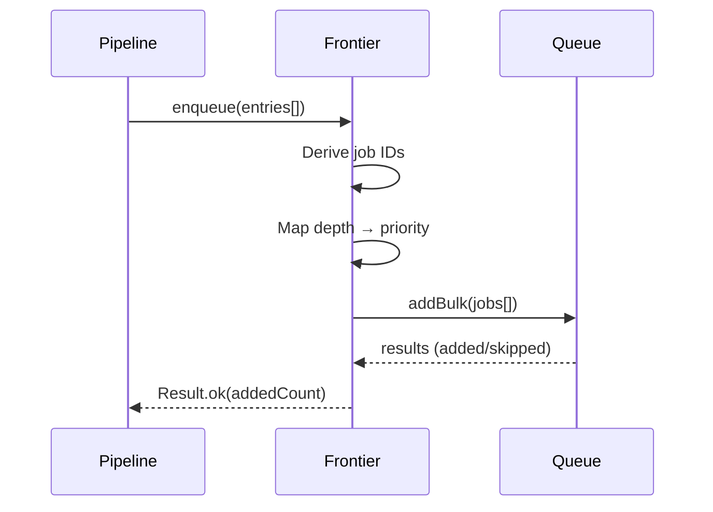

# URL Frontier — Design

> Architecture for the distributed job queue with BFS ordering, deduplication, and batch operations.
> Implements: [requirements.md](requirements.md) | ADRs: [ADR-002](../../adr/ADR-002-job-queue-system.md), [ADR-010](../../adr/ADR-010-data-layer.md)

---

## 1. Frontier Architecture

```mermaid
graph TD
    subgraph Frontier Adapter
        DUP[Deduplication Layer]
        PRI[Priority Calculator]
        BATCH[Batch Enqueue]
        RET[Retention Manager]
    end

    ENTRIES[FrontierEntry[]] --> DUP
    DUP -->|unique entries| PRI
    PRI -->|depth → priority| BATCH
    BATCH -->|single round-trip| QUEUE[(Job Queue)]
    QUEUE --> RET
    RET -->|sliding window| STORE[(Completed/Failed Store)]
```

## 2. Deduplication Strategy

Job IDs are derived deterministically from the normalized URL:

```typescript
function deriveJobId(normalizedUrl: NormalizedUrl): string {
  return createHash('sha256')
    .update(normalizedUrl)
    .digest('hex')
    .slice(0, 32)  // 128-bit collision resistance
}
```

The job queue silently discards duplicate job IDs, making enqueue idempotent.

Covers: REQ-DIST-001

## 3. BFS Priority Mapping

Lower depth = higher priority (processed first):

```typescript
function depthToPriority(depth: number): number {
  // BullMQ: lower number = higher priority
  return depth
}
```

Covers: REQ-DIST-002

## 4. Batch Enqueue



Single round-trip via `queue.addBulk()`. Covers: REQ-DIST-004

## 5. Retry Configuration

```typescript
const RETRY_CONFIG = {
  attempts: 3,          // REQ-DIST-003
  backoff: {
    type: 'exponential',
    delay: 1000,        // 1s base
  },
}
```

## 6. Retention Windows

| Category | Default Limit | Behavior |
| --- | --- | --- |
| Completed | 10,000 | Sliding window; oldest evicted |
| Failed | 5,000 | Sliding window; oldest evicted |

Covers: REQ-DIST-005

## 7. Design Decisions

| Decision | Choice | Rationale |
| --- | --- | --- |
| Job ID derivation | SHA-256 hash of normalized URL | Deterministic; collision-resistant |
| Queue backend | BullMQ + Dragonfly (ADR-002) | Per-domain rate limits; reliable |
| Priority scheme | `priority = depth` | BFS order; BullMQ native priority |
| Batch API | `addBulk()` | Single round-trip (REQ-DIST-004) |
| Queue name | Constant shared across all components | REQ-DIST-006 |

---

> **Provenance**: Created 2026-03-25. Architect Agent design for URL frontier per ADR-002/020.
