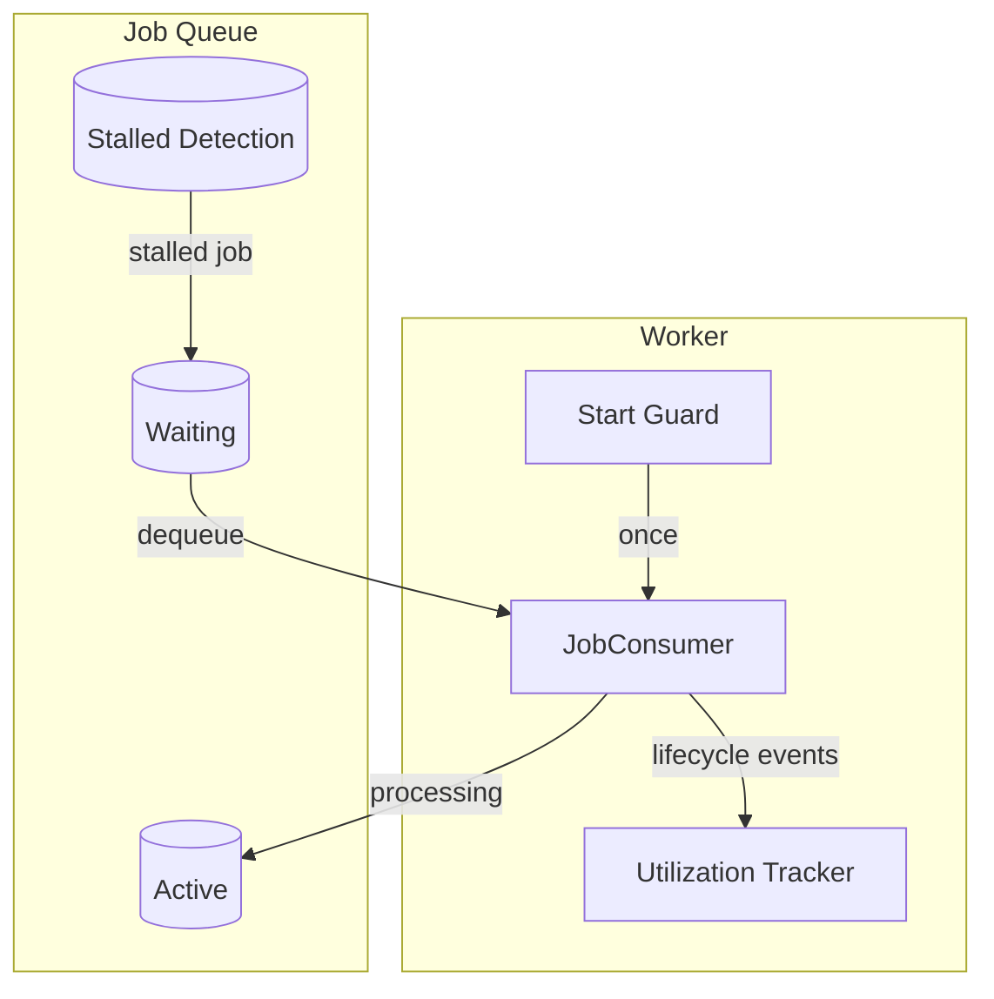
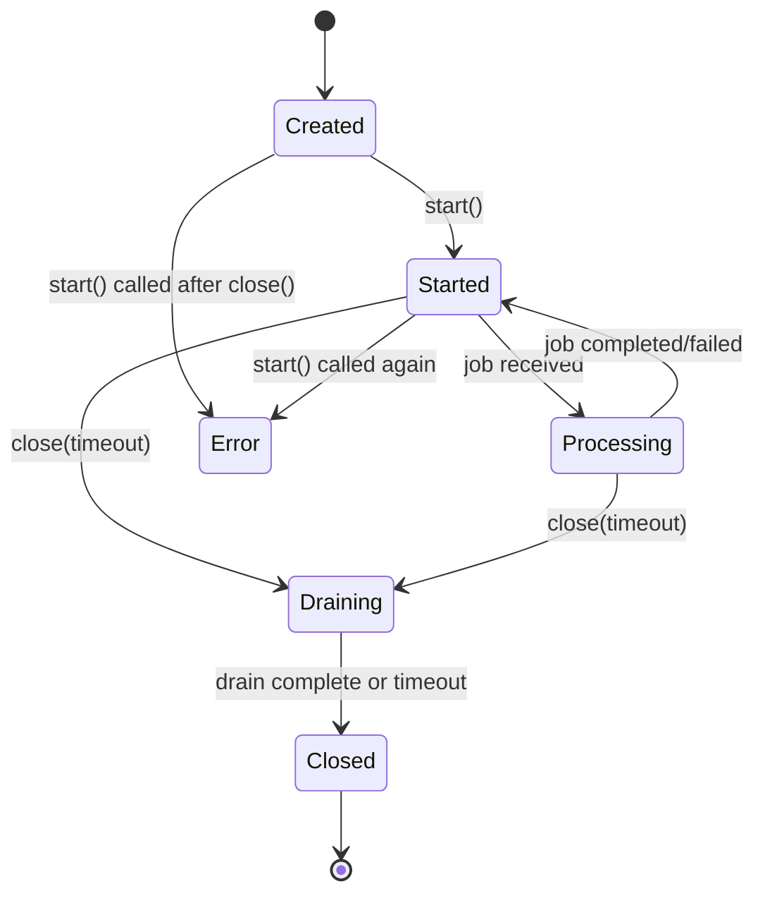
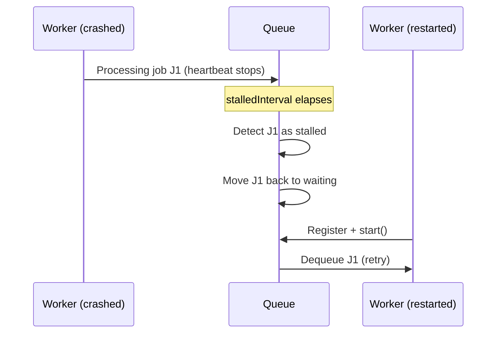

# Worker Management — Design

> Architecture for worker concurrency, stalled job detection, and utilization tracking.
> Implements: [requirements.md](requirements.md) | ADRs: [ADR-002](../../adr/ADR-002-job-queue-system.md), [ADR-009](../../adr/ADR-009-resilience-patterns.md)

---

## 1. Worker Architecture



## 2. Job Consumer Lifecycle



- **Start guard** (REQ-DIST-010): Boolean flag set on first `start()`. Second call throws.
- **Event registration** (REQ-DIST-009): All listeners attached in constructor, before `start()` enables job consumption.

## 3. Utilization Tracker

```typescript
interface UtilizationTracker {
  readonly ratio: number          // [0.0, 1.0]
  readonly activeJobs: number     // non-negative, guarded
  onJobStarted(): void            // increment active
  onJobCompleted(): void          // decrement active (floor 0)
  onJobFailed(): void             // decrement active (floor 0)
}
```

Implementation:

- In-process counter (`activeJobs`) incremented on job start, decremented on complete/fail
- Floor guard: `activeJobs = Math.max(0, activeJobs - 1)` prevents negative values
- Ratio: `activeJobs / maxConcurrency`
- No state-store queries — purely event-driven (REQ-DIST-011)

## 4. Stalled Job Configuration

```typescript
interface StalledJobConfig {
  readonly checkInterval: number   // ms, detection interval
  readonly lockDuration: number    // ms, >= 2 * checkInterval
  readonly maxStalledCount: number // max stalled retries before fail
}
```

Invariant: `lockDuration >= 2 * checkInterval` (REQ-DIST-008)

## 5. Design Decisions

| Decision | Choice | Rationale |
| --- | --- | --- |
| Concurrency control | BullMQ `concurrency` option | Native support (ADR-002) |
| Stalled detection | BullMQ stalledInterval + lockDuration | Built-in, configurable |
| Utilization tracking | In-process counters | No state-store round-trips (REQ-DIST-011) |
| Start guard | Boolean flag + throw | Simple, safe (REQ-DIST-010) |
| Event ordering | Register listeners before start() | Prevents missed events (REQ-DIST-009) |
| Recovery | Process restart + stalled detection | Crash recovery via BullMQ (REQ-DIST-012) |

## 6. Worker Recovery Procedure

Crash recovery relies on BullMQ's stalled job detection — no custom recovery code needed:



Covers: REQ-DIST-012

## 7. Counter Consistency Guard

```typescript
// Periodically verify counter matches actual queue state
function verifyCounterConsistency(
  tracker: UtilizationTracker,
  queue: Queue,
  maxConcurrency: number,
): void {
  if (tracker.activeJobs > maxConcurrency) {
    const actual = queue.getActiveCount();
    logger.warn({ expected: tracker.activeJobs, actual }, 'Counter inconsistency detected');
    tracker.reset(actual);
    metrics.increment('utilization_counter_reset_total');
  }
}
```

Covers: REQ-DIST-013, REQ-DIST-014

---

> **Provenance**: Created 2026-03-25. Architect Agent design for worker management per ADR-002/009/020. Updated 2026-03-26: added §6 (recovery procedure), §7 (counter consistency guard) per PR Review Council.
